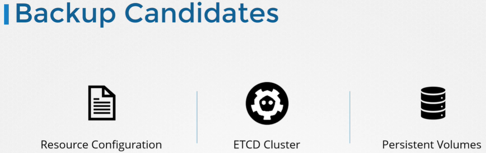
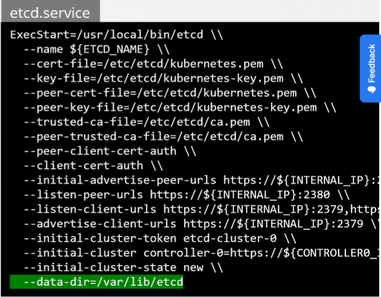
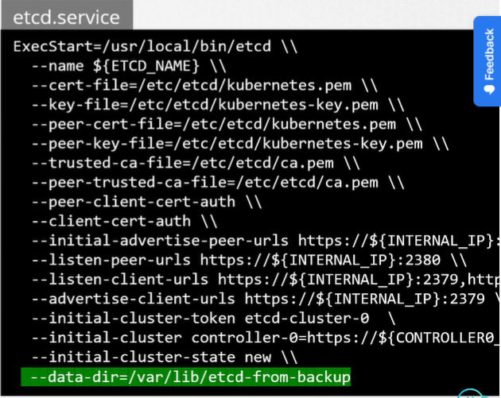

<br>

При создании объектов в кластере мы можем использовать как императивный, так и декларативный подходы. Если вы хотите сохранить свою конфигурацию, более предпочтительным является декларативный подход. Хорошей практикой является хранение object definition файлов в репозитории. Репозиторий в свою очередь должен бекапироваться.

Но, не смотря на то, что декларативный подход является предпочтительным, это вовсе не означает, что все члены вашей команды будут его придерживаться. Что если кто-то из коллег создаст объект императивным способом без документирования этой информации где-либо?

Более подходящий способ для бекапирования конфигурации ресурсов - использовать запрос к apiserver с помощью утилиты kubectl или прямым вызовом API.

Сохранить конфигурацию всех Deployments, Services и Pods во всех namespace: `kubectl get all --all-namespaces -o yaml > all-deploy-services.yaml`.

И это только для некоторых resource groups. Существует множество других resource groups, которые должны учитываться. Для существует инструмент *Velero*.

Перейдем к etcd. Etcd хранит информацию о состоянии нашего кластера, его нод, каждого ресурса созданного в нем. Вместо бекапирования ресурсов описанного в предыдущем подходе, вы можете выбрать бекапирование самого etcd-сервера.

Etcd-кластер располагается на master-нодах. При конфигурировании etcd мы указываем путь, где будут храниться все данные. Эта директория может быть настроена для бекапа с помощью вашего инструмента бекапирования.

<br>

Также у etcd есть встроенное решения для создания snapshot-ов.

Создать snapshot БД etcd: `ETCDCTL_API=3 etcdctl snapshot save snapshot.db`. Файл `snapshot.db` будет создан в текущей директории. Если нужно создать файл в другом каталоге, укажите полный путь.

Посмотреть статус бекапа: `ETCDCTL_API=3 etcdctl snapshot status snapshot.db`.

Для восстановление кластера из бекапа сначала нужно остановить kube-apiserver: `service kube-apiserver stop`, т.к. процесс восстановления потребует рестарта etcd-кластера, а kube-apiserver зависит от него.

Затем выполняем команду: `ETCDCTL_API=3 etcdctl snapshot restore snapshot.db --data-dir=/var/lib/etcd-from-backup`.

Когда etcd восстанавливается из бекапа, он инициализирует новую конфигурацию кластера и настраивает членов etcd как новых членов нового кластера. Это сделано для предотвращения случайного присоединения нового участника к существующему кластеру. При запуске данной команды будет создана новая data directory `/var/lib/etcd-from-backup`.

Затем мы настраиваем конфигурацию etcd для использования новой data directory.

<br>

Затем перезапускаем сервис etcd:

```bash
systemctl daemon-reload
service etcd restart
```

И в конце запускаем kube-apiserver: `service kube-apiserver start`. После этого кластер должен вернуться в исходное состояние.

Для всех etcd-команд нужно указывать файлы сертификатов для аутентификации, endpoint для etcd-кластера и ключ.

```bash
ETCDCTL_API=3 etcdctl \
  snapshot save snapshot.db \
  --endpoints=https://127.0.0.1:2379 \
  --cacert=/etc/etcd/ca.crt \
  --cert=/etc/etcd/etcd-server.crt \
  --key=/etc/etcd/etcd-server.key
```

Если вы используете managed K8s окружение, то у вас может не быть доступа к etcd-кластеру. В этом случае бэкап с помощью запроса к kube-apiserver возможно будет более подходящим решением.

Помощь по командам etcd: `etcdctl snapshot save -h`. Плюс можно задать переменную окружения сразу для всей сессии: `export ETCDCTL_API=3`.

Узнать версию etcd в кластере можно двумя способами. Посмотреть логи pod-а:

`kubectl -n kube-system logs etcd-controlplane | grep -i 'etcd-version'`

Либо посмотреть версию образа: `kubectl -n kube-system describe pod etcd-controlplane | grep Image:`.

Посмотреть по какому адресу доступен etcd для подключения: `kubectl describe pod etcd-controlplane -n kube-system` и смотрим на опцию `--listen-client-urls`.

Посмотреть где лежит серверный сертификат etcd: `kubectl describe pod etcd-controlplane -n kube-system` и смотрим на опцию `--cert-file`.

Посмотреть где лежит серверный сертификат etcd: `kubectl describe pod etcd-controlplane -n kube-system` и смотрим на опцию `--trusted-ca-file`.

Сделать snapshot можно непосредственно с master-ноды:

```bash
etcdctl --endpoints=https://[127.0.0.1]:2379 \
--cacert=/etc/kubernetes/pki/etcd/ca.crt \
--cert=/etc/kubernetes/pki/etcd/server.crt \
--key=/etc/kubernetes/pki/etcd/server.key \
snapshot save /opt/snapshot-pre-boot.db
```

Восстановить из snapshot сервер etcd: `ETCDCTL_API=3 etcdctl snapshot restore /opt/snapshot-pre-boot.db --data-dir /var/lib/etcd-from-backup`.

В опции `--data-dir` указываем путь до нового каталога `/var/lib/etcd-from-backup`, который будет создан автоматически.

Обновляем файл манифеста `/etc/kubernetes/manifests/etcd.yaml`. А именно, обновляем значение для опции `--data-dir=/var/lib/etcd-from-backup`

Мы восстановили snapshot etcd по новому пути на master-ноде - `/var/lib/etcd-from-backup`, поэтому нужно изменить значение `hostPath` для volume под названием `etcd-data`:

```yaml
  volumes:
  - hostPath:
      path: /var/lib/etcd-from-backup
      type: DirectoryOrCreate
    name: etcd-data
```

Теперь каталог `/var/lib/etcd` в контейнере будет ссылаться на каталог `/var/lib/etcd-from-backup` на master-ноде.

После обновления манифеста etcd pod будет автоматически пересоздан, т.к. это статический pod из каталога `/etc/kubernetes/manifests`.


Note 1: As the ETCD pod has changed it will automatically restart, and also kube-controller-manager and kube-scheduler. Wait 1-2 to mins for this pods to restart. You can run the command: watch "crictl ps | grep etcd" to see when the ETCD pod is restarted.

Note 2: If the etcd pod is not getting Ready 1/1, then restart it by kubectl delete pod -n kube-system etcd-controlplane and wait 1 minute.

Note 3: This is the simplest way to make sure that ETCD uses the restored data after the ETCD pod is recreated. You don't have to change anything else.


If you do change --data-dir to /var/lib/etcd-from-backup in the ETCD YAML file, make sure that the volumeMounts for etcd-data is updated as well, with the mountPath pointing to /var/lib/etcd-from-backup (THIS COMPLETE STEP IS OPTIONAL AND NEED NOT BE DONE FOR COMPLETING THE RESTORE)

---
---

This means that ETCD is set up as a *Stacked ETCD Topology* where the distributed data storage cluster provided by etcd is stacked on top of the cluster formed by the nodes managed by kubeadm that run control plane components.