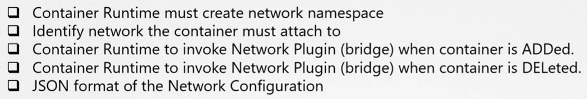
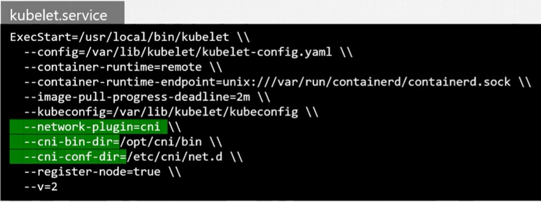

Как мы узнали из предыдущих лекций, CNI определяет набор обязанностей для container runtime.

 

Где мы указываем CNI плагины, которые будет использовать K8s? CNI плагин должен вызываться компонентом K8s, отвечающим за создание контейнеров. Потому что этот компонент затем должен вызвать соответствующий сетевой плагин после того как контейнер создан.

CNI плагин конфигурируется в сервисе kubelet на каждой ноде кластера. Если вы посмотрите на файл сервиса kubelet, то увидите опцию `--network-plugin=cni`.

 

Еще один способ посмотреть эту же информацию: `ps -aux | grep kubelet`.