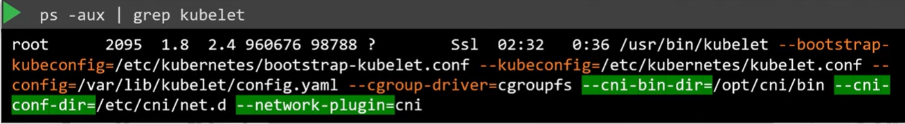

Как мы узнали из предыдущих лекций, CNI определяет набор обязанностей для container runtime.

 

Где мы указываем CNI плагины, которые будет использовать K8s? CNI плагин должен вызываться компонентом K8s, отвечающим за создание контейнеров. Потому что этот компонент затем должен вызвать соответствующий сетевой плагин после того как контейнер создан.

CNI плагин конфигурируется в сервисе kubelet на каждой ноде кластера. Если вы посмотрите на файл сервиса kubelet, то увидите опцию `--network-plugin=cni`.

 

Еще один способ посмотреть эту же информацию в запущенном сервисе: `ps -aux | grep kubelet`.

 

Каталог, указанный в параметре `--cni-bin-dir`, содержит бинарные файлы всех поддерживаемых CNI плагинов.

 

Каталог, указанный в параметре `--cni-conf-dir`, содержит набор конфигурационных файлов. Сюда смотрит kubelet, чтобы понять какой плагин должен использоваться.

 

Если здесь находится несколько файлов, kubelet выберет один в алфавитном порядке.

Посмотрим содержимое файла `10-bridge.conf`:

 

Это формат, определенный стандартом CNI для конфигурационного файла плагина. Имя - `mynet`, тип - `bridge`, параметр `isGateway` определяет, должна ли bridge-сеть получить назначенный ей IP-адрес, чтобы она могла действовать как шлюз. `ipMasq` определяет должно ли быть добавлено правило NAT для IP-маскарадинга. Секция `ipam` определяет конфигурацию IP Address Management. Здесь вы задаете подсеть или диапазон IP-адресов, которые будут назначены pod-ам, и любые необходимые маршруты. Тип `host-local` указывает, что IP-адреса управляются локально на хосте, в отличие от DHCP-сервера, поддерживающего их удаленно. Соответственно тип может быть задан `dhcp` для настройки внешнего DHCP-сервера.