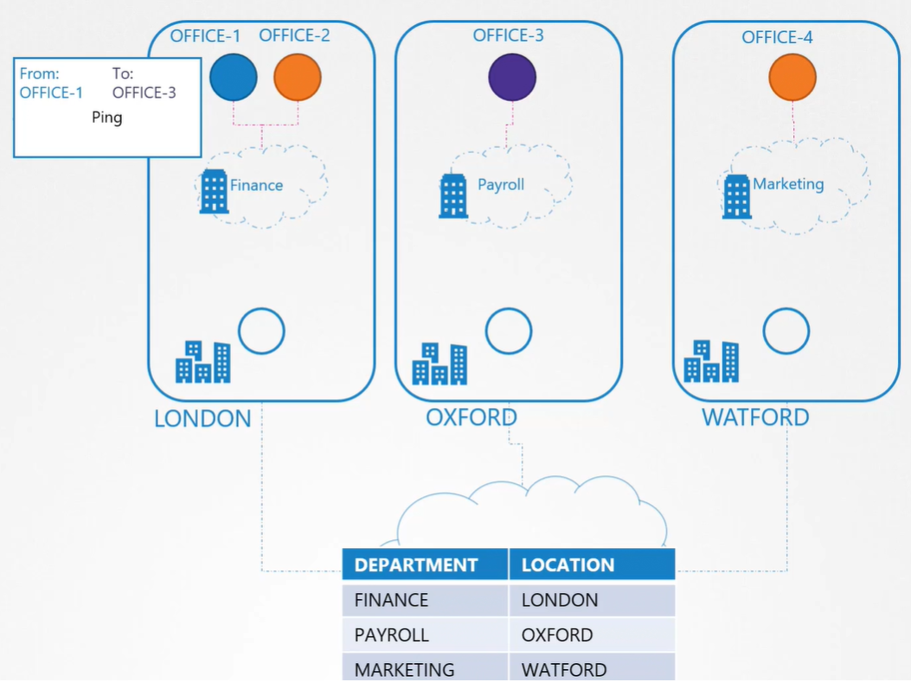
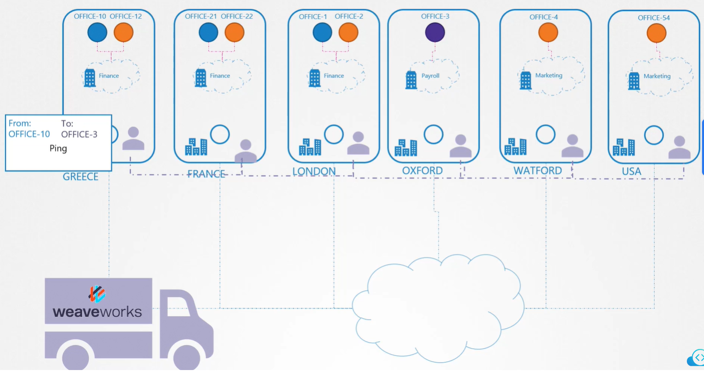
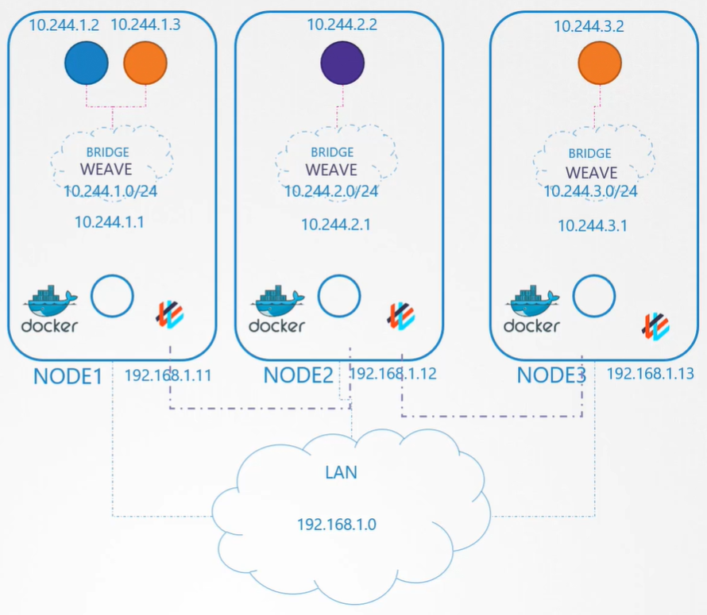
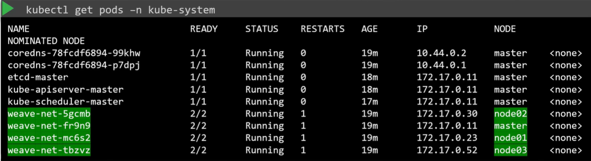

Данная лекция является логическим продолжением урока "Pod Networking".

Сетевое решение, настроенное нами вручную, имеет таблицу маршрутизации, отражающую маппинг какие маршруты прописаны на каких хостах. Когда пакет отправляется от одного pod-а к другому, он выходит в сеть, к маршрутизатору, и находит путь к ноде, на которой находится целевой pod. Это работает для небольших окружений и простых сетей. Но в больших окружениях с сотнями нод в кластере и сотнями pod-ов на каждой ноде это непрактично. Таблица маршрутизации может не поддерживать такое большое количество записей.

Давайте посмотрим на K8s-кластер как на компанию, а на ноды как на ее филиалы (office sites). В каждом филиале у нас есть различные отделы (departments - finance, payroll, marketing), а в каждом отделе есть различные бюро (в этой аналогии pod-ы). Кто-то из бюро-1 хочет отправить пакет в бюро-3 и передает его курьеру (office boy). Все, что он знает, это то, что пакет нужно доставить в бюро-3, и ему все равно, кто и как его перевезет. Курьер берет пакет, садится в свою машину, смотрит целевой адрес в GPS и, используя указатели на улицах, находит путь в филиал назначения. Доставляет пакет в отдел расчета заработной платы, который в свою очередь перенаправляет пакет в бюро-3. В данной ситуации это хорошо работает.

<br>

Далее мы расширяемся в другие регионы и страны, и этот процесс больше не работает. Для курьера тяжело отслеживать множество маршрутов в большое количество офисов, расположенных в разных странах, и конечно он теперь не сможет ездить во все эти офисы самостоятельно. И мы решаем передать почтовую и транспортную деятельность на аутсорсинг компании, которая делает это лучше всего.

Первым делом привлеченная транспортная компания размещает своих агентов в каждом филиале нашей компании. Эти агенты отвечают за управление всей транспортной деятельностью между филиалами. Они также продолжают взаимодействовать друг с другом, у них хорошие связи и все они знают обо всех филиалах, отделах внутри филиалов, бюро внутри отделов.

<br>

Когда отправляется пакет, например из бюро-10 в бюро-3, экспедитор (shipping agent) в этом филиале перехватывает его и смотрит на адрес целевого бюро. Он точно узнает в каком филиале и отделе находится целевое бюро через свою небольшую внутреннюю сеть со своими коллегами (peers), находящимися в других филиалах. Затем он помещает исходный пакет в свой собственный новый пакет с адресом назначения равным адресу филиала назначения и отправляет его. Как только пакет прибывает в точку назначения, он снова перехватывается агентом этого филиала. Он открывает пакет, извлекает из него оригинальный пакет и доставляет его в нужный отдел.

Возвращаясь обратно в кластер K8s с установленным weave, тот разворачивает своих агентов на каждой ноде. Агенты взаимодействуют друг с другом для обмена информацией касательно нод, находящихся на них pod-ов и сетей. Каждый агент (или peer) хранит топологию всей системы, таким образом зная о pod-ах и их IP-адресах на других нодах. Weave создает собственные bridge-ы на нодах и называет их `weave`. Затем назначает IP-адрес каждой сети.

<br>

Важно помнить, что один pod может быть подключен к нескольким bridge-сетям. Например, у вас может быть pod, подключенный к weave bridge и к docker bridge одновременно. Какой путь выберет пакет для достижения точки назначения зависит от маршрута, настроенного в контейнере. Weave гарантирует, что pod получит правильный маршрут, сконфигурированный для достижения агента. Агент затем позаботится об остальных pod-ах.

Когда пакет отправляется от одного pod-а (source `10.244.1.2`) к другому pod-у (destination `10.244.3.2`), находящемуся на другой ноде, weave перехватывает пакет и определяет, что он в отдельной сети. Затем weave инкапсулирует исходный пакет в новый пакет с новым source (IP первой ноды) и destination (IP третьей ноды) и посылает его по сети. С другой стороны weave-агент получает пакет, декапсулирует его и маршрутизирует пакет к нужному pod-у.

Как мы можем развернуть weave? Weave и weave-peers могут быть развернуты вручную как сервисы или демоны на каждой ноде кластера. А если K8s-кластер уже установлен, то более легкий способ сделать это - развернуть weave в виде pod-ов. Как только базовая система K8s готова - развернуты ноды, правильно настроена сеть между ними, установлены базовые компоненты control plane, weave может быть развернут в кластере всего с помощью одной команды:

`kubectl apply -f https://github.com/weaveworks/weave/releases/download/v2.8.1/weave-daemonset-k8s.yaml`

С ее помощью будут установлены все необходимые для weave компоненты. Важно отметить, что weave peers разворачиваются в виде DaemonSet. DaemonSets гарантирует, что один pod данного типа будет развернут на всех нодах кластера. Если вы развернули кластер с помощью инструмента kubeadm и weave-плагина, то можете увидеть weave peers в виде pod-ов, развернутых на каждой ноде.

<br>


[Ссылка](https://kubernetes.io/docs/concepts/cluster-administration/addons/) на документацию K8s по установке сетевых плагинов.

При установке weave нужно проверить, что опция `IPALLOC_RANGE` в манифесте DaemonSet weave совпадает со значением опции `--cluster-cidr` в конфигурации kube-proxy. Для этого смотрим описание pod-а kube-proxy: `kubectl -n kube-system describe po kube-proxy-nlv79`.

```yaml
    Command:
      /usr/local/bin/kube-proxy
      --config=/var/lib/kube-proxy/config.conf
      --hostname-override=$(NODE_NAME)
...
    Mounts:
      /var/lib/kube-proxy from kube-proxy (rw)
...
Volumes:
  kube-proxy:
    Type:      ConfigMap (a volume populated by a ConfigMap)
    Name:      kube-proxy
    Optional:  false
```

Смотрим откуда монтируется конфиг kube-proxy `config.conf` - из ConfigMap `kube-proxy`.

Смотрим описание ConfigMap: `kubectl -n kube-system describe cm kube-proxy` и ищем значение опции `clusterCIDR: 10.244.0.0/16`.

Скачиваем манифест weave: `wget https://github.com/weaveworks/weave/releases/download/v2.8.1/weave-daemonset-k8s.yaml`.

И прописываем для контейнера `weave` необходимую переменную `IPALLOC_RANGE` (по умолчанию ее там нет):

```yaml
      containers:
        - name: weave
          env:
            - name: IPALLOC_RANGE
              value: 10.244.0.0/16
```

Применяем манифест через команду apply, наслаждаемся.