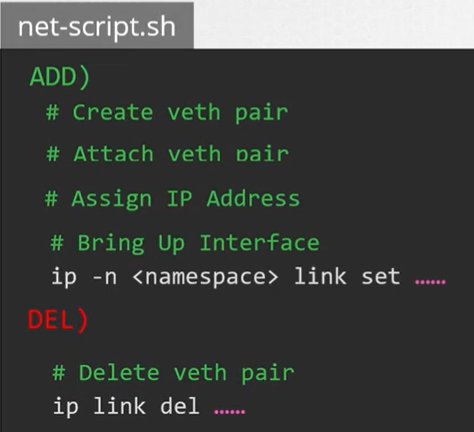
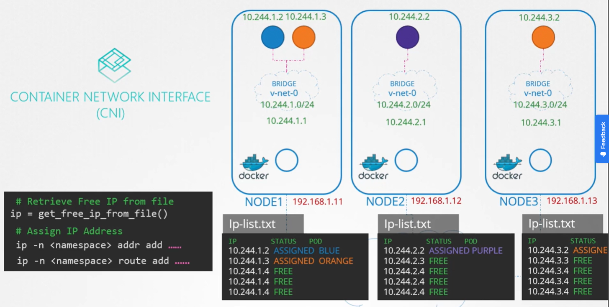

Данная секция не касается назначения IP-адресов на ноды в сети. Мы можем управлять этим процессом самостоятельно либо с помощью стороннего IPAM решения.

В этом уроке рассказывается каким образом виртуальным bridge-сетям и нодам назначается IP-подсеть, а также как IP-адреса назначаются pod-ам. Где хранится эта информация и кто гарантирует, что не будут назначены дублирующиеся IP-адреса? Начнем с "кто" и обратимся к CNI, который задает стандарты. CNI говорит, что обязанность CNI плагина, network solution provider позаботиться о назначении IP-адресов контейнерам.

Вспомним базовый плагин, который написали ранее. Мы на самом деле позаботились о назначении IP-адресов в этом плагине.

<br>

Там была секция назначения IP-адреса для container network namespace.

```bash
# Assign IP Address
ip -n <namespace> addr add ...
ip -n <namespace> route add ...
```

Но как нам управлять этими IP-адресами? K8s не волнует как мы это делаем. Нам просто нужно сделать это, убедившись, что мы не назначаем дублирующиеся IP-адреса и правильно управляем ими.

Легкий способ сделать это - хранить список IP-адресов в файле и убедиться, что в нашем скрипте есть необходимый код для правильного управления этим файлом. Этот файл размещается на каждом хосте и управляет IP-адресами pod-ов на этих нодах.

<br>

```bash
# Retrieve Free IP from file
ip = get_free_ip_from_file()
# Assign IP Address
ip -n <namespace> addr add ...
ip -n <namespace> route add ...
```

Вместо того, чтобы кодить это самостоятельно в нашем скрипте, CNI поставляется с двумя встроенными плагинами, которым вы можете передать эту задачу на аутсорсинг. В данном случае плагин `host-local` реализует подход, которого мы придерживаемся для управления IP-адресами локально на каждом хосте. Но нашей обязанностью все еще является вызов этого плагина в скрипте.

```bash
# Invoke IPAM host-local plugin
ip = get_free_ip_from_host_local()
# Assign IP Address
ip -n <namespace> addr add ...
ip -n <namespace> route add ...
```

Либо мы можем сделать скрипт динамическим для поддержки различных типов плагинов.