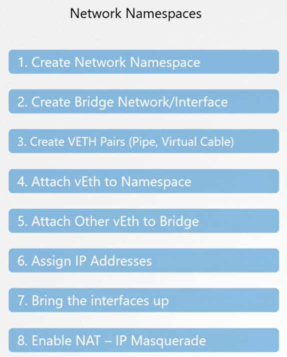

В предыдущих уроках мы узнали как работает Network Namespace, а именно:
- как создать изолированное окружение Network Namespace в системе
- как подключить несколько таких namespaces через bridge-сеть
- как создать виртуальный кабель (или pipe) с виртуальными интерфейсами на каждом конце
- как подключить каждый конец этого кабеля к namespace и к bridge
- как назначить ip-адрес на интерфейс и включить его
- как включить NAT или IP-маскарадинг для взаимодействия с внешним миром

 

Далее мы узнали как это делает Docker
