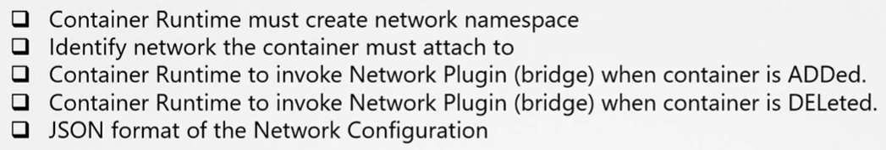
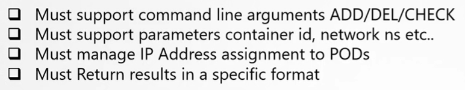

В предыдущих уроках мы узнали как работает Network Namespace, а именно:
- как создать изолированное окружение Network Namespace в системе
- как подключить несколько таких namespaces через bridge-сеть
- как создать виртуальный кабель (или pipe) с виртуальными интерфейсами на каждом конце
- как подключить каждый конец этого кабеля к namespace и к bridge
- как назначить ip-адрес на интерфейс и включить его
- как включить NAT или IP-маскарадинг для взаимодействия с внешним миром

<br>

Далее мы узнали как это делает Docker - похожим образом, но за исключением других паттернов именования. Другие container solutions решают сетевые проблемы (challenges) схожими способами. Если все мы решаем одни и те же сетевые проблемы путем исследования и, наконец, определения аналогичного подхода  с небольшими различиями, зачем разрабатывать похожие решения по нескольку раз? Почему бы не создать единый стандартный подход, следовать которому может каждый? Итак, мы берем все идеи от различных networking solutions и перемещаем все сетевые "куски" в единую программу (или код). И т.к. он предназначен для bridge-сети, то назовем его *bridge*. Мы создали программу или скрипт, которая выполняет все необходимые задачи по подключения контейнера к bridge-сети.

Например вы можете запустить эту программу, используя ее имя `bridge` и указать, что хотите добавить контейнер в определенный network namespace:

`bridge add 507c61b161b8 /var/run/netns/507c61b161b8`

Программа `bridge` позаботится обо все остальном, а container runtime environment таким образом освобождается от этих задач.

Например, когда K8s или rkt создают новый контейнер, то они вызывают программу `bridge` и передают ей ID контейнера и namespace, чтобы получить в итоге настроенную сеть для этого контейнера.

Что если вы захотите создать подобную программу для себя, возможно для нового типа сети? Какие команды и аргументы она должна поддерживать? Как нам убедиться, что созданная программа будет работать корректно с container runtimes? Как нам узнать, что container runtime, например K8s, будет вызывать нашу программу корректно?

Вот где нам нужен определенный стандарт. Стандарт, который определяет как программа должна выглядеть, каким образом container runtime будет ее вызывать. Чтобы каждый мог следовать единому набору стандартов и разрабатывать решения, работающие во всех runtimes.

И вот тут нужен *Container Network Interface*. CNI - это набор стандартов, который определяет каким образом должны разрабатываться программы для решения сетевых проблем в container runtime environment. Эти программы упоминаются как плагины. В нашем примере программа `bridge`, о которой мы упоминали, по сути является плагином для CNI. CNI определяет как плагин должен разрабатываться и каким образом container runtimes будут его вызывать. CNI определяет набор обязанностей для container runtimes и плагинов.

CNI определяет, что container runtime отвечает за создание network namespace для каждого контейнера.

Container runtime должна идентифицировать сети, к которым подключается контейнер.

Container runtime должна затем вызывать плагин, когда контейнер создается с помощью команды `ADD`, а также вызывать плагин, когда контейнер удаляется с помощью команды `DEL`.

CNI также определяет как настроить сетевой плагин в container runtime environment с помощью JSON-файла.

<br>

CNI определяет, что плагин должен поддерживать аргументы командной строки `ADD`, `DEL`, `CHECK`, а также принимать такие параметры, как ID контейнера, network namespace и др.

Плагин должен позаботиться о назначении pod-ам IP-адресов и каких-либо связанных маршрутов, требующихся контейнерам для соединения с другими контейнерами в сети.

Результаты по итогу должны быть определены в специфическом формате.

<br>

Пока плагины и container runtimes следуют этим стандартам, они могут жить вместе в гармонии.

Любая runtime должна иметь возможность работать с любым плагином. CNI сразу поставляется с набором поддерживаемых плагинов, таких как BRIDGE, VLAN, IPVLAN, MACVLAN, WINDOWS, а также IPAM-плагинов, таких как host-local и DHCP.

Также существуют другие плагины доступные от third party организаций - Weave, Flannel, Cilium, VMware NSX, Calico, Infoblox и др. Все упоминавшиеся ранее container runtimes обеспечивают выполнение стандартов CNI. Поэтому любая runtime может работать с любым из этих плагинов. Но есть одна runtime, которой нет в этом списке - Docker.

Docker не следует стандартам CNI, он имеет свой собственный набор стандартов, известный как CNM (Container Network Model). Это другой стандарт, цель которого решать container networking challenges схожим с CNI образом, но с некоторыми отличиями. Из-за отличий эти плагины изначально не интегрируются с Docker. Это значит, что вы не можете запустить Docker-контейнер и указать для сетевого плагина использовать CNI и один из указанных выше плагинов:

`docker run --network=cni-bridge nginx`

Но это не значит, что вы вовсе не можете использовать Docker вместе с CNI. Существует workaround.

Например, создать контейнер без какой-либо сетевой конфигурации и затем самому вручную вызвать bridge-плагин.

```bash
docker run --network=none nginx
bridge add 507c61b161b8 /var/run/netns/507c61b161b8
```

Примерно так и делает K8s. Когда K8s создает Docker-контейнер, он создает его в сети `none`, а затем вызывает настроенный CNI плагин, который позаботится об оставшейся конфигурации.