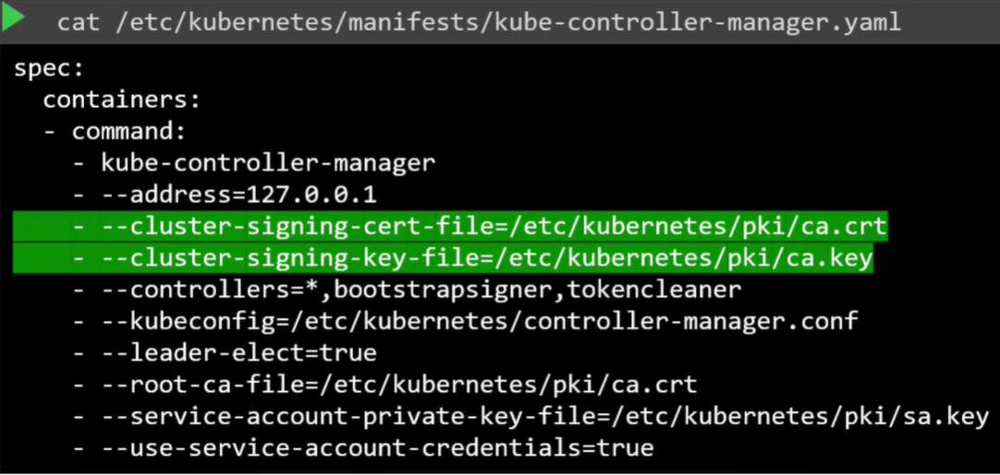

Я, как администратор кластера, в процессе его установки развернул также сервер CA и пачку сертификатов для различных компонентов. Затем запустил сервисы с использованием правильных сертификатов и сейчас запущено и работает. У меня, как у единственного администратора и пользователя кластера, есть свои собственные сертификат и ключ.

В команду пришел новый администратор. Ему нужен доступ в кластер. Я должен выдать ему пару ключ/сертификат для доступа в кластер. Новый админ создает свой собственный приватный ключ, генерирует CSR и посылает его мне. Т.к. только я являюсь администратором, то беру этот CSR и помещаю его на сервер CA, подписываю с помощью приватного ключа CA и корневого сертификата, тем самым генерируя новый сертификат и отправляю обратно новому администратору. Теперь у него есть собственная валидная пара ключ/сертификат, которую он может использовать для доступа к кластеру.

Сертификаты имеют срок годности, после определенного промежутка времени срок их действия заканчивается. Каждый раз, когда они "протухают", нам нужно по аналогичной процедуре генерировать новый CSR и подписывать его с помощью CA. Таким образом мы продолжаем ротацию файлов сертификатов.

Что такое сервер CA и где находится, когда речь идет о K8s? CA на самом деле представляет собой всего лишь пару файлов ключ/сертификат, которые мы сгенерировали. Любой получивший доступ к этой паре файлов сможет подписать любой сертификат для K8s окружения. Он сможет создать столько пользователей, сколько захочет, и с какими угодно привилегиями. Соответственно эти файлы должны быть защищены и храниться в безопасном окружении. Скажем, мы положили их на полностью безопасный сервер. Теперь этот сервер становится вашим сервером CA. Файлы ключа/сертификата безопасно хранятся на этом сервере и только на нем. Каждый раз, когда вы хотите подписать сертификат, то можете сделать это, только зайдя на этот сервер.

На данный момент мы имеем сертификаты, лежащие на самой master-ноде K8s. Соответственно master-нода также является нашим сервером CA.

Инструмент kubeadm делает аналогично - создает пару файлов CA и сохраняет их непосредственно на master-ноде. Все это время мы вручную подписывали CSR. Но с ростом численности команды нам нужен более подходящий автоматизированный способ управления CSR-ми и ротации сертификатов, когда они истекают. K8s имеет встроенный *Certificates API*, который может делать это за вас. С его помощью вы можете послать CSR напрямую в K8s с помощью вызова API.

В этот раз, когда администратор получает CSR, вместо того, чтобы логиниться на master-ноду и самостоятельно подписывать сертификат, он создает K8s API объект называющийся *CertificateSigningRequest*. Как только объект создан, все CSR становятся видны администраторам кластера. Запросы могут быть легко рассмотрены и одобрены с помощью kubectl-команды. Этот сертификат затем может быть извлечен и передан пользователю.

Посмотрим как это делается.

- Пользователь jane создает ключ: `openssl genrsa -out jane.key 2048`
- Затем с помощью ключа генерирует CSR, содержащий ее имя: `openssl req -new -key jane.key -subj "/CN=jane" -out jane.csr`
- Посылает созданный CSR администратору
- Администратор берет ключ и создает объект CertificateSigningRequest в виде обычного манифест файла

```yaml
apiVersion: certificates.k8s.io/v1beta1
kind: CertificateSigningRequest
metadata:
  name: jane
spec:
  groups:
  # перечисляются группы, в которых будет состоять пользователь
  - system:authenticated
  usages:
  # перечисляются варианты использования учетной записи
  - digital signature
  - key encipherment
  - server auth
  request:
  # здесь указывается содержимое файла jane.csr, закодированное в формате base64
        LS0tLS1CRUdJTiBDRVJUSUZJQ0FURSBSRVFVRVNULS0tLS0KTUlJQ1ZEQ0NBVHdDQVFBd0R6RU5NQXNHQTFVRUF3d0VhbUZ1WlRDQ0FTSXdEUVlKS29aSWh2Y05BUUVCQlFBRApnZ0VQQURDQ0FRb0NnZ0VCQU5JUDl0M3NsSDNWM3JpWWdRTUZmejNTNTlsQW9Qay8xOWlRWXRKMzF3OG9qdGhlCkZYZEYrZzQ4VEowc0tFSzBqV2VUdFZTOEtseVZWWDVZUEV5RlpyaWRhWUpPRmFzeDYzdWFWRVNPcGl1RWNNeGIKTW1EMXFsbG84T0hTVHNRTWRQakdLcFlFeWczdXZzQzlqcjdDckxnNW9xKzdFY01JOTI3U3JDMFVVVmFvZnk4QQpYYkpTV1laWlZZeEptdUNLYSswa1ZxdllqS1lFQ05EcmpCdXE4UDk0ZEYzRW9mNGE1SGkxVXhDQTRJNlE1dlVYCnA3dER3eHd2L3BwWmVIaUVMcE9Ed3p3UTlBdTVxU09jUkp2UmlrOXppM2pqQUowaXdCRDVCazBTbUJ6NlFnY3QKdDBrTVhRZGRxd1ZBUlQxNTk4bWVZZndOUVlWbDkycnN0NStyZ01FQ0F3RUFBYUFBTUEwR0NTcUdTSWIzRFFFQgpDd1VBQTRJQkFRQTBtSGtFM012NGFvWjlaUldqcitIWGQrcmVpbXBPR0kzVEl2WFUveEVCbWJPVTNvSmt0RmxPCnBMVCs4VWRjeHB1UTVjYndGMXE2ZmlhN25tWm5GVTc5Y0ZKaUF4WTlNekFmeEtybnlJMnlvVmxCaU16S3EwYWwKbGdyZ01FekhqaXVzc3NHeUROL09zeEIvazlzenc2Y003b0ptUGlsSThzMFJuTW51akREUUNybUkrMVhSS3JDWQpnUS9TVmdZK3Y0NDArVDllUVQ5R2FGMlBIQWFuVkVnbkVTQXBMZHhucFRvUnhtWU9DdGQzNW5oenBrdnViSkVKClN4TWdKMFJJRkdvWXZtSElvOHQ1cnVsUHJ3VStEL2lrK29oSEN1N0I3TXlTcmhWN3BHcXo2SHBoVCswMCtKNm0KR3R2TE9idjhPRGp6Sm13Smg0b3dXNXNFQzdUNVNwbXUKLS0tLS1FTkQgQ0VSVElGSUNBVEUgUkVRVUVTVC0tLS0tCg==
```

Закодировать содержимое CSR в base64: `cat jane.csr | base64 | tr -d "\n"`. Здесь команда `tr -d "\n"` удаляет (-d=delete) символы переноса строки.

Либо еще вариант: `cat jane.csr | base64 -w 0`. Здесь опция `-w 0` отключает перенос строк.

Как только объект CertificateSigningRequest создан, все CSR становятся видны администраторам кластера с помощью команды: `kubectl get csr`.

Определите новый запрос и примите его командой: `kubectl certificate approve jane`. K8s подпишет сертификат с помощью пары ключ/сертфикат CA и сгенериует сертификат для пользователя. Далее сертификат может быть извлечен и передан пользователю.

Либо мы также можем и отклонить запрос: `kubectl certificate deny agent-smith`.

Посмотреть сертификат можно в формате YAML: `kubectl get csr jane -o yaml`, поле `certificate`. Но как и прежде он будет закодирован в формате base64, поэтому нужно его раскодировать командой: `echo "LS0...Qo" | base64 --decode`.

Теперь когда мы увидели как все работает, посмотрим кто может делать все это за нас. Какой из control plane компонентов отвечает за все операции, связанные с сертификатами? Это controller manager. Если вы рассмотрите этот компонент более детально, то увидите, что он содержит в себе такие контроллеры как *csr-approving*, *csr-signing* и др.

Мы знаем, что если кто-то должен подписывать сертификаты, то ему нужны корневой сертификат и приватный ключ CA сервера. Конфигурация сервиса kube-controller-manager имеет две опции, где вы можете их указать.

<br>