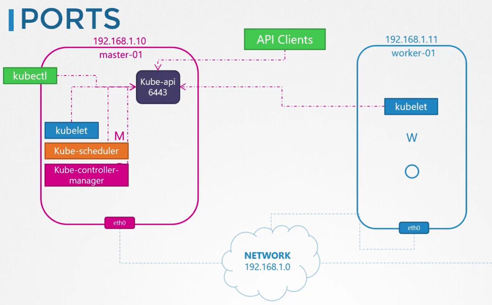

Каждая нода кластера должны иметь минимум один интерфейс, подключенный к сети.

Каждый интерфейс должен иметь настроенный адрес.

Хосты должны иметь уникальные hostname, а также уникальные MAC-адреса. Это важно понимать, особенно если вы создаете ВМ путем клонирования уже существующей.

Также должны быть открыты некоторые порты.

Master должен принимать подключения на порт `6443` (порт API-сервера). Worker-ноды, утилита kubectl, внешние пользователи и все остальные компоненты control plane обращаются к API-серверу через этот порт.

 

Kubelet на master и worker-нодах слушает на порт `10250`. Важно отметить, что kubelet может быть представлен также и на master-нодах.

Для kube-scheduler требуется открытый порт `10259`.

Для kube-controller-manager требуется открытый порт `10257`.

Worker-ноды выставляют Services для внешнего доступа в диапазоне `30000 - 32767`. Соответственно этот диапазон портов должен быть открыт.

И наконец ETCD-сервер слушает на порту `2379`. Если у вас несколько master-нод, все эти порты должны быть открыты на каждой ноде. Также должен быть открыт порт `2380`, чтобы клиенты ETCD могли взаимодействовать друг с другом.

Ссылка на [документацию](https://kubernetes.io/docs/reference/networking/ports-and-protocols/)