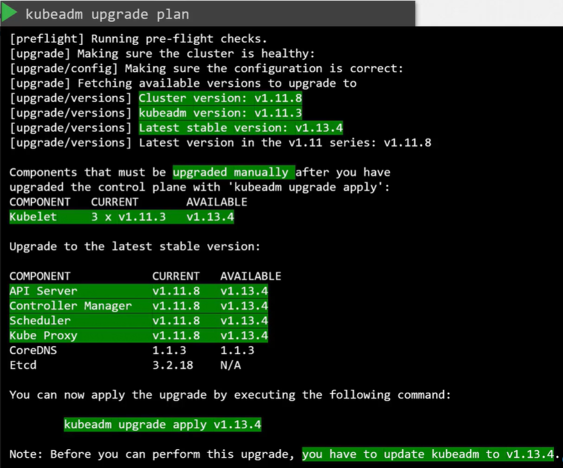
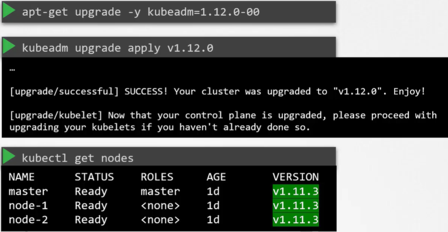
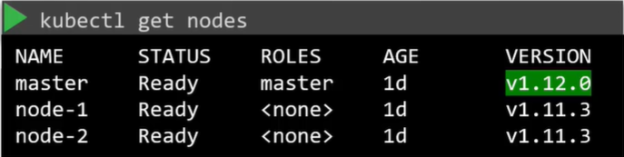

Не будем пока рассматривать зависимые внешние компоненты, такие как ETCD и CoreDNS, а сосредоточимся на core control plane компонентах. Они необязательно должны быть одинаковой версии, их версии могут различаться.

Т.к. kube-apiserver является главным компонентом control plane и другие компоненты обращаются к нему, то ни один из них НЕ может иметь версию выше, чем у kube-apiserver. Controller-manager и kube-scheduler могут быть на одну версию ниже, а kubelet и kube-proxy могут быть на две версии ниже, чем kube-apiserver.

Исключением является утилита kubectl, она может быть как на одну версию выше, так и на одну версию ниже, чем kube-apiserver.

<br>

Такой допустимый перекос в версиях позволяет нам выполнять live upgrade. Мы можем обновлять компонент за компонентом, если требуется.

K8s в любой момент поддерживает только последние три minor версии. Например, если последний выпущенный релиз 1.12, тогда K8s поддерживает версии 1.12, 1.11 и 1.10.

Можем ли обновиться например сразу с релиза 1.10 до 1.13? Нет. Рекомендуемый подход - обновлять одну minor версию за раз, с 1.10 до 1.11, с 1.11 до 1.12, с 1.12 до 1.13.

<br>

Процесс обновления зависит от того каким образом был развернут ваш кластер. Если ваш кластер является managed K8s кластером, развернутым в одном из облачных провайдеров, то процесс обновления выполняется всего в несколько кликов. Если вы разворачивали кластер с помощью инструмента kubeadm, то он может помочь спланировать обновление кластера - `kubeadm upgrade plan` и `kubeadm upgrade apply`.

Если вы разворачивали кластер с нуля ("The hard way"), тогда придется вручную обновлять различные компоненты кластера.

В этом уроке мы рассмотрим вариант с kubeadm.

Предположим у нас есть production кластер с master и worker-нодами, с  нагрузкой и активными пользователями. Ноды и компоненты кластера версии 1.10.

Обновление кластера включает в себя два главных шага. Сначала вы обновляете master-ноды, а затем worker-ноды. В процессе обновления master-ов компоненты control plane, такие как apiserver, scheduler и controller-managers кратковременно становятся недоступны. Однако недоступность master-ов не оказывает влияния на worker-ноды и приложения в кластере. Все нагрузки находящиеся на worker-нодах продолжают обслуживать пользователей в обычном режиме. Т.к. master недоступен, то недоступен и весь функционал управления. Вы не сможете получить доступ к кластеру с помощью kubectl или других K8s API. Вы не сможете разворачивать новые приложения, а также изменять или удалять существующие. Controller-managers также не функционируют. Если какой-либо pod упадет, новый pod не будет создан. Но пока ноды и pod-ы в запущенном состоянии, влияния на пользователей не будет. Как только обновление будет закончено и кластер вернется в строй, он будет нормально функционировать. Теперь мы имеем master и его компоненты версии 1.11 и worker-ы версии 1.10. Это поддерживаемая конфигурация.

Теперь время обновлять worker-ноды. Существуют различные стратегии обновления worker-нод. Одна из них заключается в обновлении всех worker-ов за раз. Однако при таком способе все приложения уходят оффлайн и пользователи не смогут получить к ним доступ. Соответственно данный подход требует простоя.

Вторая стратегия - обновлять по одной ноде за раз. Сначала мы обновляем первый worker, нагрузка при этом переезжает на вторую и третью ноды. И далее по аналогии обновляются оставшиеся ноды. По такой же схеме мы обновляем ноды с версии 1.11 до 1.12 и с 1.12 до 1.13.

Третья стратегия заключается в добавлении новых нод со свежей версией K8s в кластер. Это особенно удобно в облачной инфраструктуре, когда вы легко можете создавать новые ноды и выводить старые. Новая нода добавляется в кластер, на нее перемещается нагрузка со старой ноды, и затем старая нода удаляется. И так до тех пор, пока все ноды не станут актуальной версии.

Команда `kubeadm upgrade plan` даст нам много полезной информации:

<br>

Важно запомнить - kubeadm не устанавливает и не обновляет компонент kubelet. Сначала нужно обновить сам инструмент kubeadm перед обновлением кластера. Утилита kubeadm следует той же версии, что и версия K8s.

Наша цель обновить кластер с версии 1.11 до 1.13, но т.к. мы можем обновлять только одну minor версию за раз, то сначала нужно обновиться до версии 1.12.

Сначала обновляем саму утилиту kubeadm: `apt-get upgrade -y kubeadm=1.12.0-00`.

Далее выполняем обновление кластера: `kubeadm upgrade apply v1.12.0`. Команда спулит необходимые образы и обновит компоненты кластера.

Если по завершении обновления мы выполним команду: `kubectl get nodes`, то увидим, что версия master-ноды все еще 1.11.

<br>

Такое поведение объясняется тем, что данная команда показывает версию kubelet на каждой ноде, зарегистрированной в apiserver, но не версию самого apiserver.

Следующий шаг - обновление kubelet. Важно запомнить, в зависимости от способа деплоя кластера kubelet может быть установлен, а может быть и НЕ установлен на master-нодах. В данном примере кластер развернутый с помощью kubeadm имеет kubelet на master-нодах, который используется для запуска компонентов control plane в виде pod-ов на master-ах.

Однако, когда в следующих уроках мы будем разворачивать кластер с нуля, мы не будем устанавливать kubelet на master-ноды. Поэтому при запуске команды `kubectl get nodes` мы не увидим в списке master-ноду.

Итак, следующий шаг - обновление kubelet на master-нодах, если он на них установлен. Для этого используем команду: `apt-get upgrade -y kubelet=1.12.0-00`. После обновления пакета перезапускаем сервис: `systemctl restart kubelet`. Теперь, команда: `kubectl get nodes` покажет, что master был обновлен до версии v1.12.0. При этом worker-ы все еще версии v1.11.3.

<br>

Далее переходим к worker-ам. Сначала нужно переместить нагрузку с первого worker-а на другие ноды. Команда: `kubectl drain node-1` позволит мягко завершить все pod-ы на ноде и выполнить их перезапуск на других нодах. Также данная команда "оцепляет" (cordon) ноду и помечает ее как unschedulable. Таким образом на нее не будут планироваться новые pod-ы. Затем обновляем пакеты kubeadm и kubelet на worker-нодах: `apt-get upgrade -y kubeadm=1.12.0-00` и `apt-get upgrade -y kubelet=1.12.0-00`. Далее с помощью команды: `kubeadm upgrade node config --kubelet-version v1.12.0` обновляем конфигурацию ноды для новой версии kubelet. Перезапускаем сервис: `systemctl restart kubelet`. Нода обновлена до новой версии. Далее нужно сделать ноду доступной для размещения нагрузки: `kubectl uncordon node-1`. Аналогичные шаги выполняем для других worker-нод.

Ссылка на [документацию](https://kubernetes.io/docs/tasks/administer-cluster/kubeadm/kubeadm-upgrade/) по обновлению кластера.

Выводим ноду в maintenance: `kubectl drain controlplane --ignore-daemonsets`.

Определяем версию ОС: `cat /etc/*release*`.

Далее выполняем команды: `apt update` и `apt-cache madison kubeadm`. Команда `apt-cache madison` пытается имитировать формат вывода и часть функций инструмента управления архивами Debian - Madison. Ниже ее вывод:

```bash
   kubeadm |  1.28.2-00 | http://apt.kubernetes.io kubernetes-xenial/main amd64 Packages
   kubeadm |  1.28.1-00 | http://apt.kubernetes.io kubernetes-xenial/main amd64 Packages
   kubeadm |  1.28.0-00 | http://apt.kubernetes.io kubernetes-xenial/main amd64 Packages
   kubeadm |  1.27.6-00 | http://apt.kubernetes.io kubernetes-xenial/main amd64 Packages
   kubeadm |  1.27.5-00 | http://apt.kubernetes.io kubernetes-xenial/main amd64 Packages
   kubeadm |  1.27.4-00 | http://apt.kubernetes.io kubernetes-xenial/main amd64 Packages
   kubeadm |  1.27.3-00 | http://apt.kubernetes.io kubernetes-xenial/main amd64 Packages
   kubeadm |  1.27.2-00 | http://apt.kubernetes.io kubernetes-xenial/main amd64 Packages
   kubeadm |  1.27.1-00 | http://apt.kubernetes.io kubernetes-xenial/main amd64 Packages
   kubeadm |  1.27.0-00 | http://apt.kubernetes.io kubernetes-xenial/main amd64 Packages
   kubeadm |  1.26.9-00 | http://apt.kubernetes.io kubernetes-xenial/main amd64 Packages
```

Выбираем из списка нужную нам версию.

```bash
apt-mark unhold kubeadm && \
apt-get update && apt-get install -y kubeadm='1.27.0-00' && \
apt-mark hold kubeadm
```

Когда мы пометили какой-либо пакет командой `apt-mark hold`, то при запуске команды `apt upgrade` увидим следующее:

```bash
Reading package lists... Done
Building dependency tree
Reading state information... Done
Calculating upgrade... Done
The following packages have been kept back:
  containerd.io kubeadm   # пакет удержан от обновления
The following packages will be upgraded:
  apt apt-transport-https
```

Проверяем версию обновленного пакета: `kubeadm version`. Смотрим план: `kubeadm upgrade plan`.

Выполняем обновление control plane компонентов: `kubeadm upgrade apply v1.27.0`.

Далее обновляем kubelet и kubectl:

```bash
apt-mark unhold kubelet kubectl && \
apt-get update && apt-get install -y kubelet='1.27.0-00' kubectl='1.27.0-00' && \
apt-mark hold kubelet kubectl
```

Перезапускаем службу kubelet:

```bash
sudo systemctl daemon-reload
sudo systemctl restart kubelet
```

Снимаем оцепление с ноды: `kubectl uncordon controlplane`.

Переходим к worker-у. Выполняем команду с master-а: `kubectl drain node01 --ignore-daemonsets`.

Подключаемся по ssh к ноде: `ssh node01`.

Обновляем пакет kubeadm: `apt-get install -y kubeadm='1.27.0-00'`.

Обновляем конфигурацию ноды: `kubeadm upgrade node`.

Обновляем пакет kubelet: `apt-get install -y kubelet='1.27.0-00'`.

Перезапускаем службу kubelet:

```bash
sudo systemctl daemon-reload
sudo systemctl restart kubelet
```