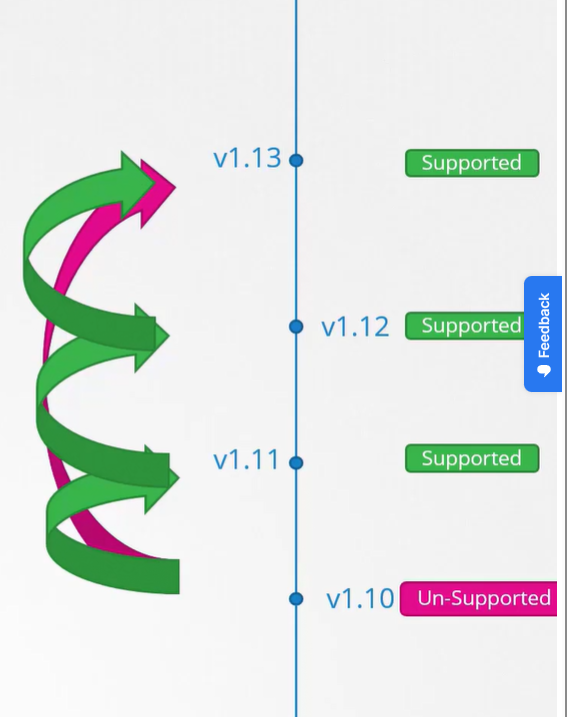

Не будем пока рассматривать зависимые внешние компоненты, такие как ETCD и CoreDNS, а сосредоточимся на core control plane компонентах. Они необязательно должны быть одинаковой версии, их версии могут различаться.

Т.к. kube-apiserver является главным компонентом control plane и другие компоненты обращаются к нему, то ни один из них НЕ может иметь версию выше, чем у kube-apiserver. Controller-manager и kube-scheduler могут быть на одну версию ниже, а kubelet и kube-proxy могут быть на две версии ниже, чем kube-apiserver.

Исключением является утилита kubectl, она может быть как на одну версию выше, так и на одну версию ниже, чем kube-apiserver.

 

Такой допустимый перекос в версиях позволяет нам выполнять live upgrade. Мы можем обновлять компонент за компонентом, если требуется.

K8s в любой момент поддерживает только последние три minor версии. Например, если последний выпущенный релиз 1.12, тогда K8s поддерживает версии 1.12, 1.11 и 1.10.

Можем ли обновиться например сразу с релиза 1.10 до 1.13? Нет. Рекомендуемый подход - обновлять одну minor версию за раз, с 1.10 до 1.11, с 1.11 до 1.12, с 1.12 до 1.13.

 

Процесс обновления зависит от того каким образом был развернут ваш кластер. Если ваш кластер является managed K8s кластером, развернутым в одном из облачных провайдеров, то процесс обновления выполняется всего в несколько кликов. Если вы разворачивали кластер с помощью инструмента kubeadm, то он может помочь спланировать обновление кластера - `kubeadm upgrade plan` и `kubeadm upgrade apply`.

Если вы разворачивали кластер с нуля ("The hard way"), тогда придется вручную обновлять различные компоненты кластера.

В этом уроке мы рассмотрим вариант с kubeadm.

Предположим у нас есть production кластер с master и worker-нодами, с  нагрузкой и активными пользователями. Ноды и компоненты кластера версии 1.10.

Обновление кластера включает в себя два главных шага. Сначала вы обновляете master-ноды, а затем worker-ноды. В процессе обновления master-ов компоненты control plane, такие как apiserver, scheduler и controller-managers кратковременно становятся недоступны. Однако недоступность master-ов не оказывает влияния на worker-ноды и приложения в кластере. Все нагрузки находящиеся на worker-нодах продолжают обслуживать пользователей в обычном режиме. Т.к. master недоступен, то недоступен и весь функционал управления. Вы не сможете получить доступ к кластеру с помощью kubectl или других K8s API. Вы не сможете разворачивать новые приложения, а также изменять или удалять существующие. Controller-managers также не функционируют. Если какой-либо pod упадет, новый pod не будет создан. Но пока ноды и pod-ы в запущенном состоянии, влияния на пользователей не будет. Как только обновление будет закончено и кластер вернется в строй, он будет нормально функционировать. Теперь мы имеем master и его компоненты версии 1.11 и worker-ы версии 1.10. Это поддерживаемая конфигурация.

Теперь время обновлять worker-ноды. Существуют различные стратегии обновления worker-нод. Одна из них заключается в обновлении всех worker-ов за раз. Однако при таком способе все приложения уходят оффлайн и пользователи не смогут получить к ним доступ. Соответственно данный подход требует простоя.

Вторая стратегия - обновлять по одной ноде за раз. Сначала мы обновляем первый worker, нагрузка при этом переезжает на вторую и третью ноды. И далее по аналогии обновляются оставшиеся ноды. По такой же схеме мы обновляем ноды с версии 1.11 до 1.12 и с 1.12 до 1.13.

Третья стратегия заключается в добавлении новых нод со свежей версией K8s в кластер. Это особенно удобно в облачной инфраструктуре, когда вы легко можете создавать новые ноды и выводить старые. Новая нода добавляется в кластер, на нее перемещается нагрузка со старой ноды, и затем старая нода удаляется. И так до тех пор, пока все ноды не станут актуальной версии.