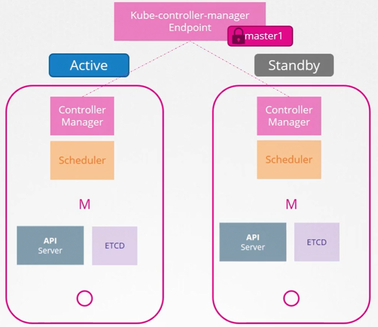

Что происходит, когда вы теряете master-ноду в кластере? Пока worker-ноды запущены и живы контейнеры, ваши приложения все еще будут работать, а пользователи смогут получить к ним доступ. До тех пор пока дела не пойдут плохо. Например, упадет pod или контейнер на worker-ноде. Если pod был частью ReplicaSet, то replication controller на master-е должен проинструктировать worker, чтобы тот загрузил новый pod. Но master недоступен, а контроллеры и scheduler-ы тоже находятся на master-е. Соответственно нет никого, чтобы пересоздать pod и никого, чтобы запланировать pod на ноды.

Аналогично, т.к. недоступен API-сервер, вы не можете получить доступ к кластеру извне с помощью утилиты kubectl или через API.

Поэтому вам нужно обдумать наличие нескольких master-нод в HA-конфигурации в вашем production окружении. High Availability конфигурация подразумевает избыточность для каждого компонента в кластере, чтобы избежать единой точки отказа. Master-ноды, worker-ноды, компоненты control plane, сами приложения, которые мы уже имеем в нескольких копиях в формате ReplicaSet и Services.

В данном уроке мы сфокусируемся только на master-нодах и control plane компонентах.

Как мы уже знаем на master-ноде размещаются control plane компоненты, включая API, Controller Manager, Scheduler и ETCD-сервер.

При HA-конфигурации мы имеем дополнительную master-ноду и аналогичные компоненты, запущенные на ней. Как это работает? Когда запущено нескольких экземпляров одного компонента. Они собираются делать одно и то же дважды? Как они разделяют работу между собой? По-разному в зависимости от того, что они делают.

Как мы знаем API-сервер отвечает за получение запросов, их обработку и предоставление информации о кластере. Он обрабатывает один запрос за раз. Поэтому API-серверы на всех кластерных нодах могут быть запущены одновременно в режиме active-active.

<br>

Как мы уже знаем утилита kubectl общается с API-сервером для достижения поставленной цели. И мы указываем утилите kubectl обращаться к master-ноде на порт `6443`. Это порт, на котором слушает API-сервер, и он настроен в файле `kubeconfig`. Теперь, когда у нас два master-а, куда нам направлять kubectl? Мы можем послать запрос любому из них, но мы не должны посылать одинаковый запрос обоим.

Лучше всего иметь какой-либо балансировщик, установленный перед master-нодами и разделяющий трафик между API-серверами. Соответственно мы настраиваем утилиту kubectl на этот балансировщик. Для этих целей вы можете использовать Nginx, HAProxy или любой другой балансировщик.

А что насчет Scheduler-а и Controller Manager-а? Это контроллеры, которые следят за состоянием кластера и принимают соответствующие меры. Например Controller Manager состоит из контроллеров вроде replication controller, который постоянно следит за состоянием pod-ов и предпринимает необходимые действия, например создание нового pod-а, когда один из них упал и т.д. Если несколько его экземпляров запущены параллельно, тогда они могут начать дублировать действия друг друга и в результате мы получим больше pod-ов, чем реально требуется. То же самое верно и для Scheduler-а. По существу они не должны работать параллельно. Они запускаются в режиме active-standby.

Кто же тогда решает, какой из двух будет активным, а какой пассивным? Это достигается через процесс выбора лидера (leader election). Как это работает?

Для примера рассмотрим Controller Manager. Когда сконфигурирован процесс Controller Manager-а, вы можете указать опцию `--leader-elect`, которая по умолчанию имеет значение `true`.

`kube-controller-manager --leader-elect true [other options]`

С этой опцией, когда запускается процесс Controller Manager-а, он пытается получить аренду (lease) или замок (lock) на объекте Endpoint в K8s, который называется *kube-controller-manager endpoint*. Какой процесс первым обновит endpoint с этой информацией, тот и получит аренду и станет активным из двух, а  другой станет пассивным. Он будет удерживать аренду в течение lease duration, которая указывается с помощью опции `--leader-elect-lease-duration` и по умолчанию имеет значение 15 секунд.

```bash
kube-controller-manager --leader-elect true [other options]
                        --leader-elect-lease duration 15s
```

Активный процесс затем обновляет аренду каждые 10 секунд, что является дефолтным значением для опции `--leader-elect-renew-deadline`.

```bash
kube-controller-manager --leader-elect true [other options]
                        --leader-elect-lease duration 15s
                        --leader-elect-renew-deadline 10s
```

Оба процесса пытаются стать лидерами каждые 2 секунды, задается в параметре `--leader-elect-retry-period`.

```bash
kube-controller-manager --leader-elect true [other options]
                        --leader-elect-lease duration 15s
                        --leader-elect-renew-deadline 10s
                        --leader-elect-retry-period 2s
```

Таким образом, если один процесс упал, например, потому что первый master ушел в оффлайн, то второй процесс сможет завладеть lock и стать лидером.

Scheduler придерживается аналогичного подхода и имеет такие же опции командной строки.

<br>

Далее поговорим про ETCD. Для ETCD существуют две топологии, которые вы можете настроить в K8s. 