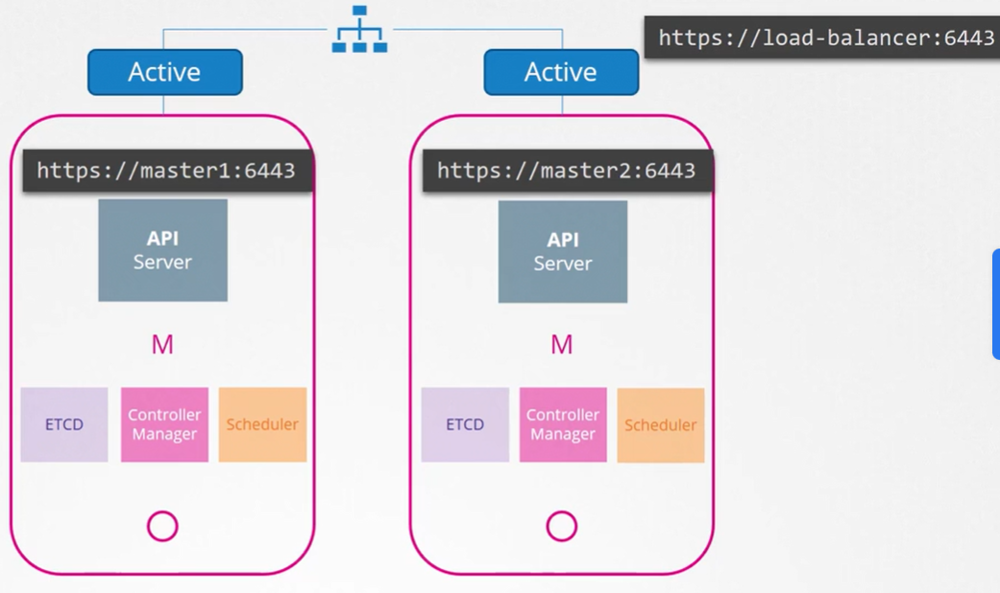

Что происходит, когда вы теряете master-ноду в кластере? Пока worker-ноды запущены и живы контейнеры, ваши приложения все еще будут работать, а пользователи смогут получить к ним доступ. До тех пор пока дела не пойдут плохо. Например, упадет pod или контейнер на worker-ноде. Если pod был частью ReplicaSet, то replication controller на master-е должен проинструктировать worker, чтобы тот загрузил новый pod. Но master недоступен, а контроллеры и scheduler-ы тоже находятся на master-е. Соответственно нет никого, чтобы пересоздать pod и никого, чтобы запланировать pod на ноды.

Аналогично, т.к. недоступен API-сервер, вы не можете получить доступ к кластеру извне с помощью утилиты kubectl или через API.

Поэтому вам нужно обдумать наличие нескольких master-нод в HA-конфигурации в вашем production окружении. High Availability конфигурация подразумевает избыточность для каждого компонента в кластере, чтобы избежать единой точки отказа. Master-ноды, worker-ноды, компоненты control plane, сами приложения, которые мы уже имеем в нескольких копиях в формате ReplicaSet и Services.

В данном уроке мы сфокусируемся только на master-нодах и control plane компонентах.

Как мы уже знаем на master-ноде размещаются control plane компоненты, включая API, Controller Manager, Scheduler и ETCD-сервер.

При HA-конфигурации мы имеем дополнительную master-ноду и аналогичные компоненты, запущенные на ней. Как это работает? Когда запущено нескольких экземпляров одного компонента. Они собираются делать одно и то же дважды? Как они разделяют работу между собой? По-разному в зависимости от того, что они делают.

Как мы знаем API-сервер отвечает за получение запросов, их обработку и предоставление информации о кластере. Он обрабатывает один запрос за раз. Поэтому API-серверы на всех кластерных нодах могут быть запущены одновременно в режиме active-active.

 

Как мы уже знаем утилита kubectl общается с API-сервером для достижения поставленной цели. И мы указываем утилите kubectl обращаться к master-ноде на порт `6443`. Это порт, на котором слушает API-сервер, и он настроен в файле `kubeconfig`. Теперь, когда у нас два master-а, куда нам направлять kubectl? Мы можем послать запрос любому из них, но мы не должны посылать одинаковый запрос обоим.

Лучше всего иметь какой-либо балансировщик, установленный перед master-нодами и разделяющий трафик между API-серверами. Соответственно мы настраиваем утилиту kubectl на этот балансировщик. Для этих целей вы можете использовать Nginx, HAProxy или любой другой балансировщик.

А что насчет Scheduler-а 