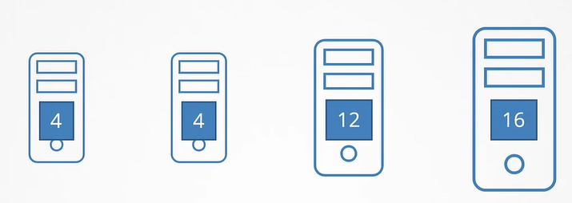

Рассмотрим процесс планирования pod-а. Ниже представлен его манифест файл.

```yaml
apiVersion: v1
kind: Pod
metadata:
  name: simple-webapp-color
spec:
  priorityClassName: high-priority
  containers:
    - name: simple-webapp-color
      image: simple-webapp-color
      resources:
        requests:
          memory: "1Gi"
          cpu: 10
```

Он ждет scheduling-а на одну из четырех нод кластера. Числа на картинке - свободное количество CPU на нодах.

<br>

Но разумеется этот pod не один, существуют и другие, которые тоже ждут своей очереди на scheduling.

После создания pod-ы первым делом попадают в так называемую *Scheduling Queue*. На этом этапе pod-ы сортируются по приоритету, определенному в pod-е. В нашем случае pod имеет приоритет `high-priority`.

Чтобы задать приоритет, сначала нужно создать объект PriorityClass.

```yaml
apiVersion: scheduling.k8s.io/v1
kind: PriorityClass
metadata:
  name: high-priority
value: 1000000
globalDefault: false
description: "This priority class should be used for XYZ service pods only."
```

Соответственно pod-ы с более высоким приоритетом встают в начало очереди.

Далее pod переходит в фазу *Filtering*. На этом этапе отфильтровываются ноды, которые не смогут запустить pod. В нашем случае это первые две ноды, т.к. они не имеют достаточного количества ресурсов.

Следующая фаза - *Scoring*. Здесь ноды оцениваются с разными весами. Из двух оставшихся нод scheduler дает оценку каждой ноде, основываясь на свободном пространстве, которое останется после резервирования необходимого для этого pod-а количества CPU. В данном примере на первой ноде останется 2 CPU, а на второй 6 CPU. Соответственно вторая нода получит более высокую оценку и будет выбрана scheduler-ом как целевая.

Следующая фаза - *Binding*. На этот стадии pod окончательно связывается (binding) с нодой с наивысшей оценкой.

Все эти операции достигаются с помощью определенных плагинов.

Например в процессе Scheduling Queue плагин *PrioritySort* сортирует pod-ы в порядке приоритетов, настроенных на pod-ах.

На стадии Filtering плагин *NodeResourcesFit* определяет ноды, имеющие достаточное количество ресурсов, и отфильтровывает неподходящие ноды. Другие примеры плагинов, работающих на этой стадии - плагин *NodeName*, который проверяет задано ли у pod-а имя ноды в поле `nodeName` и отфильтровывает все ноды, несоответствующие указанному имени.