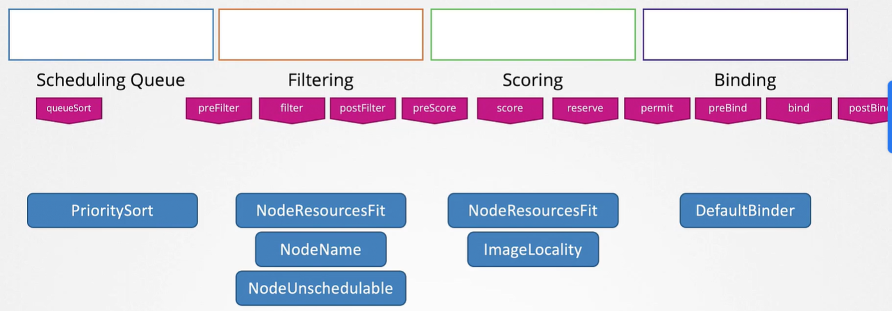
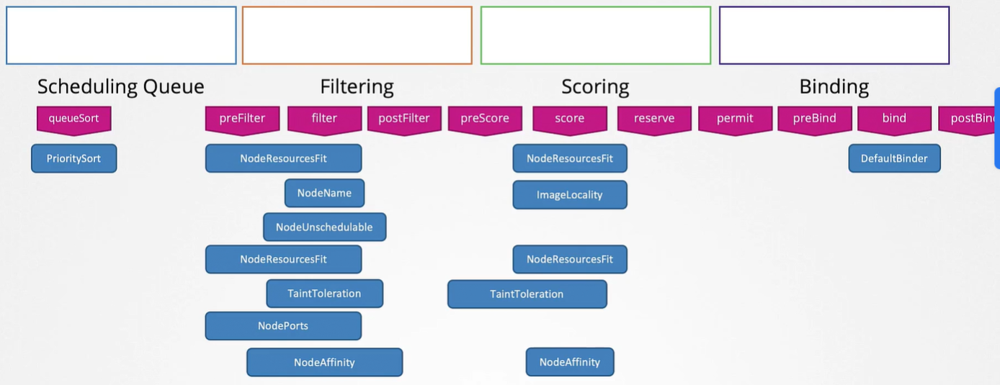

Рассмотрим процесс планирования pod-а. Ниже представлен его манифест файл.

```yaml
apiVersion: v1
kind: Pod
metadata:
  name: simple-webapp-color
spec:
  priorityClassName: high-priority
  containers:
    - name: simple-webapp-color
      image: simple-webapp-color
      resources:
        requests:
          memory: "1Gi"
          cpu: 10
```

Он ждет scheduling-а на одну из четырех нод кластера. Числа на картинке - свободное количество CPU на нодах.

<br>

Но разумеется этот pod не один, существуют и другие, которые тоже ждут своей очереди на scheduling.

После создания pod-ы первым делом попадают в так называемую *Scheduling Queue*. На этом этапе pod-ы сортируются по приоритету, определенному в pod-е. В нашем случае pod имеет приоритет `high-priority`.

Чтобы задать приоритет, сначала нужно создать объект PriorityClass.

```yaml
apiVersion: scheduling.k8s.io/v1
kind: PriorityClass
metadata:
  name: high-priority
value: 1000000
globalDefault: false
description: "This priority class should be used for XYZ service pods only."
```

Соответственно pod-ы с более высоким приоритетом встают в начало очереди.

Далее pod переходит в фазу *Filtering*. На этом этапе отфильтровываются ноды, которые не смогут запустить pod. В нашем случае это первые две ноды, т.к. они не имеют достаточного количества ресурсов.

Следующая фаза - *Scoring*. Здесь ноды оцениваются с разными весами. Из двух оставшихся нод scheduler дает оценку каждой ноде, основываясь на свободном пространстве, которое останется после резервирования необходимого для этого pod-а количества CPU. В данном примере на первой ноде останется 2 CPU, а на второй 6 CPU. Соответственно вторая нода получит более высокую оценку и будет выбрана scheduler-ом как целевая.

Следующая фаза - *Binding*. На этот стадии pod окончательно связывается (binding) с нодой с наивысшей оценкой.

Все эти операции достигаются с помощью определенных плагинов.

Например в процессе Scheduling Queue плагин *PrioritySort* сортирует pod-ы в порядке приоритетов, настроенных на pod-ах.

На стадии Filtering плагин *NodeResourcesFit* определяет ноды, имеющие достаточное количество ресурсов, и отфильтровывает неподходящие ноды. Другие примеры плагинов, работающих на этой стадии - плагин *NodeName*, который проверяет задано ли у pod-а имя ноды в поле `nodeName` и отфильтровывает все ноды, несоответствующие указанному имени. Еще один пример - плагин `NodeUnschedulable`, который отфильтровывает ноды, у которых флаг `Unschedulable` равен `true`.

На стадии Scoring вновь плагин NodeResourcesFit присваивает оценку каждой ноде, основываясь на количестве доступных ресурсов на ней после размещения pod-а. Один и тот же плагин может быть задействован в нескольких разных фазах. Другой пример плагина применяемого на этой стадии - `ImageLocality`, который назначает более высокую оценку тем нодам, на которых уже есть образ, используемый pod-ами. На этой фазе плагины на самом деле не отклоняют размещение pod-а на определенной ноде. Например в случае `ImageLocality` плагин гарантирует размещение pod-а на ноде, которая уже содержит нужный образ, но если подходящие ноды не найдены, то не смотря на это, он разместит pod на ноде, которая не имеет подходящего образа.

На стадии Binding плагин `DefaultBinder` предоставляет механизм связывания.

Легко расширяемая природа K8s дает нам возможность кастомизации и в первую очередь возможность написания и подключения своего собственного плагина. Это достигается с помощь так называемых *extension points*. На каждой стадии существует extension point, к которой может быть подключен плагин. В Scheduling Queue имеется расширение *queueSort*, к которому подключается плагин PrioritySort. Также существуют расширения *filter*, *score* и *bind*, к которым подключаются плагины, о которых мы упоминали только что.

Важный факт состоит в том, что существует намного большее количество расширений. Смотрите схему ниже.

<br>

По сути, вы можете использовать свой код в любом месте путем создания собственного плагина и его подключения к соответствующей extension point.

Некоторые плагины охватывают несколько extension points, некоторые действуют только в пределах определенной extension point.

<br>

В предыдущем уроке мы говорили о деплое трех отдельных schedulers. 

**scheduler-config.yaml**
```yaml
apiVersion: kubescheduler.config.k8s.io/v1
kind: KubeSchedulerConfiguration
profiles:
- schedulerName: default-scheduler
```

**my-scheduler-config.yaml**
```yaml
apiVersion: kubescheduler.config.k8s.io/v1
kind: KubeSchedulerConfiguration
profiles:
- schedulerName: my-scheduler
```

**my-scheduler-2-config.yaml**
```yaml
apiVersion: kubescheduler.config.k8s.io/v1
kind: KubeSchedulerConfiguration
profiles:
- schedulerName: my-scheduler-2
```

Все три являются отдельными бинарными файлами, запущенными с отдельными конфиг-файлами. Т.к. все это отдельные процессы, то требуются дополнительные усилия по их обслуживанию и, что более важно, возможно наступление состояния гонки (race condition) при принятии scheduling решений. Например один scheduler может запланировать нагрузку на ноду, не зная при этом, что другие scheduler-ы одновременно запланировали нагрузку на эту же ноду.

С релизом K8s 1.18 появилась функция поддержки нескольких профилей одного scheduler. Теперь вы можете настроить несколько профилей для одного scheduler-а с помощью добавления нескольких записей в список профилей в его конфиг-файле, и для каждого профиля указывая отдельное имя scheduler-а.

**my-scheduler-2-config.yaml**
```yaml
apiVersion: kubescheduler.config.k8s.io/v1
kind: KubeSchedulerConfiguration
profiles:
- schedulerName: my-scheduler-2
- schedulerName: my-scheduler-3
- schedulerName: my-scheduler-4
```

Это создает отдельный профиль для каждого scheduler, который выступает как отдельный scheduler, за исключением того, что теперь несколько scheduler-ов запускаются как один и тот же бинарный файл.

Далее для каждого профиля мы можем настроить плагины нужным нам способом. В секции `plugin` указываются extension points и плагины, которые необходимо включить или отключить.

**my-scheduler-2-config.yaml**
```yaml
apiVersion: kubescheduler.config.k8s.io/v1
kind: KubeSchedulerConfiguration
profiles:
- schedulerName: my-scheduler-2
  plugins:
    score:
      disabled:
        - name: TaintToleration
      enabled:
        - name: MyCustomPluginA
        - name: MyCustomPluginB
- schedulerName: my-scheduler-3
  plugins:
    preScore:
      disabled:
        - name: '*'   #отключены все preScore плагины
    score:
      disabled:
        - name: '*'   #отключены все score плагины
- schedulerName: my-scheduler-4
```