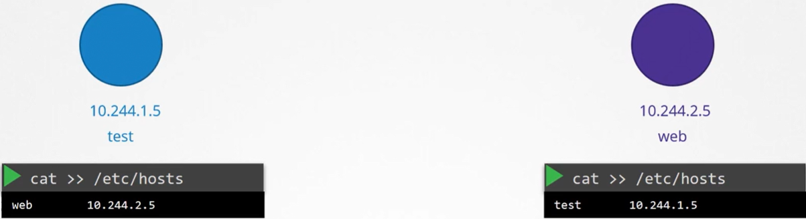

В данном уроке мы рассмотрим как K8s реализует DNS в кластере.

Предположим у нас есть два pod-а с IP-адресами. Как бы действовали мы? Основываясь на том, что мы изучили в prerequisite лекции про DNS, легкий способ дать им возможность разрешать имена друг друга - добавить соответствующую запись в каждый из файлов `/etc/hosts`.

 

Конечно, когда у вас тысячи pod-ов в кластере и сотни из них создаются и удаляются каждую минуту, это решение не подойдет. Поэтому мы перенесем записи в центральный DNS-сервер, а затем укажем pod-ам на этот DNS-сервер путем добавления записи в их файлы `/etc/resolv.conf`, в которой определим, что nameserver имеет IP-адрес DNS-сервера, в нашем примере `10.96.0.10`.

 

Каждый раз, когда создается новый pod, мы добавляем запись на DNS-сервер для этого pod-а, чтобы другие pod-ы могли получить доступ к новому pod-у, и конфигурируем файл `/etc/resolv.conf` pod-а, указывая на DNS-сервер, чтобы новый pod мог разрешать имена других pod-ов в кластере. Это способ, реализованный в K8s. За исключением того, что он не создает подобные записи для pod-ов, чтобы смапить имя pod-а с его IP-адресом, как мы узнали из предыдущей лекции. Он делает это для Services. Для pod-ов K8s формирует hostnames, заменяя точки в IP-адресе pod-а на тире.

K8s реализует DNS таким же образом. Он разворачивает DNS-сервер в кластере. До версии `v1.12` DNS, реализованный в K8s, был известен как *kube-dns*. Начиная с версии `v1.12` рекомендованный DNS-сервер - *CoreDNS*.

Сервер CoreDNS разворачивается в виде двух pod-ов (для резервирования, как часть ReplicaSet в рамках Deployment) в namespace `kube-system` в K8s-кластере. В этой лекции мы будем рассматривать CoreDNS только как pod. В этом pod-е запускается исполняемый файл CoreDNS.

Для CoreDNS требуется конфигурационный файл, в нашем случае это `Corefile`. Также делает и K8s, он использует файл `/etc/coredns/Corefile`. В этом файле имеется некоторое количество настроенных плагинов (выделены оранжевым). Сконфигурированы плагины для обработки ошибок, репортов о состоянии здоровья, мониторинга метрик, кэша и т.д.

 

Плагином, который делает возможным работу CoreDNS с K8s, является плагин `kubernetes`. Здесь задается доменное имя верхнего уровня для кластера. В данном случае это `cluster.local`. Соответственно каждая запись в DNS-сервере CoreDNS подпадает под этот домен.

В плагине `kubernetes` существует множество опций. Опция `pods` отвечает за создание записей для pod-ов в кластере. Помните, мы говорили как создаются записи для каждого pod-а путем конвертации их IP-адресов в формат с тире, который отключен по умолчанию? Он может быть включен с помощью этой опции здесь.

Любой запрос, который этот DNS-сервер не может разрешить (например pod пытается обратиться к `www.google.com`), будет перенаправлен на nameserver, указанный в файле `/etc/resolv.conf` в pod-е CoreDNS. Файл `/etc/resolv.conf` настроен на использование nameserver из K8s ноды.

Стоит также отметить, что Corefile передается в pod как объект ConfigMap. Соответственно, если нужно изменить эту конфигурацию, то вы можете отредактировать ConfigMap.

Теперь у нас есть работающий pod CoreDNS, который использует соответствующий плагин `kubernetes`. Он мониторит K8s-кластер на предмет новых pod-ов или Services, и каждый раз, когда создается новый pod либо Service, он добавляет запись в БД.

Следующий шаг - указать pod-у на сервер CoreDNS. Какой адрес используют pod-ы, чтобы обращаться к DNS-серверу? Когда мы разворачиваем решение CoreDNS, то также создается Service с именем `kube-dns` (по умолчанию), чтобы сделать его доступным для других компонентов кластера. IP-адрес этого Service прописывается как nameserver в pod-ах. Вам не нужно конфигурировать это самостоятельно. Конфигурация DNS в pod-ах выполняется K8s автоматически, когда они создаются. Какой компонент K8s за это отвечает? Kubelet. Если вы посмотрите на конфигурационный файл kubelet, то увидите в нем IP-адрес DNS-сервера и домен.

 

Как только pod-ы сконфигурированы с правильным nameserver, вы можете разрешить другие pod-ы и Services.