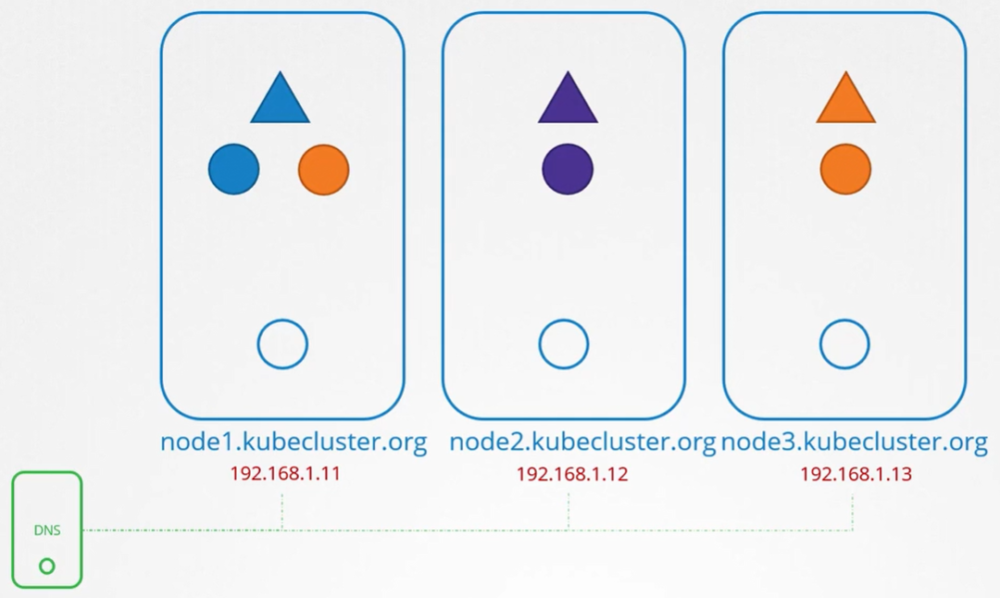
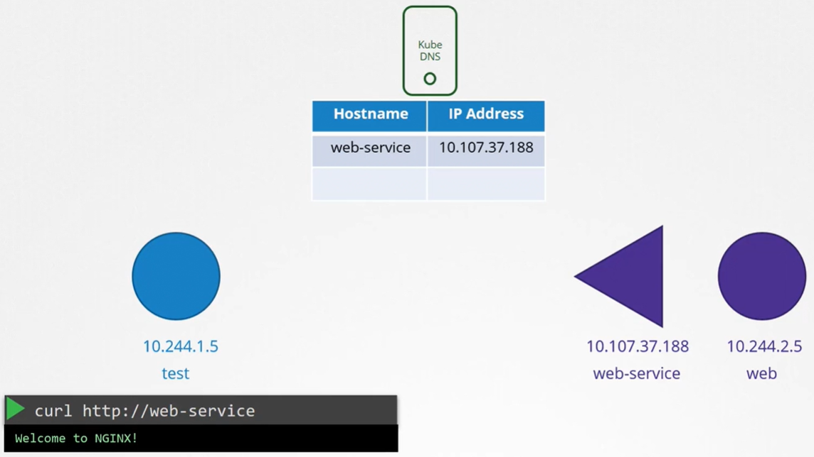

Предположим у нас есть 3х-нодовый K8s-кластер с развернутыми в нем pod-ами и Services. Каждая нода имеет свое имя и назначенный на нее IP-адрес. Имена нод и IP-адреса кластера вероятно зарегистрированы на DNS-сервере вашей организации. Кто им управляет и кто имеет к нему доступ, нас не беспокоит в рамках данного урока. В этой лекции мы обсудим DNS resolution в кластере между различными компонентами, такими как pod-ы и Services.

По умолчанию K8s разворачивает встроенный DNS-сервер, когда вы устанавливаете кластер. Если вы устанавливаете K8s вручную, то делаете это самостоятельно. Нас не особо интересуют ноды, мы полностью сосредоточимся на pod-ах и Services в кластере.

При условии, что сеть кластера правильно настроена, следуя best practices, которые мы изучили в этой секции, все pod-ы и Services могут получить свой собственный IP-адрес и достучаться друг до друга, все должно быть хорошо.

 

Начнем всего лишь с двух pod-ов и Service. Слева у нас есть pod `test` с IP-адресом `10.244.1.5`, а справа pod `web` с IP-адресом `10.244.2.5`. Посмотрев на их IP, вы можете предположить, что они вероятно расположены на двух разных нодах. Но это не имеет большого значения. Что касается DNS (as far as DNS is concerned), мы предполагаем, что все pod-ы и Services могут достучаться друг до друга, используя их IP-адреса.

Чтобы сделать web-сервера доступным для pod-а `test`, мы создаем Service `web-service`. Service получает IP-адрес `10.107.37.188`. Как только Service создан, кубовый DNS-сервис создает запись для этого Service. Он мапит имя Service с его IP-адресом. Теперь в пределах кластера любой pod может достигнуть этот Service, используя его имя.

 

Помните как мы ранее говорили о namespaces? Все в пределах одного namespace обращаются друг к другу только лишь по имени, а к кому-либо в другом namespace, используя полное имя/фамилию.