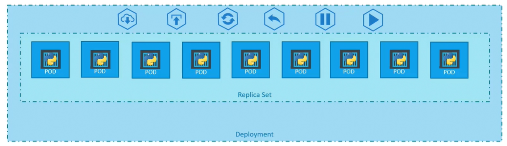

Поговорим о том каким образом вы можете развернуть свое приложение в production окружении.

Например у вас есть web-сервер, который необходимо развернуть в production окружении. Вам нужен не один, а множество экземпляров запущенного web-сервера по очевидным причинам.

Всякий раз, когда становится доступной новая версия приложения в Docker registry, вам хотелось бы бесшовно обновить все Docker instances. Однако когда вы обновляете инстансы, вы не хотите обновить их все за раз, т.к. это может повлиять на пользователей, работающих с приложением. Поэтому возможно вы захотите обновить их один за другим. Этот вид обновления известен как *rolling updates*.

Предположим одно из выполненных вами обновлений привело к неожиданной ошибке и вас попросили отменить последние изменения. Вы бы хотели иметь возможность откатить изменения, которые были недавно проведены.

Наконец вам бы хотелось сделать множество изменений в окружении, таких как обновление версии лежащего в основе (underlying) web-сервера, масштабирование окружения, изменение распределения ресурсов и т.д. Вы не хотите применять каждое изменения немедленно после запуска команды. Вместо этого вы хотите применить паузу к вашему окружению, сделать изменения, а затем возобновить, чтобы все изменения "выкатились" вместе. Все эти возможности доступны с K8s Deployments.

Пока в этом курсе мы обсуждали pod-ы, которые разворачивают отдельный экземпляр нашего приложения, например web-приложения в данном примере. Каждый контейнер инкапсулирован в pod. Множество таких pod-ов разворачиваются с помощью Replication Controller или Replica Set. Затем приходит Deployment - объект K8s, который стоит выше в иерархии. Deployment предоставляет нам возможность бесшовно обновлять лежащие в основе instances, используя rolling updates, отменять изменения, ставить на паузу и возобновлять изменения.

<br>

Как мы создаем Deployment? С помощью definition-файла.

```yaml
apiVersion: apps/v1
kind: Deployment
metadata:
  name: myapp-deployment
  labels:
    app: myapp
    type: front-end
spec:
  template:
    metadata:
      name: myapp-pod
      labels:
        app: myapp
        type: front-end
    spec:
      containers:
        - name: nginx-container
          image: nginx
  replicas: 2
  selector:
    matchLabels:
      type: front-end
```

Deployment автоматически создает Replica Set. Replica Set в конечном счете создает pod-ы.