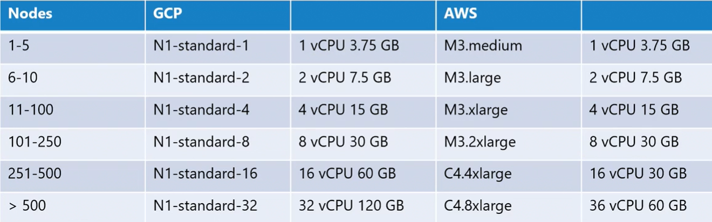

Прежде чем приступить к проектированию кластера, стоит задать следующие вопросы:
- Каково назначение кластера? Он предназначен для обучения, разработки, тестирования или же для размещения приложений production уровня?
- Как относятся к "облакам" в вашей организации? Вы предпочитаете, чтобы ваша платформа управлялась облачным провайдером или это будет self hosted решение?
- Какой тип нагрузок вы собираетесь запускать в этом кластере?
- Какое количество приложений будет размещено в кластере? Много или мало?
- Какой типы приложений будут размещаться в кластере? Веб-приложения, big data, аналитика? В зависимости от типа приложения требования к ресурсам могут различаться.
- Какой тип сетевого трафика эти приложения ожидают? Непрерывный интенсивный трафик или его всплески?

Если вы хотите развернуть кластер для учебных целей, тогда следует выбрать решение основанное на minikube или single node кластер, развернутый с помощью kubeadm на локальных ВМ или у облачных провайдеров (GCP, AWS).

Если вам нужен кластер в целях разработки/тестирования, подойдет multi node кластер с одной master и несколькими worker-нодами. И снова kubeadm подходящий инструмент или же в управляемых облачных средах доступна быстрая подготовка (quickly provision) кластера с использованием GKE в GCP, AKS в Azure или AWS.

Для размещения приложений production уровня рекомендуется использовать высокодоступный (HA) multi node кластер с несколькими master-нодами. Он также может быть развернут с помощью kubeadm, GCP, kOps в AWS или других поддерживаемых платформах. Вы можете иметь до 5 000 нод в кластере, до 150 000 pod-ов, до 300 000 контейнеров и до 100 pod-ов на одну ноду.

В зависимости от размеров кластера требования к ресурсам на нодах могу различаться. GCP и AWS автоматически выбирают для вас ноды подходящего размера, основываясь на количестве нод в кластере. Таблица ниже показывает размер экземпляров, а также спецификацию ресурсов для определенного числа нод.

 