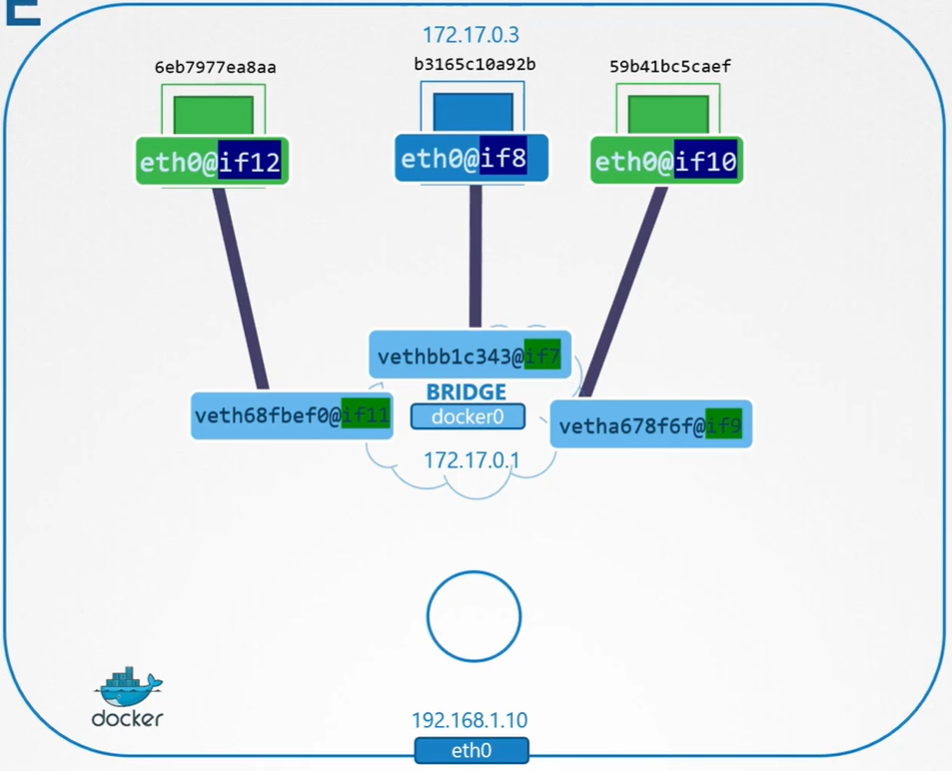

Рассмотрим сервер с установленным Docker. У него есть ethernet-интерфейс `eth0` с IP-адресом `192.168.1.10`, подключенный к локальной сети.

Когда вы запускаете контейнер, то можете выбрать различные networking опции.

Первая опция - *none network*.

`docker run --network none nginx`

В этом случае контейнер не подключается к какой-либо сети. Он не может выйти во внешний мир и никто из внешнего мира не может достучаться до контейнера. Если вы запустите несколько контейнеров, все они создадутся, не являясь при этом частью какой-либо сети, и не смогут взаимодействовать друг с другом или с внешним миром.

Вторая опция - *host network*.

`docker run --network host nginx`

В этом случай контейнер подключается к сети хоста. При этом отсутствует сетевая изоляция между хостом и контейнером. Если вы развернули веб-приложение в контейнере, работающее на 80 порту, то это приложение будет доступно по 80 порту на самом хосте без дополнительной настройки port mapping.

Если вы попытаетесь запустить еще один экземпляр этого же контейнера, который также слушает на 80 порту, это не будет работать, т.к. оба контейнера делят сеть хоста и два процесса не смогут одновременно слушать один и тот же порт.

Третья опция - *bridge network*.

В этом случае создается внутренняя частная сеть, к которой подключается сам docker-хост и контейнеры. По умолчанию сеть имеет адрес `172.17.0.0/16` и каждое устройство, подключенное к данной сети, получает свой собственный внутренний частный ip-адрес. Рассмотрим этот вариант подробнее.

Когда на хосте устанавливается Docker, он создает внутреннюю частную сеть, которая по умолчанию называется `bridge`.

Это можно увидеть из вывода команды: `docker network ls`.

```bash
aidar@ubuntu-vm:~$ docker network ls
NETWORK ID     NAME      DRIVER    SCOPE
36410aaf2028   bridge    bridge    local
58993bb0f381   host      host      local
27077fa3247a   none      null      local
```

Docker называет эту сеть `bridge`, однако на самом хосте сеть создается с именем `docker0`.

```bash
aidar@ubuntu-vm:~$ ip link
1: lo: <LOOPBACK,UP,LOWER_UP> mtu 65536 qdisc noqueue state UNKNOWN mode DEFAULT group default qlen 1000
    link/loopback 00:00:00:00:00:00 brd 00:00:00:00:00:00
2: ens33: <BROADCAST,MULTICAST,UP,LOWER_UP> mtu 1500 qdisc fq_codel state UP mode DEFAULT group default qlen 1000
    link/ether 00:0c:29:c4:9e:df brd ff:ff:ff:ff:ff:ff
    altname enp2s1
3: docker0: <NO-CARRIER,BROADCAST,MULTICAST,UP> mtu 1500 qdisc noqueue state DOWN mode DEFAULT group default
    link/ether 02:42:10:8c:95:50 brd ff:ff:ff:ff:ff:ff
```

По сути Docker использует внутри команду, о которой мы упоминали в уроке "Network Namespaces" - `ip link add docker0 type bridge`.

Таким образом имя сети `bridge` (из вывода команды `docker network ls`) ссылается на `docker0` на хосте. Также стоит отметить, что на данный момент интерфейс (или сеть) в статусе `DOWN`.

Как мы помним, сеть bridge является интерфейсом для хоста, но при этом коммутатором для namespaces или контейнеров на хосте. Интерфейсу `docker0` на хосте назначается адрес `172.17.0.1`.

```bash
aidar@ubuntu-vm:~$ ip addr
3: docker0: <NO-CARRIER,BROADCAST,MULTICAST,UP> mtu 1500 qdisc noqueue state DOWN group default
    link/ether 02:42:10:8c:95:50 brd ff:ff:ff:ff:ff:ff
    inet 172.17.0.1/16 brd 172.17.255.255 scope global docker0
       valid_lft forever preferred_lft forever
```

Всякий раз когда запускается контейнер, Docker создает для него network namespace, также как мы делали это в уроке "Network Namespaces".

Чтобы созданные Docker-ом namespaces были видны в выводе команды `ip netns ls` (по умолчанию их не видно), нужно сделать следующее:

```bash
sandboxKey=$(docker container inspect container_id --format '{{ .NetworkSettings.SandboxKey }}')   #получаем полный путь до namespace Docker
netns=$(basename "$sandboxKey")   #с помощью утилиты basename отсекаем путь и получаем только имя namespace
sudo ln -s $sandboxKey /var/run/netns/$netns   #создаем символическую ссылку на namespace Docker в общем каталоге namespace-ов ОС
```

Теперь проверяем созданный Docker-ом namespace:

```bash
aidar@ubuntu-vm:~$ ip netns ls
155c21828608 (id: 0)
```

Имя namespace начинается с `155c21828608`. Узнать имя namespace, ассоциированного с каждым контейнером, можно из вывода команды `docker inspect container_id`:

```json
"NetworkSettings": {
    "Bridge": "",
    "SandboxID": "155c21828608acf64d7de848d11f822ac206e96b654c2fa4d5c908b025f95351",
    "SandboxKey": "/var/run/docker/netns/155c21828608",
```

Каким образом Docker подключает контейнер или его network namespace к bridge-сети? Важное напоминание, когда мы говорим контейнер или network namespace (созданный Docker-ом для этого контейнера), то имеем ввиду одну и то же. Docker создает виртуальный кабель с двумя интерфейсами на обоих концах. Проверим это. Выполним команду `ip link` на Docker хосте, из которой видно, что один интерфейс кабеля подключен к локальному bridge `docker0`.

```bash
aidar@ubuntu-vm:~$ ip link
7: vetha78aec1@if6: <BROADCAST,MULTICAST,UP,LOWER_UP> mtu 1500 qdisc noqueue master docker0 state UP mode DEFAULT group default
    link/ether d6:55:a5:de:36:f6 brd ff:ff:ff:ff:ff:ff link-netnsid 0
```

Выполним эту же команду, но уже в созданном Docker-ом namespace, и увидим другой конец кабеля, подключенный к namespace:

```bash
aidar@ubuntu-vm:~$ ip -n 155c21828608 link
1: lo: <LOOPBACK,UP,LOWER_UP> mtu 65536 qdisc noqueue state UNKNOWN mode DEFAULT group default qlen 1000
    link/loopback 00:00:00:00:00:00 brd 00:00:00:00:00:00
6: eth0@if7: <BROADCAST,MULTICAST,UP,LOWER_UP> mtu 1500 qdisc noqueue state UP mode DEFAULT group default
    link/ether 02:42:ac:11:00:02 brd ff:ff:ff:ff:ff:ff link-netnsid 0
```

Интерфейс так же получает IP-адрес из заданного диапазона:

```bash
aidar@ubuntu-vm:~$ ip -n 155c21828608 addr
6: eth0@if7: <BROADCAST,MULTICAST,UP,LOWER_UP> mtu 1500 qdisc noqueue state UP group default
    link/ether 02:42:ac:11:00:02 brd ff:ff:ff:ff:ff:ff link-netnsid 0
    inet 172.17.0.2/16 brd 172.17.255.255 scope global eth0
       valid_lft forever preferred_lft forever
```

Аналогичная процедура происходит каждый раз, когда создается новый контейнер. Docker создает namespace и пару интерфейсов, подключает оба конца "кабеля" соответствующим образом. Пары интерфейсов могут быть идентифицированы с помощью их номеров. Четный и нечетный номер формируют пару. Например 9 и 10 одна пара, 7 и 8 вторая пара, 11 и 12 третья. Теперь все контейнеры являются частью одной сети и могут взаимодействовать друг с другом.

<br>

Поговорим о port mapping. Созданный нами контейнер - это nginx, веб-приложение, обслуживающее веб-страницу на 80 порту. Наш контейнер находится в частной сети внутри хоста, поэтому только другие контейнеры в этой же сети или сам хост могут получить доступ к этой веб-странице. Если вы попытаетесь получить доступ к веб-странице с помощью команды `curl http://172.17.0.2:80` непосредственно с самого Docker-хоста, то увидите ее содержимое. Если же вы попробуете сделать то же самое извне, с другого хоста, то не увидите веб-страницу, доступа не будет. Чтобы разрешить доступ к приложениям в контейнерах для внешних пользователей, Docker предоставляют опцию *port publishing* или *port mapping*. Когда вы запускаете контейнер, скажите Docker-у смапить порт 8080 на Docker-хосте на порт 80 в контейнере.

`docker run --rm -d -p 8080:80 nginx`

После этого вы сможете получить доступ к веб-приложению, используя IP-адрес Docker-хоста и порт 8080: `curl http://192.168.30.131:8080`.

Любой трафик, идущий на порт 8080 Docker-хоста будет перенаправляться на порт 80 контейнера. Каким образом Docker это делает? Каким образом перенаправляет трафик с одного порта на другой? Мы говорили об этом в предыдущих prerequisite лекциях.

Забудем пока про Docker. Чтобы перенаправить трафик с одного порта сервера на другой, мы создаем NAT-правило. С помощью iptables создается запись в таблице NAT для добавления (appending) правила в цепочку `PREROUTING` для изменения destination порта с 8080 на 80:

`iptables -t nat -A PREROUTING -p tcp --dport 8080 -j DNAT  --to-destination 80`

Docker добавляет правило в цепочку `DOCKER` и устанавливает destination равным IP-адресу контейнера:

`iptables -t nat -A DOCKER -p tcp --dport 8080 -j DNAT --to-destination 172.17.0.3:80`

Посмотреть правило созданные Docker-ом: `iptables -nvL -t nat`.