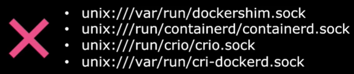
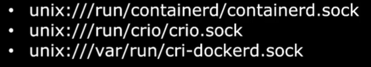

Вернемся к началу эпохи контейнеров. Был Docker и были другие инструменты, такие как Rocket. Но пользовательский опыт использования Docker делал работу с контейнерами супер простой. Поэтому Docker стал самым доминирующим инструментом для работы с контейнерами.

Затем пришел K8s для оркестрирования Docker-ом. K8s был построен для оркестрирования конкретно Docker-ом в самом начале. Поэтому Docker и K8s были тесно связаны, и тогда K8s работал только с Docker-ом и не поддерживал какие-либо другие решения для управления контейнерами. Затем популярность K8s как оркестратора контейнеров выросла и сейчас хотелось бы видеть другие container runtimes, такие как Rocket. Пользователям K8s потребовалось работать с другими container runtimes кроме Docker.

K8s представил интерфейс, названный *Container Runtime Interface* (CRI). CRI позволяет любому вендору работать в качестве container runtime для K8s пока он (вендор) придерживается стандартов OCI. OCI расшифровывается как *Open Container Initiative* и состоит из спецификации образов (imagespec) и спецификации среды выполнения (runtimespec).

Imagespec означает спецификации того, каким образом должен собираться образ.

Runtimespec определяет стандарты того, каким образом container runtime должна разрабатываться. Таким образом, придерживаясь данных стандартов, любой может построить container runtime, которая может быть использована в дальнейшем кем угодно для работы с K8s.

Rocket и другие container runtimes, придерживавшиеся стандартов OCI, теперь поддерживаются в качестве container runtime в K8s через CRI.

Однако Docker НЕ был разработан с поддержкой стандартов CRI. Docker был разработан до введения CRI и все еще был самым доминирующим и используемым большинством инструментом для работы с контейнерами. Поэтому K8s продолжал также поддерживать Docker. K8s представил инструмент, известный как Docker Shim, который был замудренным, но временным способом продолжать поддерживать Docker за пределами Container Runtime Interface.

В то время как большинство других container runtimes работали через CRI, Docker продолжал работать без него. Теперь как видите Docker не является единственным container runtime. Docker состоит из множества инструментов, собранных вместе. Например Docker CLI, Docker API, build tool помогающая собирать образы. Была поддержка для Volumes, Auth, Security, а также наконец сама container runtime, которая называлась *runc* и демон, который управлял runc и назывался *containerd*.

Containerd совместим с CRI и может работать напрямую с K8s как все другие runtimes. Таким образом containerd может использоваться самостоятельно в качестве runtime, отдельно от Docker. Сейчас мы имеем containerd как отдельную runtime и отдельно Docker.

K8s продолжал осуществлять поддержку движка Docker напрямую. Однако необходимость поддерживать Docker Shim была ненужным усилием и добавляла осложнений. В версии K8s 1.24 было решено полностью удалить Docker Shim. Таким образом поддержка Docker была удалена. Но все образы, которые были собраны до того, как Docker был удален, т.е. все Docker-образы, продолжают работать, т.к. Docker придерживался imagespec из стандартов OCI. Соответственно все образы собранные Docker соответствуют стандартам, они продолжают работать с containerd, но сам Docker был удален из K8s в качестве поддерживаемой runtime.

Не смотря на то, что containerd является частью Docker, сейчас это отдельный самостоятельный проект, являющийся членом CNCF, с graduated статусом.

Сейчас вы можете установить containerd самостоятельно без необходимости устанавливать Docker, если вам действительно не нужны функции Docker.

Обычно мы запускаем контейнеры с помощью команды `docker run`, когда у нас есть Docker. Но если Docker не установлен, как нам запускать контейнеры только с помощью containerd? Теперь когда вы устанавливаете containerd, он идет с утилитой командной строки *ctr*. Эта утилита создана исключительно для дебага containerd, соответственно она не user-friendly и поддерживает ограниченный набор функций. Это то, что вы увидите на страницах документации для этого инструмента.

Кроме ограниченного набора функций, который предоставляет данная утилита, любой другой способ взаимодействия с containerd предполагает использование прямых вызовов API, что не является самым user-friendly способом для нас. Просто чтобы дать вам представление, команда `ctr` может быть использована для выполнения базовых container-related активностей, таких как пуллинг образов.

Например, чтобы спуллить образ redis нужно использовать команду: `ctr images pull docker.io/library/redis:alpine`.

Для запуска контейнера: `ctr run docker.io/library/redis:alpine redis`.

Но как уже говорилось ранее эта утилита создана исключительно для дебага containerd, не очень user-friendly и НЕ используется для запуска или управления контейнерами в production окружении.

Рекомендуется использовать более подходящую альтернативу - утилиту *nerdctl*. Nerdctl - утилита командной строки очень похожая на Docker, это как CLI для containerd. Она поддерживает большинство опций, которые поддерживает Docker. Кроме этого она имеет дополнительную выгоду - она может дать нам доступ к новейшим функциям, реализованным в containerd. Например мы можем работать с зашифрованным образами контейнеров или другими новыми фичами, которые со временем будут реализованы в обычных Docker-командах в будущем. Она также поддерживает lazy pulling образов, P2P распространение образов, подпись и проверку образов, namespaces в K8s, которые недоступны в Docker.

Nerdctl работает очень схоже с Docker CLI. Вместо `docker` вы можете просто писать `nerdctl`. Так вы можете запускать практически все Docker-команды, которые взаимодействуют с контейнерами. Пример:

`docker run --name=redis redis:alpine` => `nerdctl run --name=redis redis:alpine`

`docker run --name=webserver -p 80:80 -d nginx` => `nerdctl run --name=webserver -p 80:80 -d nginx`

Также важно поговорить о другой утилите командной строки - *crictl*. Ранее мы говорили о Container Runtime Interface (CRI), который представляет собой единый интерфейс, используемый для подключения CRI-совместимых container runtimes, таких как containerd, rocket и др. Итак crictl - это утилита командной строки, используемая для взаимодействия c CRI-совместимыми container runtimes. Это вид взаимодействия с точки зрения K8s. Этот инструмент разрабатывается и поддерживается K8s сообществом и работает среди всех различных container runtimes. В отличие от утилит ctr и nerdctl, которые были созданы сообществом containerd, конкретно для containerd. Этот специфический инструмент от лица K8s, который работает среди различных container runtimes. Он устанавливается отдельно и используется для проверки и дебага container runtime. И опять, в идеале он не используется для создания контейнеров в отличие от Docker или nerdctl. Это инструмент дебага. Технически вы можете создавать контейнеры с помощью утилиты crictl, но это непросто. И помните, как это работает с kubelet. Как мы уже знаем, kubelet отвечает за то, чтобы определенное число контейнеров или pod-ов всегда были доступны на ноде. Если вы попробуете создать контейнеры с помощью утилиты crictl, kubelet в конечном счете удалит их, т.к. не знает ничего об этих контейнерах или pod-ах созданных без его ведома. Поэтому crictl используется только как инструмент дебага.

Рассмотрим несколько примеров работы данной утилиты.

Спуллить образ: `crictl pull busybox`.

Смотреть список образов: `crictl images`.

Смотреть список контейнеров: `crictl ps -a`.

Выполните команду в контейнере: `crictl exec -i -t <container_id> ls`.

Смотреть логи контейнера: `crictl logs <container_id>`.

Важное отличие от Docker заключается в том, что crictl знает о pod-ах. Соответственно можно посмотреть список pod-ов: `crictl pods`.

В прошлом, при работе с K8s мы использовали много docker-команд для траблшутинга контейнеров и просмотра логов, особенно на worker-нодах. Теперь для этого нужно использовать crictl. Синтакс во многом похож. По [ссылке](https://kubernetes.io/docs/reference/tools/map-crictl-dockercli/) находится сравнительная таблица для Docker и crictl команд. Множество команд работает совершенно одинаково.

В предыдущих версиях K8s до версии 1.24 инструмент crictl подключался к runtime endpoints в следующем порядке:

<br>

Однако с релизом K8s версии 1.24 было сделано значительное изменение. Точка `dockershim.sock` была заменена на `cri-dockerd.sock`.

<br>

Как результат обновленные дефолтные endpoints для утилиты crictl также были изменены. Эти изменения были внесены в ответ на deprecation предыдущих настроек по умолчанию. Теперь пользователям рекомендуется вручную устанавливать endpoints. Эти изменения задокументированы в K8s crictl GitHub-репозитории.

```bash
crictl --runtime-endpoint
export CONTAINER_RUNTIME_ENDPOINT
```