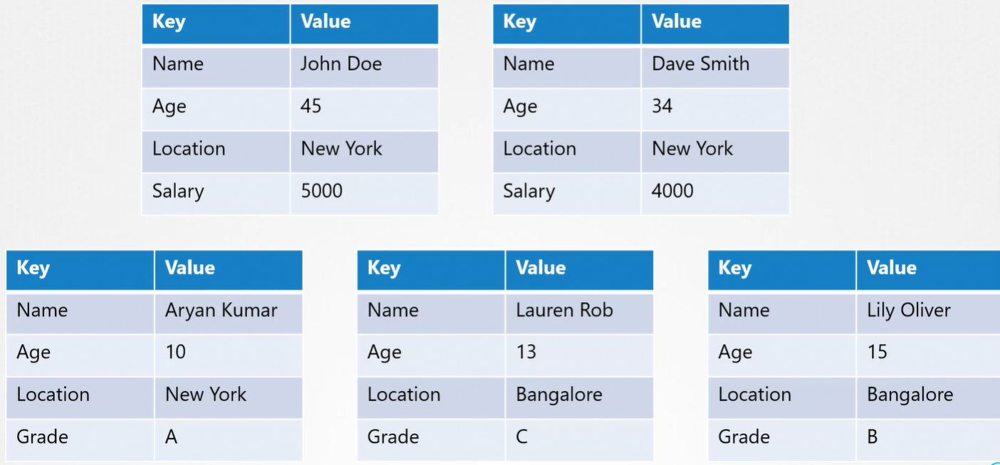

ETCD - это распределенное надежное key-value хранилище, простое, безопасное и быстрое.

Что такое key-value хранилище? Традиционно базы данных были в табличном формате. Вероятно вы слышали о SQL или реляционных БД. Они хранят данные в виде столбцов и строк. Ниже для примера представлена таблица, которая содержит информацию относительно некоторых людей. Строки отражают каждого человека, а колонки отражают тип информации, которая будет храниться.

| Name | Age | Location |
| ----------- | ----------- | ----------- |
| John Doe | 45 | New York |
| Dave Smith | 34 | New York |
| Aryan Kumar | 10 | New York |
| Lauren Rob | 13 | Bangalore |
| Lily Oliver | 15 | Bangalore |

Теперь мы хотим добавить дополнительную информации об этих людях, например их зарплату. Соответственно мы добавляем дополнительную колонку.

| Name | Age | Location | Salary
| ----------- | ----------- | ----------- | ----------- |
| John Doe | 45 | New York | 5000 |
| Dave Smith | 34 | New York | 4000 |
| Aryan Kumar | 10 | New York | |
| Lauren Rob | 13 | Bangalore | |
| Lily Oliver | 15 | Bangalore | |

Это повлияет на всю таблицу и на всех людей в ней. Т.к. не все из них работают, некоторые ячейки остались пустыми.

Затем потребовалось хранить информацию об оценках этих людей. Мы добавляем новую колонку и обновляем информацию о студентах в соответствии с их оценками.

| Name | Age | Location | Salary | Grade |
| ----------- | ----------- | ----------- | ----------- | ----------- |
| John Doe | 45 | New York | 5000 | |
| Dave Smith | 34 | New York | 4000 | |
| Aryan Kumar | 10 | New York | | A |
| Lauren Rob | 13 | Bangalore | | C |
| Lily Oliver | 15 | Bangalore | | B |

И снова, только студенты имеют оценки. Поэтому соответствующие ячейки взрослых остались пустыми.

Каждый раз, когда необходимо добавить новую информацию, это влияет на всю таблицу и приводит к большому количеству пустых ячеек.

Key-value store хранит информацию в виде документов или страниц. Соответственно каждый человек получает документ и вся информация об этом человек хранится в этом файле. Эти файлы могут быть в любых формате/структуре и изменения в одном файле не влияют на другие файлы. Так работающие люди могут иметь файлы с полем "Salary", а студенты могут иметь страницы только с их оценками.

<br>

Вы можете добавить какие-либо дополнительные сведения к любому из этих документов без необходимости обновления других аналогичных документов.

<br>

Довольно легко установить и начать работу с etcd.

1. Скачиваете соответствующий бинарный файл для вашей ОС с GitHub:

   `curl -L https://github.com/etcd-io/etcd/releases/download/v3.5.10/etcd-v3.5.10-linux-amd64.tar.gz -o /tmp/etcd-v3.5.10-linux-amd64.tar.gz`

2. Распаковываете архив: `tar xzvf /tmp/etcd-v3.5.10-linux-amd64.tar.gz`

3. Запускаете: `./etcd`

Когда вы запускаете etcd, стартует сервис, слушающий на порту 2379 по умолчанию. Вы можете приложить какой-либо клиент к сервису etcd для сохранения и извлечения информации. Клиент по умолчанию идущий вместе с etcd - клиент etcdctl. Это клиент командной строки для etcd. Вы можете использовать его для сохранения и извлечения пар ключ/значение.

Для того, чтобы сохранить пару ключ/значение: `./etcdctl set key1 value1`. Это создаст запись в БД с данной информацией.

Чтобы извлечь сохраненные данные: `./etcdctl get key1`.

Чтобы посмотреть все возможные опции: `./etcdctl`.

Вы можете встретить различные версии команд в процессе изучения etcd и соответствующих онлайн статей. Важно понимать историю релизов etcd, чтобы знать когда и что изменилось.

Первая версия etcd *v0.1* была выпущена в августе 2013-го.

Официальная стабильная версия *v2.0* была выпущена в феврале 2015. В ней был переработан алгоритм консенсуса Raft и поддерживалось более 10 000 rides в секунду.

В январе 2017-го etcd вышла версия *v3.1* с большим количество оптимизаций и улучшений производительности.

В январе 2018-го проект etcd был инкубирован в CNCF.

Самое важное здесь - отметить различия между версиями 2 и 3. Версия 2 много использовалась и в версии 3 было сделано много изменений. Изменилась версия API в этих версиях etcd. Это означает, что изменились и команды etcdctl.

Команды `set` и `get`, о которых упоминалось ранее, были для версии 2 и одна для версии 3. Команда `etcdctl` настроена для работы с v2 и v3 одновременно.

Как выяснить на работу с какой версией настроена etcdctl? Выполните команду:

```bash
./etcdctl --version

etcdctl version: 3.3.11   #версия самой etcdctl
API version: 2            #версия API
```

Существует два типа версий - версия самой утилиты etcdctl и версия API, на которую настроена утилита etcdctl. Версия API может быть 2 или 3.

Из текущего вывода понятно, что утилита настроена на API версии 2. Соответственно, если мы выполним команду `./etcdctl` без параметров, то получим список поддерживаемых команд для версии 2!

Для новых версий etcd версия API по умолчанию равна v3. Поэтому вероятно вы захотите проверять на какую версию API настроена утилита с помощью команды `./etcdctl --version` перед тем как выполнять какие-либо etcdctl-команды.

Для того, чтобы переконфигурировать утилиту для работы с другой версией API, установить environment variable одним из способов:

```bash
ETCDCTL_API=3 ./etcdctl version   #при таком способе нужно будет указывать переменную в каждой команде

export ETCDCTL_API=3              #при таком способе нужно один раз задать переменную в оболочке
./etcdctl version
```

Также стоит отметить, что в v3 `version` - это команда, а в v2 `--version` - это опция.

Команда set в v3 заменена на put: `./etcdctl put key1 value1`.

Для извлечения сохраненных данных команда та же: `./etcdctl get key1`.