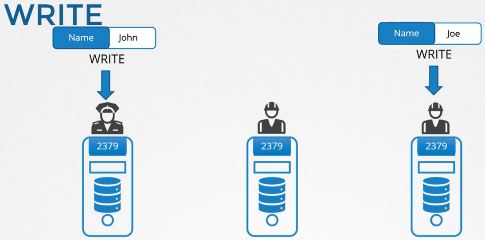

Предположим у нас есть один сервер с ETCD. Но это база данных и она может хранить важные данные. Поэтому возможно разместить хранилище данных на нескольких серверах.

Теперь у нас есть три сервера, на всех запущен ETCD, и все они обслуживают одинаковую копию БД. Соответственно, если вы потеряете один сервер, то все еще будете иметь две копии данных. Но каким образом ETCD обеспечивает согласованность (консистентность) данных на всех нодах?

Вы можете осуществлять запись на любой экземпляр и читать данные с любого экземпляра. ETCD гарантирует, что одинаковая согласованная копия данных доступна одновременно на всех экземплярах.

Как он это делает? С чтением всем достаточно просто. Т.к. одинаковые данные доступны на всех нодах, то вы можете легко прочитать их с любой ноды. Но не в случае с записью. Что если два запроса на запись придут на два разных экземпляра? Какой из них пройдет?

Например, на одну ноду пришел запрос на запись для имени `John`, а на другую ноду для имени `Joe`. Конечно мы не можем иметь разные данные на двух разных нодах.

 

Когда мы сказали, что ETCD может осуществлять запись через любой экземпляр, то не были правы на 100%. ETCD не обрабатывает запросы на запись на каждой ноде. Вместо этого только один из экземпляров отвечает за обработку запросов на запись.

Внутри две ноды выбирают среди себя лидера. Из общего числа экземпляров одна нода становится лидером, а другие ноды становятся последователями (followers).

Если запрос на запись пришел через лидер-ноду, тогда лидер и обработает этот запрос. Затем лидер убеждается, что другим нодам отправлена копия данных.

Если запрос на запись пришел через любую другую follower-ноду, тогда она перенаправит запрос на запись лидеру, а лидер обработает этот запрос.

И снова, когда запрос на запись обработан, лидер убеждается, что копии записи распространены другим экземплярам кластера.

Таким образом запись считается завершенной, если лидер получил согласие от других членов кластера.

Каким образом ноды выбирают среди себя лидера? И как они обеспечивают распространение записи по всем экземплярам? ETCD реализует распределенный консенсус (согласие, единодушие), используя протокол RAFT. Посмотрим как это работает в кластере из трех нод.

Когда кластер установлен, мы имеем три ноды, у которых не выбран лидер. Алгоритм RAFT использует рандомные таймеры для инициации запросов. Например, рандомный таймер запускается у трех менеджеров. Первый, у кого закончится таймер, посылает запрос другим нодам, запрашивающий разрешение стать лидером. Другие менеджеры, получив запрос, отвечают своим голосом (голосуют) и нода принимает на себя роль лидера. Теперь, когда нода избрана лидером, она посылает нотификации через регулярный промежуток времени другим мастерам, информируя их о том, что она продолжает брать на себя роль лидера.

В случае, если другие ноды в какой-то момент времени не получают уведомлений от лидера, что может произойти либо из-за выхода лидера из строя либо потери сетевой связности, ноды инициируют среди себя процесс переизбрания и определяется новый лидер.

Возвращаясь к предыдущем примеру, когда приходит запрос на запись, он обрабатывается лидером и реплицируется на другие ноды кластера. Запись считается завершенной только, когда она скопирована (распространена) на другие экземпляры кластера.

Мы сказали, что ETCD является высокодоступным. Даже если мы теряем ноду, он все еще должен функционировать.

Например пришел новый запрос на запись, но одна из нод кластера не отвечает. Следовательно лидер имеет возможность записи только на две ноды кластера. Будет ли запись считаться завершенной в этом случае? Будет ли система ждать, когда третья нода вернется в строй? Или запись провалится?

**Запись считается завершенной в том случае, если она может быть выполнена на большинстве (majority) нод кластера**. Например в случае трех нод, значение majority равно 2. Соответственно, если данные могут быть записаны на две ноды из трех, тогда запись будет считаться завершенной.

Если третья нода вернется онлайн, то данные затем также будут скопированы и на нее.

Что такое majority? Более подходящим для использования термином будет *кворум*. Кворум - это минимальное количество нод, которые должны быть доступны для правильной работы кластера или для успешного выполнения записи.

