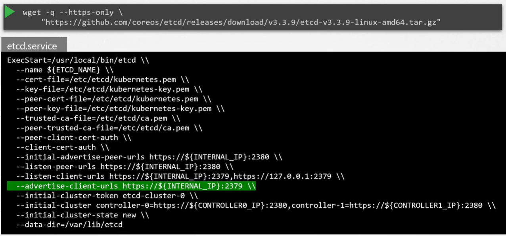

ETCD хранит информацию касательно кластера, такую как nodes, pods, configs, secrets, accounts, roles, role bindings и др. Любая информация, которую вы видите при запуске команды `kubectl get`, поступает от etcd-сервера. Каждое изменение, которое вы вносите в кластер, например добавление дополнительной ноды, деплой pod-а или ReplicaSet, обновляется в etcd-сервере. Только после обновления в etcd-сервере изменение считается завершенным.

В зависимости от того как вы разворачиваете кластер, etcd разворачивается по-разному. В процессе данного курса мы обсудим два типа развертывания. Один разворачивается с нуля (from scratch), другой с помощью инструмента *kubeadm*. Тестовая среда для практики разворачивалась с помощью инструмента kubeadm. Далее в нашем курсе, когда мы будем устанавливать кластер, мы будет делать это с нуля. Поэтому хорошо знать отличия между этими двумя методами.

Если вы устанавливаете кластер с нуля, тогда необходимо разворачивать etcd с помощью самостоятельной загрузки бинарных файлов etcd, их установкой и конфигурированием etcd в качестве сервиса на master-нодах вручную.

 

В сервис передается множество опций, некоторое их количество относится к сертификатам. Другие относятся к конфигурированию etcd в качестве кластера.

Сейчас мы отметим только одну опцию `--advertise-client-urls`. Это адрес, на котором слушает etcd. Это может быть IP сервера и порт 2379, который является дефолтным портом, на котором слушает etcd. Это URL, который должен быть сконфигурирован на kube-apiserver, когда он пытается достучаться до сервера etcd.

Если вы устанавливаете кластер с помощью kubeadm, то данная утилита разворачивает etcd в качестве pod-а в namespace `kube-system`.

Вы можете исследовать БД etcd с помощью утилиты etcdctl в этом pod-е.