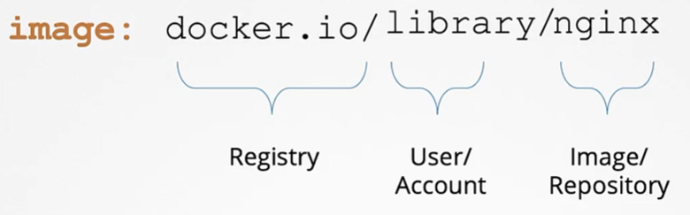

Рассмотрим стандартный pod definition файл, а именно поле `image`:

```yaml
apiVersion: v1
kind: Pod
metadata:
  name: nginx-pod
spec:
  containers:
  - name: nginx
    image: nginx
```

Что это за образ и откуда он "вытаскивается" (pull)? Это имя придерживается соглашения об именовании образов Docker. Здесь `nginx` - это образ или имя репозитория. Когда мы говорим `nginx`, то на самом деле подразумевается `library/nginx`. Первая часть означает пользователя или имя аккаунта. Если вы не указали пользователя или имя аккаунта, то будет принято значение `library`.

`library`- это имя дефолтного аккаунта, где хранятся официальные образы Docker. Эти образы продвигают best practices и поддерживаются специальной командой, отвечающей за рассмотрение и публикацию этих официальных образов.

Если вы создали свой собственный аккаунт и свои собственные репозитории (либо образы) внутри него, то вам нужно использовать аналогичный шаблон. Вместо `library` будет ваше имя или название вашей компании.

Где хранятся эти образы и откуда скачиваются? Т.к. мы не указали местоположение, откуда должны скачиваться образы, то по умолчанию принимается Docker Hub. Его DNS-имя равно `docker.io`. Registry - это место,  где хранятся все образы. Существует также и другие популярные Registries, например от Google - `gcr.io`, где хранится множество K8s-related образов.

<br>

Все это публично доступные образы, скачать и получить доступ к которым может кто угодно. Когда у вас есть созданное своими силами приложение, которое не должно быть доступно публично, хорошим решением может быть размещение внутреннего приватного Registry. Доступ к такому Registry осуществляется через набор credentials. Чтобы запустить контейнер, используя приватный образ с помощью Docker, сначала вы логинитесь в приватный Registry: `docker login private-registry.io`, вводите учетные данные и затем запускаете приложение: `docker run private-registry.io/apps/internal-app`.

Чтобы использовать приватный Registry в нашем pod definition файле, мы заменяем имя образа (`nginx`) на полный путь к образу в приватном Registry:

```yaml
apiVersion: v1
kind: Pod
metadata:
  name: nginx-pod
spec:
  containers:
  - name: nginx
    image: private-registry.io/apps/internal-app
```

Но как мы реализуем аутентификацию в приватном Registry в этом случае? Мы знаем, что в K8s образы пулятся и запускаются с помощью Docker runtime на worker-нодах. Как же credentials передаются в Docker runtime на worker-нодах? Для этого мы создаем объект Secret с учетными данным внутри:

```bash
kubectl create secret docker-registry regcred \
--docker-server=private-registry.io \
--docker-username=registry-user \
--docker-password=registry-password \
--docker-email=registry-user@org.com
```

`docker-registry` - встроенный тип Secret, созданный для хранения Docker credentials.

Затем мы указываем этот Secret внутри pod definition файла:

```yaml
apiVersion: v1
kind: Pod
metadata:
  name: nginx-pod
spec:
  containers:
  - name: nginx
    image: private-registry.io/apps/internal-app
  imagePullSecrets:
  - name: regcred
```

Когда pod создается, kubelet на worker-ноде использует credentials из этого Secret для скачивания образа.