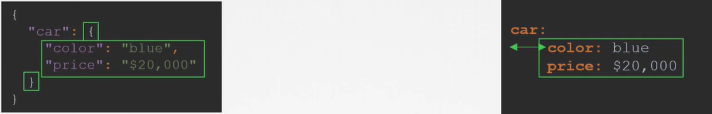
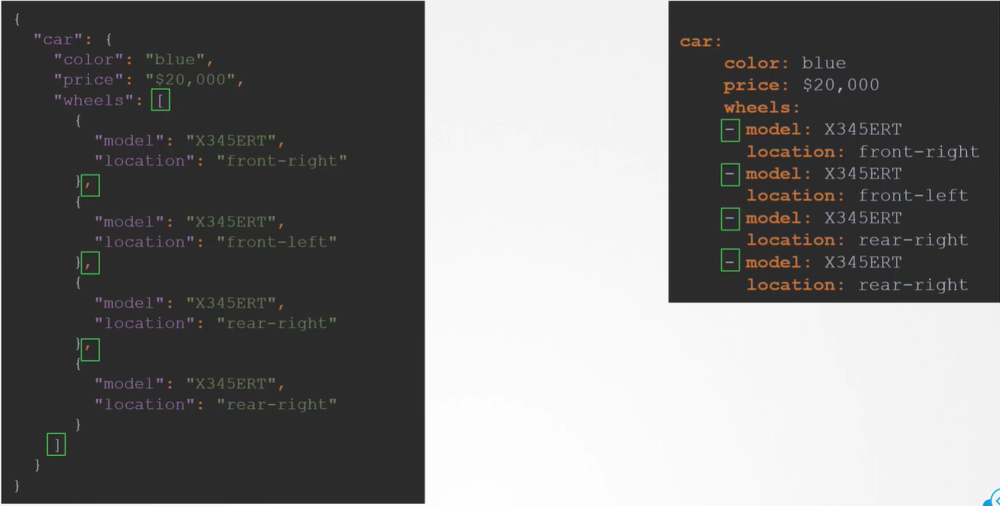
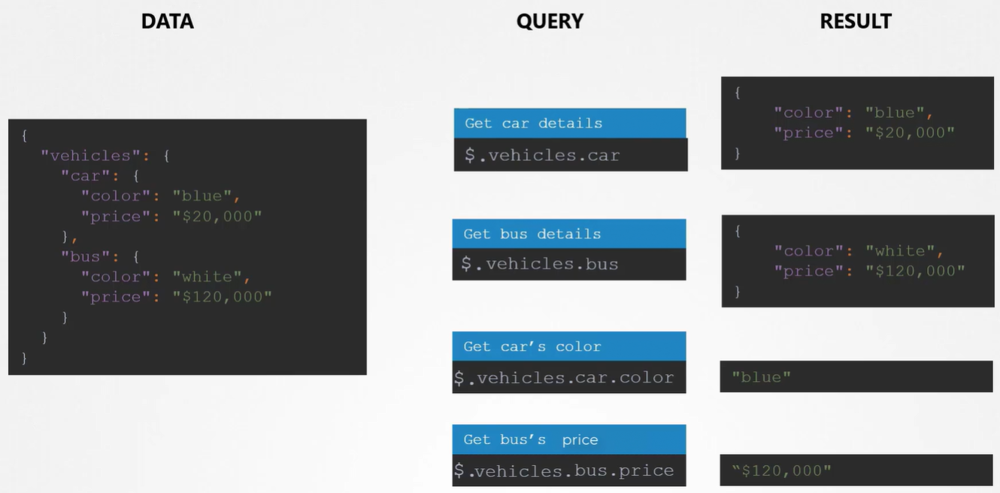

Одни и те же данные в формате JSON и в формате YAML:

 

Список в формате JSON и в формате YAML:

 

[Ресурс](https://www.json2yaml.com/) для конвертации JSON <=> YAML.

JSON PATH - язык запросов, помогающий анализировать данные, представленные в формате JSON либо YAML. Можно провести аналогию с SQL.

Примеры запросов:

 
