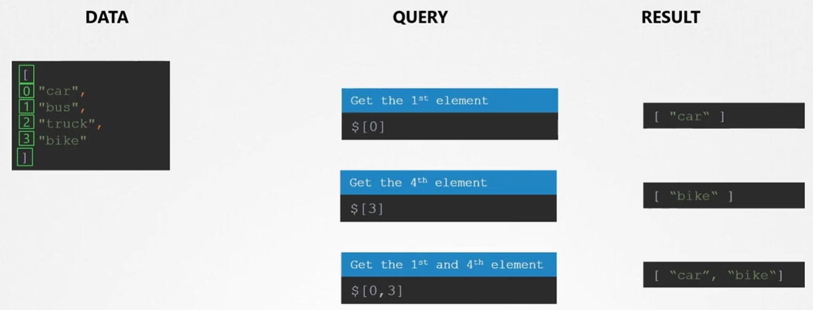
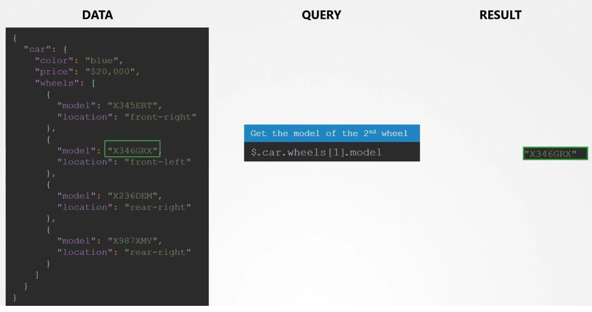
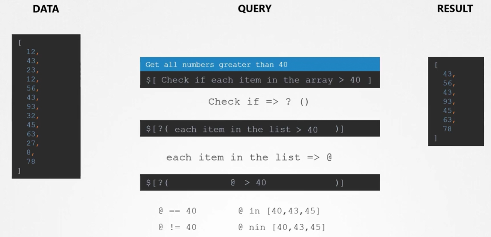
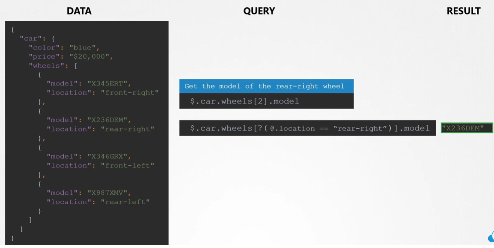

Одни и те же данные в формате JSON и в формате YAML:

 

Список (list) в формате JSON и в формате YAML:

 

[Ресурс](https://www.json2yaml.com/) для конвертации JSON <=> YAML.

JSON PATH - язык запросов, помогающий анализировать данные, представленные в формате JSON либо YAML. Можно провести аналогию с SQL.

Что-либо заключенное в фигурные скобки является словарем (dictionary) в JSON.

В данном примере `"car"` и `"bus"` являются двумя свойствами словаря или двумя словарями внутри словаря. Какого именно словаря? Верхнеуровневый словарь, который не имеет названия, известен как корневой элемент JSON-документа и обозначается как `$`.

 

Еще пример:

 

На самом деле результат любого JSON PATH запроса представляет собой массив `[]`:

 

Как получить данные из списка?

 

Получить данные из списка, находящегося внутри словаря:

 

Выбрать из списка все числа больше 40:

 

Вывести модель заднего правого колеса (rear-right):

 
