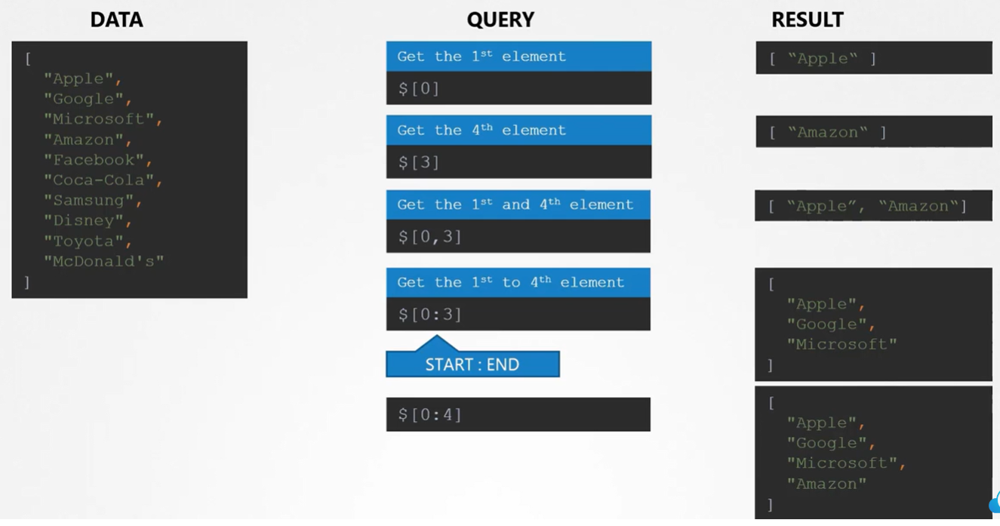
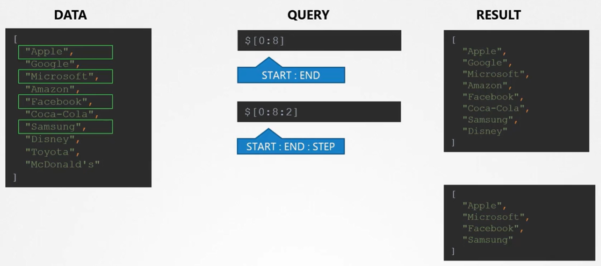
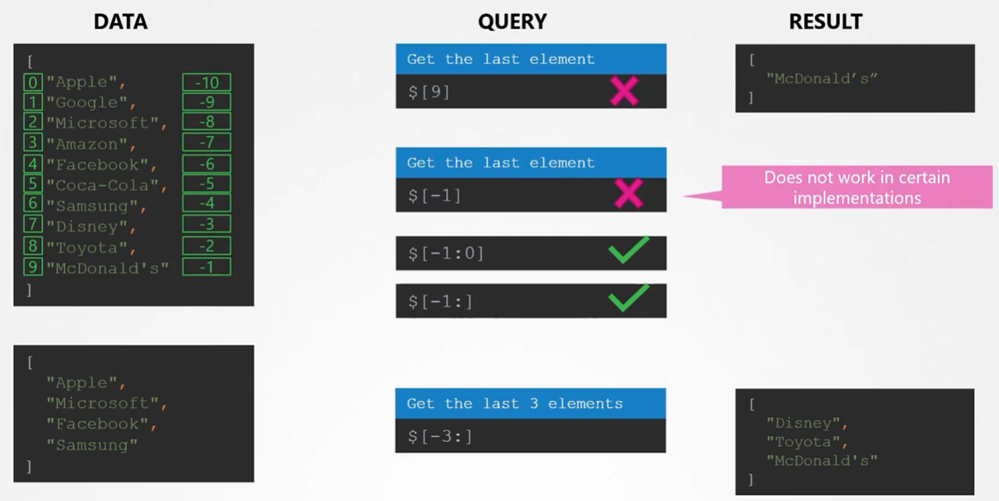

При работе со списками важно обратить внимание на следующий момент. Когда мы указываем какой-либо диапазон списка, например `[0:3]`, то будут выведены элементы с индексом 0, 1, 2. Элемент с индексом 3 в итоговую выборку не попадет!

 

Также мы можем задать шаг при работе со списком. Например вывести первые семь элементов массива с шагом два.

 

Получить последний элемент списка:

 