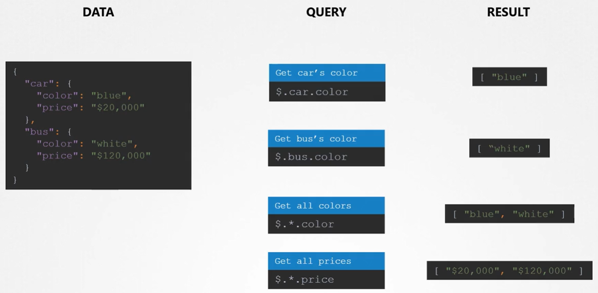
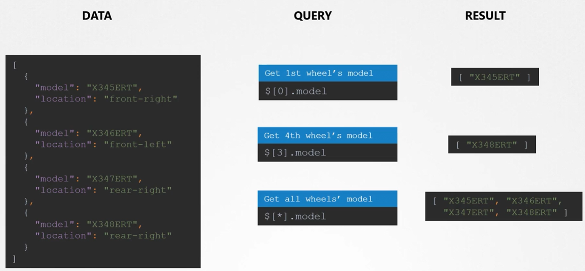
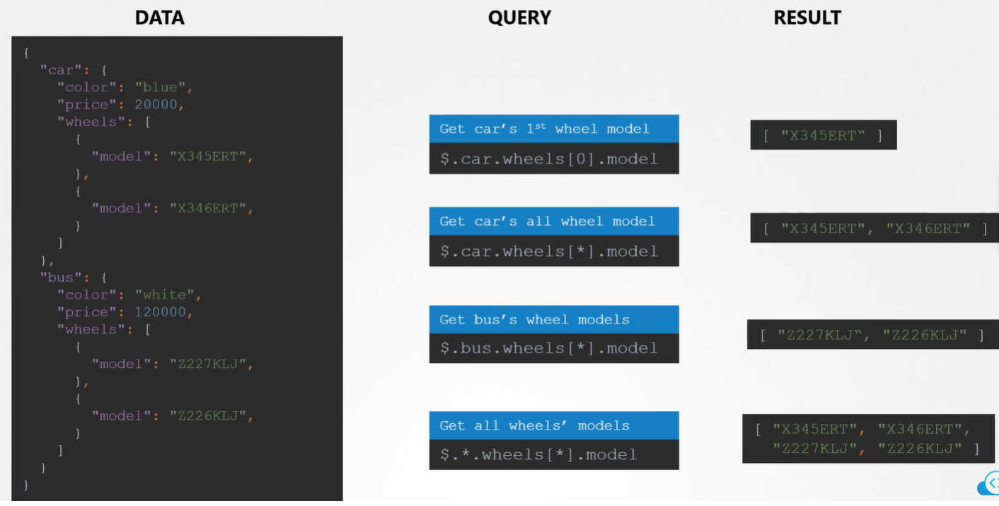

Получить цены/цвета всех объектов в словаре:

<br>

Получить модели всех объектов в списке (нужно заключать JSON PATH запрос в кавычки):

<br>

Использование wildcard в комбинации словари/списки:

<br>

Задача из лабы, получить значения указанные ниже из файла `q9.json`.

```json
[
  "Kailash",
  "Malala"
]
```

Итоговый запрос: `cat q9.json | jpath '$.prizes[?(@.year == 2014)].laureates[*].firstname'`.