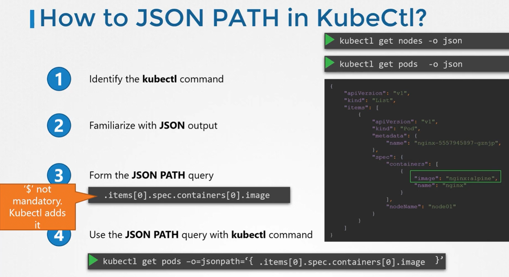
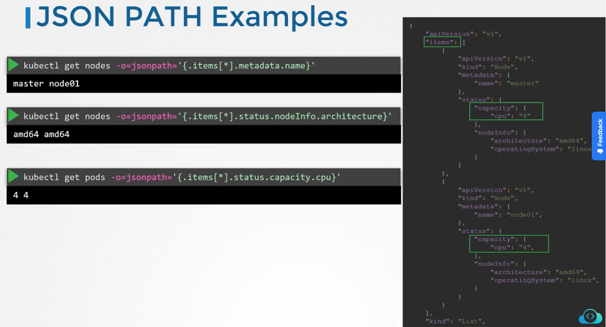
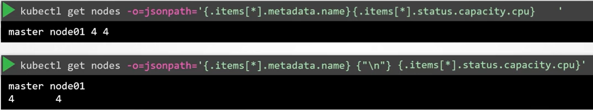
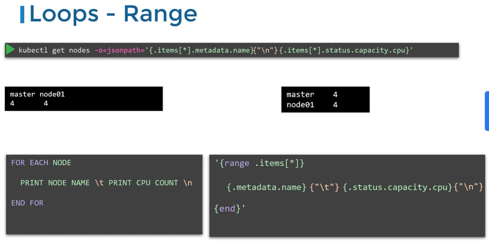
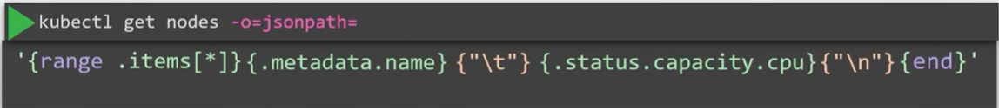
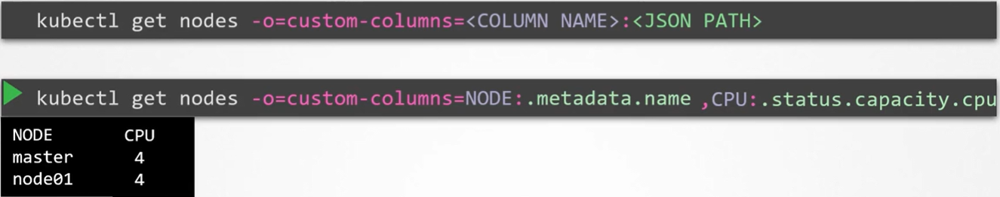
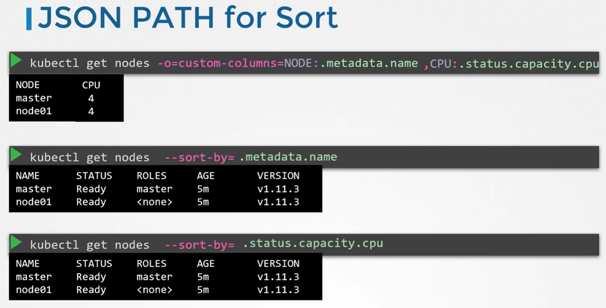

Kube-apiserver возвращает запрошенные данные в формате JSON.

Утилита kubectl в свою очередь, получив данные в формате JSON, конвертирует их в человеко-читаемый вид и выводит на экран.

В процессе этой конвертации множество информации, пришедшей в формате JSON, скрывается, чтобы сделать вывод более компактным и читаемым.

<br>

При работе с kubectl необязательно указывать символ `$` в JSON PATH запросах, утилита добавляет его автоматически. Само тело запроса нужно оборачивать в кавычки и фигурные скобки - `'{}'`.

Примеры запросов:

<br>

Также мы можем объединить несколько запросов из примера выше вместе:

<br>

Можно использовать конструкцию `{"\n"}` для переноса строки, либо `{"\t"}` для табуляции.

Теперь мы хотим вывести те же данные, но в другом формате:

```
master  4
node01  4
```

Для этого используем следующую конструкцию:

<br>

Итоговая команда:

<br>

Если мы дополнительно хотим задать названия для столбцов, можно использовать следующую конструкцию:

<br>

Здесь `.items[*]` не указывается, т.к. формат `custom-columns` принимает это по умолчанию.

Также можно задать опцию для сортировки результатов:

<br>

`kubectl get nodes -o jsonpath='{.items[*].metadata.name}'`

`kubectl get pv --sort-by=.spec.capacity.storage`

`kubectl get pv -o custom-columns=NAME:.metadata.name,CAPACITY:.spec.capacity.storage --sort-by=.spec.capacity.storage`

`kubectl config view --kubeconfig=my-kube-config -o jsonpath='{$.contexts[?(@.context.user=="aws-user")].name}'`