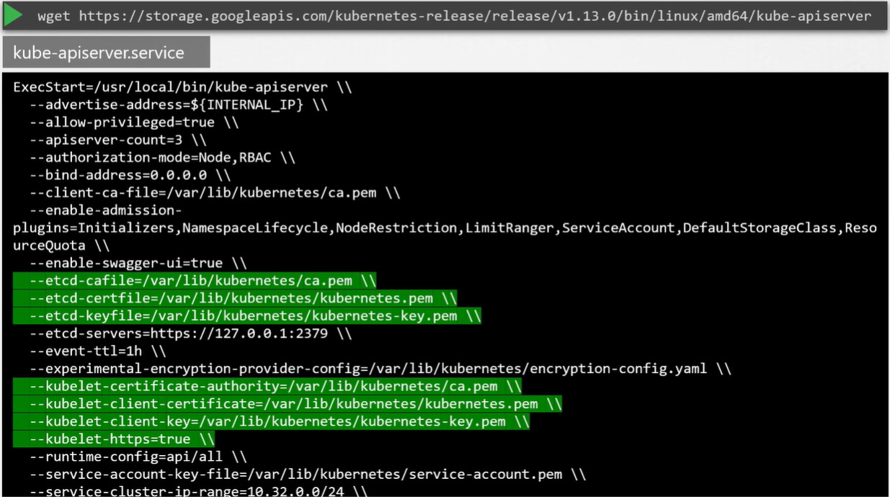
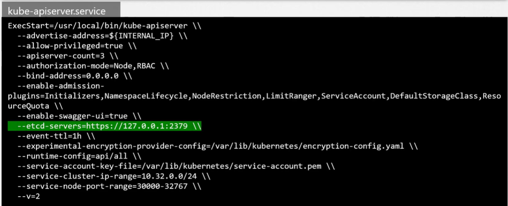
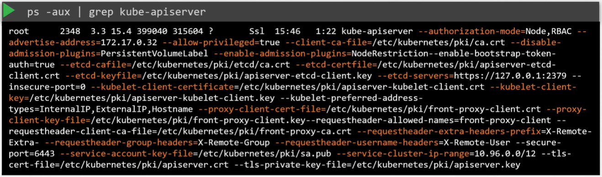

Ранее мы обсуждали, что *kube-apiserver* - это основой компонент управления в K8s.

Когда вы выполняете команду `kubectl`, утилита kubectl фактически обращается к kube-apiserver. Kube-apiserver сначала аутентифицирует запрос и проверяет его. Затем он вытаскивает данные из кластера etcd и посылает ответ с запрошенной информацией.

На самом деле вам не обязательно пользоваться утилитой kubectl. Вместо этого вы можете вызывать API напрямую, посылая POST-запросы. Рассмотрим пример создания pod-а.

`curl -X POST /api/v1/namespaces/default/pods ...[other]`

Сначала запрос проходит аутентификацию, а затем проверку. В этом случае API-сервер создает объект Pod без назначения его на ноду, обновляет информацию на сервере etcd, уведомляет пользователя, что pod был создан.

Scheduler постоянно мониторит API-сервер и понимает, что появился новый pod без назначенной ему ноды. Scheduler определяет подходящую ноду для размещения нового pod-а и взаимодействует в ответ с kube-apiserver. API-сервер затем обновляет информацию в кластере etcd и посылает ее в kubelet на соответствующей worker-ноде. Kubelet создает pod на ноде и отдает приказ container runtime engine развернуть образ приложения. Когда это сделано, kubelet в ответ посылает обновленный статус kube-apiserver-у, а API-сервер затем обновляет данные в кластере etcd. Похожая схема соблюдается каждый раз, когда запрашивается изменение.

Kube-apiserver находится в центре всех различных задач, которые должны быть выполнены, чтобы сделать изменение в кластере. Обобщая - kube-apiserver отвечает за аутентификацию и проверку запросов, получение и обновление данных в хранилище etcd. Фактически kube-apiserver является единственным компонентом, который напрямую взаимодействует с хранилищем etcd. Остальные компоненты, такие как scheduler, kube-controller-manager, kubelet используют API-сервер для выполнения обновлений в кластере в соответствующих областях. Если вы загрузили кластер с помощью инструмента kubeadm, вам необязательно это знать, но если вы устанавливаете кластер "hard way" способом, тогда kube-apiserver доступен в виде бинарных файлов на странице релиза k8s. Скачайте и настройте его в виде сервиса на вашей k8s master-ноде.

Как видите kube-apiserver запускается со множеством параметров:

 

Множество из них касаются сертификатов, которые используются для защиты соединения между различными компонентами.

В опции `--etcd-servers` указываются адреса серверов etcd. Таки образом API-сервер подключается к серверам etcd.

 

Каким образом можно посмотреть опции kube-apiserver в существующем кластере? Это зависит от того, каким способ был развернут кластер. Kubeadm разворачивает kube-apiserver в виде pod-а в namespace `kube-system` на master-ноде. Вы можете посмотреть опции в pod definition-файле по пути:

`cat /etc/kubernetes/manifests/kube-apiserver.yaml`

При установке НЕ kubeadm способом вы можете посмотреть соответствующие опции в файле сервиса: `cat /etc/systemd/system/kube-apiserver.service`.

Также вы можете посмотреть запущенный процесс и действующие опции с помощью листинга процессов на master-ноде и поиске kube-apiserver:

 