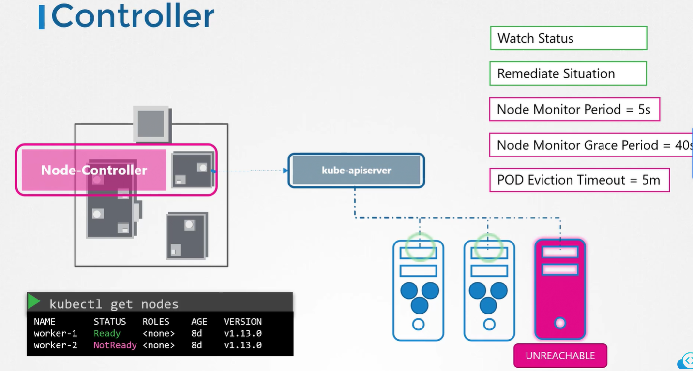
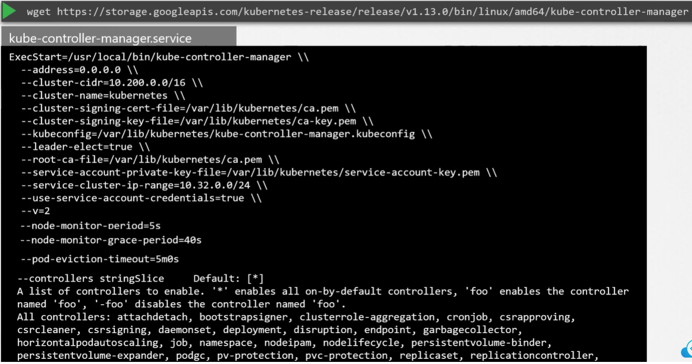
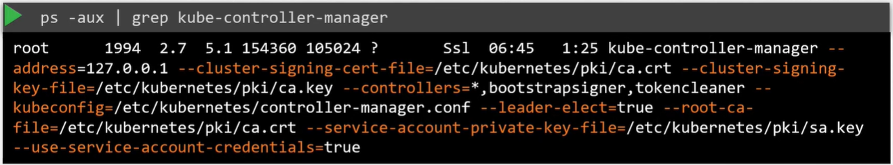

Ранее мы обсуждали, что *kube-controller-manager* управляет различными контроллерами в K8s. Контроллер похож на офис или отдел на master-корабле, который имеет свой набор обязанностей. Так например офис для кораблей будет отвечать за мониторинг и выполнение необходимых действий, касающихся непосредственно кораблей, всяких раз когда прибывает новый корабль или наоборот отплывает или даже уничтожается. Другой офис может быть одним из управляющих контейнерами на кораблях, он заботится о поврежденных или об упавших с корабля контейнерах.

Эти офисы, во-первых постоянно находятся на чеку и следят за статусами кораблей и во-вторых предпринимают необходимые действия для исправления ситуации.

В терминах K8s контроллер - это процесс, который непрерывно мониторит состояние различных компонентов в системе и работает в направлении приведения всей системы к желаемому функционирующему состоянию.

Например *node-controller* отвечает за мониторинг статуса нод и выполнение необходимых действий для сохранения приложений в запущенном состоянии. Он делает это через kube-apiserver. Node-controller проверяет статус нод каждые 5 секунд. Таким способом он может мониторить здоровье нод. Если node-controller перестает получать heartbeat-ы от ноды, она помечается как недоступная, но контроллер сначала ждет 40 секунд, прежде чем пометить ноду как недоступную. После того как нода помечена как недоступная, контроллер дает 5 ей минут для возвращения в строй. Если этого не произошло, контроллер удаляет pod-ы, которые были назначены на эту ноду и поднимает их на здоровой ноде, если pod-ы являлись частью ReplicaSet.

 

Следующий контроллер - *replication-controller*. Он отвечает за мониторинг статуса ReplicaSets и гарантирует, что желаемое количество pod-ов всегда доступны в пределах set. Если pod умирает, он создает другой.

Это были всего лишь два примера контроллеров. Существует намного больше контроллеров доступных в K8s. Любые концепции, которые мы до сих пор видели в K8s, такие как Deployments, Services, Namespaces, Persistent Volumes и какая бы логика не была встроена в эти конструкции, все они реализованы через различные контроллеры. Это можно представить, как некий типа мозга позади множества вещей в K8s.

Как вы можете увидеть эти контроллеры и где они расположены в кластере? Все они упакованы в единый процесс, известный как *kube-controller-manager*. Когда вы устанавливаете kube-controller-manager устанавливаются также и различные контроллеры. Каким образом вы можете установить и посмотреть kube-controller-manager? Скачайте kube-controller-manager со страницы релиза K8s, распакуйте и запустите как сервис. Когда вы запускаете его, то можете увидеть список предлагаемых опций. Здесь вы можете сконфигурировать дополнительные опции для кастомизации вашего контроллера. Некоторые дефолтные настройки для node-controller мы рассматривали ранее, такие как `--node-monitor-period`, `--node-monitor-grace-period`, `--pod-eviction-timeout`. Здесь они представлены в виде опций. Существует дополнительная опция `--controllers`, которую вы можете использовать для указания какие контроллеры включить. По умолчанию все они включены, но вы можете выбрать для включения только определенные.

 

Поэтому в случае, если вам кажется, что контроллеры не работают или вовсе отсутствуют, это будет хорошей отправной точкой.

Как нам посмотреть опции сервера kube-controller-manager? И снова это зависит от того, каким образом был развернут кластер. Kubeadm разворачивает kube-controller-manager в виде pod-а в namespace `kube-system` на master-ноде. Вы можете посмотреть опции в pod definition-файле по пути:

`cat /etc/kubernetes/manifests/kube-controller-manager.yaml`

При установке НЕ kubeadm способом вы можете посмотреть соответствующие опции в файле сервиса: `cat /etc/systemd/system/kube-controller-manager.service`.

Также вы можете посмотреть запущенный процесс и действующие опции с помощью листинга процессов на master-ноде и поиске kube-controller-manager:

 