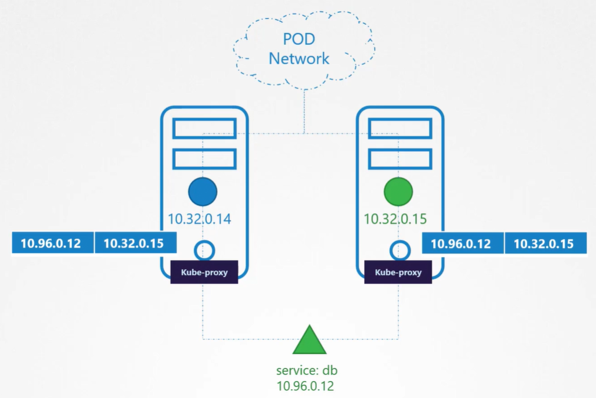
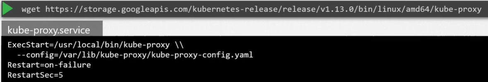

В K8s кластере каждый pod может связаться с любым другим pod-ом. Это достигается за счет развертывания в кластере POD networking solution. POD network - это виртуальная сеть, которая охватывает все ноды кластера, к которым подключаются все pod-ы. Через эту сеть они могут взаимодействовать друг с другом. Существует множество решений для развертывания такой сети.

В данном случае у нас есть web-приложение, развернутое на первой ноде, и БД, развернутая на второй. Web-приложение может связаться с БД, просто используя IP pod-а с БД. Но нет гарантий, что IP этого pod-а всегда будет оставаться одинаковым. Лучший способ для web-приложения получить доступ к БД заключается в использовании Service. Мы создаем Service, чтобы опубликовать БД в кластере. Теперь web-приложение может получить доступ к БД, используя имя Service - `db`. Service также получает назначенный на него IP. Всякий раз когда pod пытается связаться с Service, используя его IP или имя, Service перенаправляет трафик на back-end pod, в данном случае БД.

Что такое Service и как он получает IP? Service присоединяется к той же POD network? Service не может присоединиться к POD network, потому что Service - это нечто ненастоящее. Это не контейнер вроде pod-а, соответственно он не имеет каких-либо интерфейсов или активных слушающих процессов. Это виртуальный компонент, который живет только в памяти K8s. Также мы говорили, что Service должен быть доступен в пределах кластера с любой ноды. Каким образом это достигается? И вот тут на помощь приходит *kube-proxy*. Kube-proxy - это процесс, запущенный на каждый ноде в K8s-кластере. Его работа состоит в наблюдении за новыми Services и каждый раз, когда появляется новый Service, kube-proxy создает соответствующие правила на каждой ноде для перенаправления трафика, приходящего на этот Service, в сторону back-end pod. Один из способов сделать это заключается в использовании правил iptables. В данном случае kube-proxy создает правило iptables на каждой ноде кластера для перенаправления трафика идущего на IP этого Service, равный 10.96.0.12, на IP фактического pod-а, равный 10.32.0.15

 

Посмотрим как устанавливается kube-proxy. Скачайте бинарный файл kube-proxy со страницы релиза K8s, распакуйте и запустите как сервис.

 

Kubeadm разворачивает kube-proxy в виде pod-а на каждой ноде. Фактически он разворачивается в виде Daemon Set, т.е. на каждой ноде кластера всегда развернут отдельный pod.