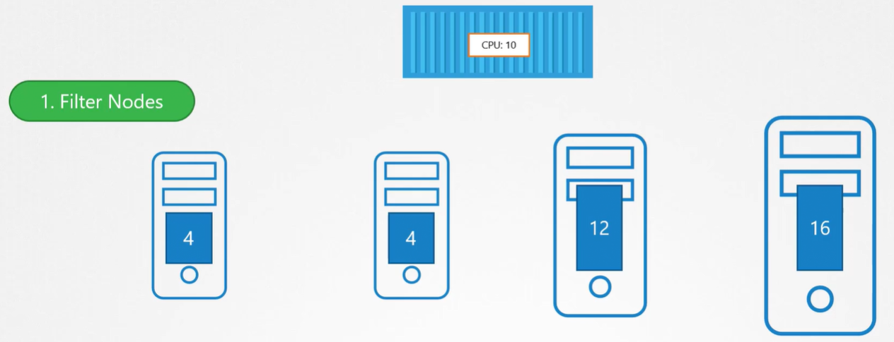
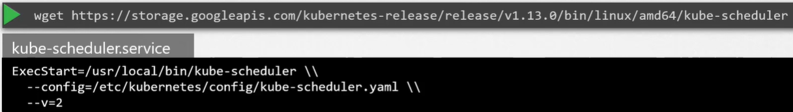

Как мы уже обсуждали ранее K8s scheduler отвечает за планирование (scheduling) pod-ов на ноды. Важно понимать, что scheduler отвечает только за принятие решения, какой pod на какую ноду будет размещен. Сам он фактически не размещает pod-ы на нодах. Это работа kubelet. Kubelet или капитан корабля создает pod-ы на кораблях. Scheduler только решает какой pod куда пойдет.

Зачем нам нужен scheduler? Существует множество кораблей и множество контейнеров. Вы хотите быть уверены, что нужный контейнер окажется на нужном корабле. Например корабли и контейнеры могут иметь разные размеры. Вы хотите быть уверены, что корабль обладает достаточной вместимостью для размещения этих контейнеров. Разные корабли могут иметь разные точки назначения. Вы хотите быть уверены, что ваши контейнеры размещены на подходящих кораблях и в итоге окажутся в нужной точке назначения.

В K8s scheduler принимает решение на какую ноду разместить pod в зависимости от определенных критериев. У вас могут быть pod-ы с различным требованиями по ресурсам. У вас могут быть ноды кластера, выделенные для определенных приложений. Итак как scheduler назначает pod-ы? Scheduler смотрит на каждый pod и пытается найти наиболее подходящую для него ноду.

Рассмотри пример - синий pod. Он имеет набор требований по CPU и памяти. Scheduler проходит через две фазы для определения наиболее подходящей ноды для этого pod-а. На первой фазе scheduler пытается отфильтровать ноды, которые НЕ подходят по профилю для этого pod-а.

 

Например это ноды, которые не обладают достаточным количеством ресурсов (CPU и память), запрошенными pod-ом. Поэтому первые две маленькие ноды (4 и 4) будут отфильтрованы. Теперь остаются две ноды (12 и 16), на которые может быть помещен pod. Каким образом scheduler выберет одну из этих двух? Scheduler ранжирует ноды, чтобы определить наиболее подходящую для pod-а. Он использует приоритетную функцию (priority function) для назначения счета нодам по шкале от 0 до 10. Например scheduler вычисляет количество ресурсов, которые будут свободны после размещения pod-а. В нашем случае нода справа будет иметь 6 свободных CPU, если pod будет помещен на нее, что на 4 больше по сравнению с другой. Поэтому нода справа получит больший ранг и соответственно победит. Так работает scheduler верхнеуровнево. Конечно это может быть кастомизировано и вы можете также написать свой собственный scheduler.

Существует намного больше тем (topics) для рассмотрения, такие как resource requirements, limits, taints and tolerations, node selectors, affinity rules и т.д.

Как устанавливается kube-scheduler? Скачайте бинарный файл kube-scheduler со страницы релиза K8s, распакуйте и запустите как сервис.

 

Когда вы запускаете scheduler как сервис, нужно указывать его конфигурационный файл.

Как посмотреть серверные опции kube-scheduler? Kubeadm разворачивает kube-scheduler в виде pod-а в namespace `kube-system` на master-ноде.