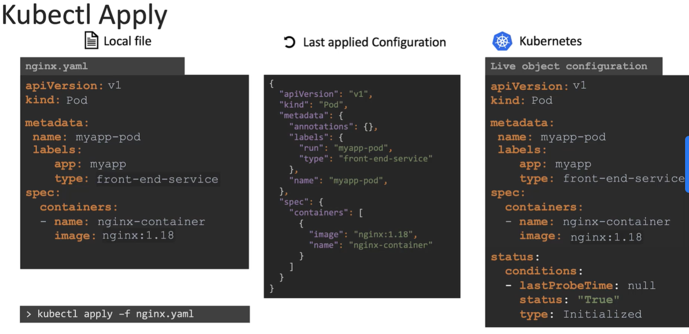

Команда `kubectl apply` принимает во внимание *local configuration file*, *live object definition* в K8s и *last applied configuration*, прежде чем принять решение какие изменения следует внести.

Когда вы запускаете команду `kubectl apply -f nginx.yaml` и объект еще не существует, то объект создается.

При создании объекта в K8s создается конфигурация объекта (live object configuration), аналогичная той, которую мы создали локально (local configuration file), но с дополнительными полями для хранения статуса объекта. Это live configuration объекта в K8s кластере. Так K8s хранит информацию об объекте внутри себя, независимо от того каким способом был создан объект.

Когда вы используете команду `kubectl apply` для создания объекта, она делает немного больше. YAML-версия нашего local configuration file, который мы написали, конвертируется в формат JSON и затем сохраняется в виде last applied configuration. При обновлении объекта все три сущности сравниваются для идентификации какие изменения следует внести в live object.

 

Например, мы решили обновить образ nginx в нашем local configuration file на версию 1.19 и запускаем команду `kubectl apply`. Это значение сравнивается со значением в live object configuration и, если они различаются, live object configuration обновляется в соответствии с новым значением.

После любого внесенного изменения last applied configuration в формате JSON всегда обновляется до последнего, соответственно она всегда актуальна.

Зачем нам на самом деле нужна last applied configuration? Если поле было удалено из local configuration, например label `type: front-end-service` был удален и сейчас, когда мы запускаем команду `kubectl apply`, мы видим, что last applied configuration имела такой label, но теперь его нет в local configuration. Это значит, что поле должен быть удалено из live configuration. Соответственно, если поле присутствовало в live configuration и отсутствовало в local или last applied configuration, тогда все останется как есть. Но если поле отсутствует в local file и при этом присутствует в last applied configuration, это значит, что на предыдущем шаге или, когда мы запускали команду `kubectl apply` в крайний раз, это конкретное поле было здесь и сейчас было удалено.

Last applied configuration помогает нам понимать, какие поля были удалены из local file. Эти поля затем удаляются из текущей live configuration.

Ссылка на [документацию](https://kubernetes.io/docs/tasks/manage-kubernetes-objects/declarative-config/)

Local file хранится в нашей системе локально, live object configuration хранится в памяти K8s. Где хранится JSON-файл с last applied configuration? Он хранится в live object configuration в самом K8s-кластере в виде аннотации `last-applied-configuration`. Помните, что это делается только при использовании команды `kubectl apply`. Команды `kubectl create` и `kubectl replace` не хранят last applied configuration. Соответственно не нужно смешивать императивный и декларативный подходы при управлении объектами в K8s.