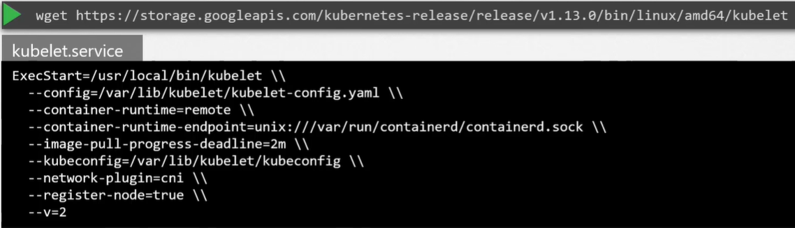
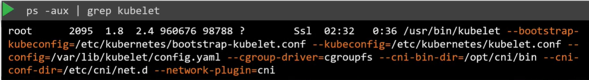

Ранее мы обсуждали, что kubelet - это капитан, который руководит всеми активностями на корабле. Они отвечают за выполнение всей работы по оформлению документации, необходимой, чтобы стать частью кластера. Они являются единственной точкой контакта с master-кораблем. Они загружают и выгружают контейнеры с кораблей согласно указанию scheduler на master-е. Они также отправляют отчеты через регулярные промежутки времени по статусу корабля и контейнеров на нем.

Kubelet в K8s worker-ноде регистрирует ноду в K8s-кластере. Когда kubelet получает инструкции загрузить контейнер или pod на ноду, он запрашивает container runtime engine, например это может быть Docker, чтобы спуллить требуемый образ и запустить экземпляр. Kubelet затем продолжает следить за состоянием pod-а и контейнеров в нем и своевременно посылает отчеты kube-apiserver.

Как вы можете установить kubelet? Если вы используете инструмент kubeadm для создания кластера, он НЕ разворачивает kubelet автоматически. В этом состоит отличие от других компонентов кластера. Вы всегда должны вручную устанавливать kubelet на worker-ноды. Скачайте установщик, распакуйте и запустите как сервис.

 

Также вы можете посмотреть запущенный процесс kubelet и действующие опции с помощью листинга процессов на master-ноде:

 