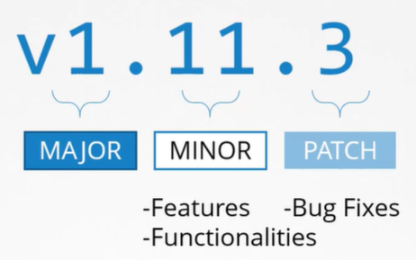
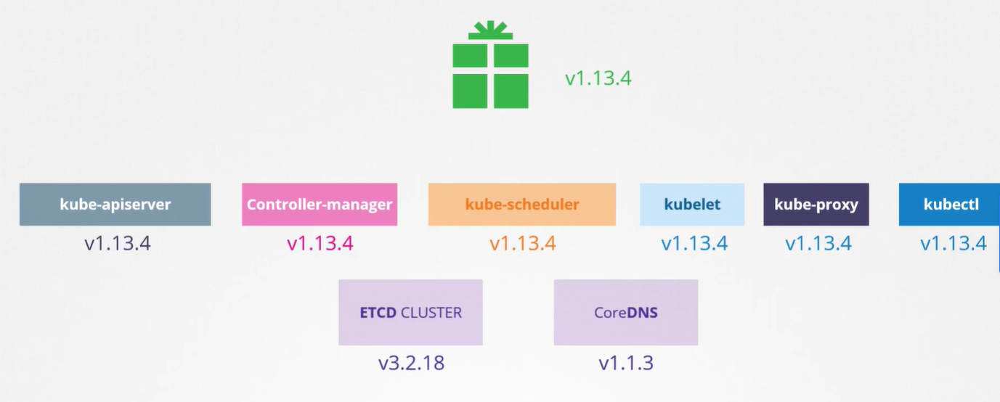

Когда мы разворачиваем кластер K8s, мы устанавливаем определенную версию K8s.

Посмотреть версию можно командой: `kubectl get nodes`.

Версия релиза K8s состоит из трех частей.

 

K8s следует стандартной процедуре управления версиями выпуска программного обеспечения.

Кроме stable релизов существуют также alpha и beta релизы. Все улучшения и bug fix-ы сначала попадают в alpha релиз, по умолчанию все новые функции отключены и могут быть глючными. Затем отсюда релиз проходит путь до beta, здесь код уже хорошо оттестирован, новые функции включены по умолчанию. И уже после релиз становится stable.

Вы можете найти все релизы на странице K8s в GitHub.

Скаченный пакет содержит внутри все control plane компоненты. Почти все из них одинаковой версии. Однако нужно помнить, что существуют некоторые control plane компоненты, имеющие отличные от остальных версии. ETCD и CoreDNS - это отдельные проекты, имеющие свои собственные версии.

Release Notes каждого релиза содержат информацию о поддерживаемых версиях внешних зависимых приложений, таких как ETCD и CoreDNS.

 