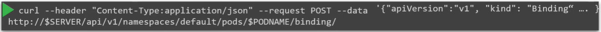

Что вы будете делать, если в кластере отсутствует scheduler? Вероятно вы не захотите полагаться на встроенный scheduler, а вместо этого захотите планировать pod-ы самостоятельно.

Как работает scheduler? Каждый pod имеет поле `nodeName:`, которое по умолчанию не задано. Обычно вы не указываете это поле при создании манифест-файла, K8s добавляет его автоматически. Scheduler идет по всем pod-ам и смотрит на те, у которых данное свойство не задано. Такие pod-ы становятся кандидатами на scheduling. Затем scheduler определяет подходящую для pod-а ноду путем запуска scheduling-алгоритма. Как только нода определена, он планирует pod к размещению на этой ноде путем задания свойства `nodeName:` равным имени ноды, создавая объект Binding.

```yaml
apiVersion: v1
kind: Pod
metadata:
  name: nginx
  labels:
    name: nginx
spec:
  containers:
    - name: nginx
      image: nginx
      ports:
        - containerPort: 8080
  nodeName: node02
```

Что происходит, если нет scheduler-а для мониторинга и планирования нод? Pod-ы остаются висеть в состоянии `Pending`. Что вы можете с этим сделать? Вы можете вручную назначить pod на ноду. Без scheduler-а самый легкий способ запланировать pod - задать поле `nodeName:` со значением равным названию ноды в манифест-файле pod-а при его создании. После этого pod будет назначен на указанную ноду. Вы можете задать имя ноды только при создании.

Но как быть если pod уже создан и вы хотите назначить его на ноду? K8s не позволит вам изменить поле `nodeName:` для pod-а. Другой способ назначить ноду для существующего pod-а заключается в создании объекта Binding и отправке POST-запроса к *pod binding API*, таким образом имитируя работу реального scheduler-а. В объекте Binding вы указываете целевую ноду.

```yaml
apiVersion: v1
kind: Binding
metadata:
  name: nginx
target:
  apiVersion: v1
  kind: Node
  name: node2
```

POST-запрос отправляется к pod binding API с данными объекта Binding в формате JSON. Соответственно вы должны конвертировать YAML-файл в его JSON-эквивалент.

<br>