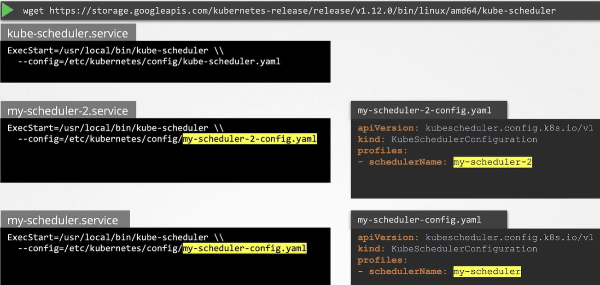
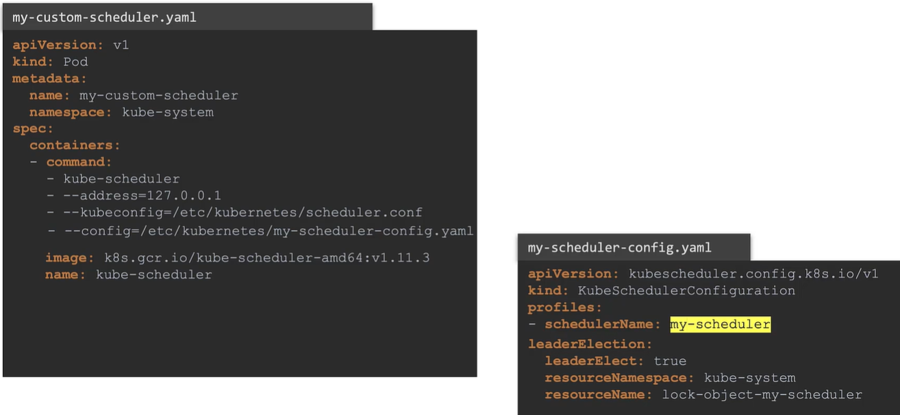
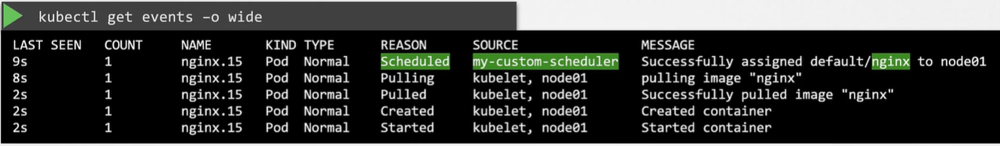
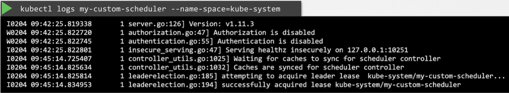

Scheduler имеет алгоритм, который равномерно распределяет pod-ы по нодам, а также принимает во внимание различные условия, которые мы задаем через taints & tolerations, node affinity и т.д. Но как быть, если ничего из этого не удовлетворяет вашим нуждам? Например у вас есть специфическое приложение, которое требует, чтобы его компоненты были размещены на ноды после прохождение дополнительных проверок.

Вы решили, что вам нужен собственный scheduling алгоритм для размещения pod-ов на нодах. Соответственно вы можете добавить в  него свои собственные кастомные условия и проверки.

K8s is highly extensible! Вы можете написать свой собственный K8s scheduler, упаковать его и развернуть в качестве дефолтного или дополнительного scheduler. При таком способе большинство приложений могут идти через дефолтный scheduler, а некоторые определенные приложения, которые вы выберете, будут использовать ваш собственный кастомный scheduler.

Ваш кластер K8s может иметь несколько scheduler-ов одновременно. При создании pod-а или Deployment вы можете проинструктировать K8s, чтобы pod был запланирован определенным scheduler-ом.

Если существует несколько scheduler-ов, то они должны иметь разные названия, чтобы мы могли идентифицировать их как отдельные scheduler-ы. Дефолтный scheduler называется `default-scheduler`. Это имя настроено в конфиг-файле kube-scheduler.

**scheduler-config.yaml**
```yaml
apiVersion: kubescheduler.config.k8s.io/v1
kind: KubeSchedulerConfiguration
profiles:
- schedulerName: default-scheduler
```

Дефолтному scheduler-у оно на самом деле не нужно, т.к. если вы не укажете имя, то автоматически будет задано `default-scheduler`.

Для других scheduler-ов мы можем создать отдельные конфиг-файлы и задать их имена.

**my-scheduler-config.yaml**
```yaml
apiVersion: kubescheduler.config.k8s.io/v1
kind: KubeSchedulerConfiguration
profiles:
- schedulerName: my-scheduler
```

**my-scheduler-2-config.yaml**
```yaml
apiVersion: kubescheduler.config.k8s.io/v1
kind: KubeSchedulerConfiguration
profiles:
- schedulerName: my-scheduler-2
```

В предыдущих уроках мы видели как разворачивается kube-scheduler. Нужно скачать бинарный файл и запустить его как сервис с набором опций. Для деплоя дополнительного scheduler-а вы можем использовать тот же самый бинарный файл kube-scheduler или какой-либо другой, собранный самостоятельно под наши нужды. В данном примере мы будем использовать тот же самый бинарный файл для деплоя дополнительного scheduler-а и в качестве конфигурационного файла укажем файл с кастомной конфигурацией, созданный нами. Каждый scheduler использует отдельный конфиг-файл и в каждом файле указано уникальное имя scheduler-а. В 99% случаев вы НЕ будете разворачивать кастомный scheduler таким способом, т.к. при использовании kubeadm все компоненты control plane разворачиваются в виде pod-ов.

<br>

Рассмотрим другой способ - деплой scheduler в виде pod-а и соответствующий манифест. В опции `--kubeconfig` задается путь до файла `scheduler.conf`, который содержит аутентификационную информацию для подключения к API-серверу. В опции `--config` задается путь до нашего кастомного конфиг-файла.

Другая важная опция - `leaderElect`, которая используется в случае HA-установки, когда имеется несколько копий scheduler-а, запущенных на разных master-нодах. Если несколько копий одного scheduler-а запущены на разных нодах, одновременно активной может быть только одна. В этом случае опция `leaderElect` поможет выбрать лидера, который будет управлять scheduling-действиями.

<br>

Ссылка на [документацию](https://kubernetes.io/docs/tasks/extend-kubernetes/configure-multiple-schedulers/) K8s по установке кастомного scheduler-а в виде Deployment.

Как использовать наш кастомный scheduler? В pod definition файле нужно указать опцию `schedulerName`.

```yaml
apiVersion: v1
kind: Pod
metadata:
  name: nginx
spec:
  containers:
  - image: nginx
    name: nginx
  schedulerName: my-custom-scheduler
```

Если scheduler был некорректно сконфигурирован, тогда после создания pod останется в состоянии Pending. Если все настроено корректно, то pod перейдет в состояние Running.

Как посмотреть какой scheduler "подобрал" наш pod, в случае если scheduler-ов несколько? Можно использовать команду: `kubectl get events -o wide`. Так можно посмотреть все события в текущем namespace.

<br>

Плюс также можно посмотреть логи самого scheduler-а командой: `kubectl logs my-custom-scheduler --name-space=kube-system`.

<br>