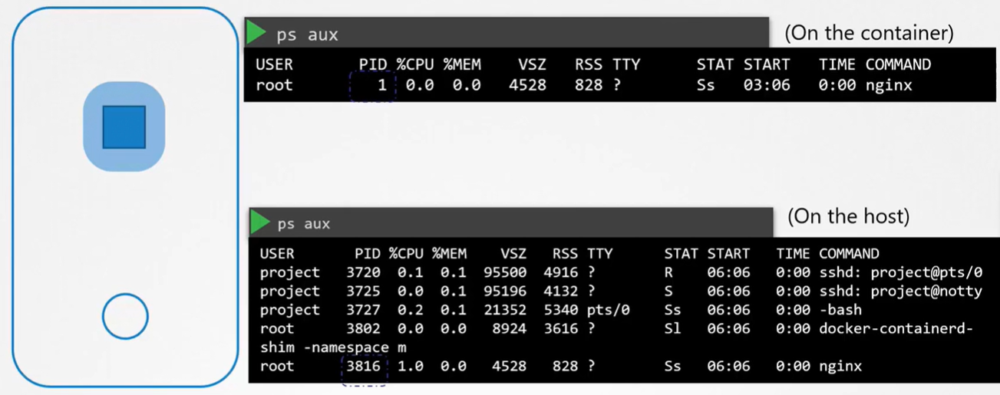
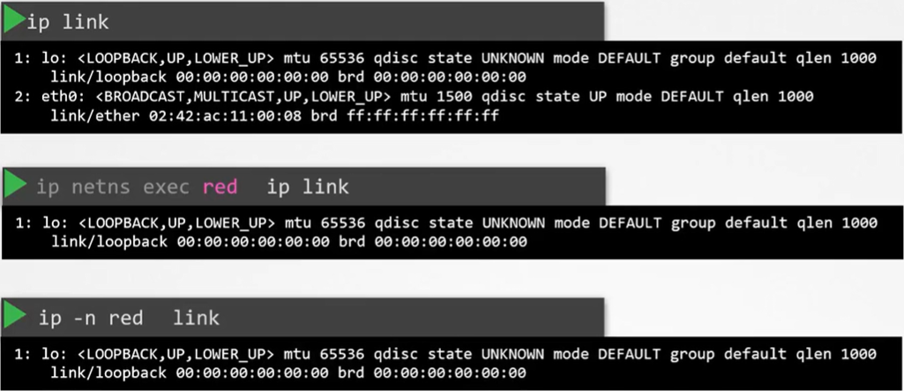
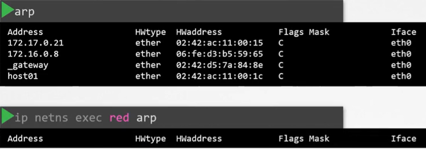
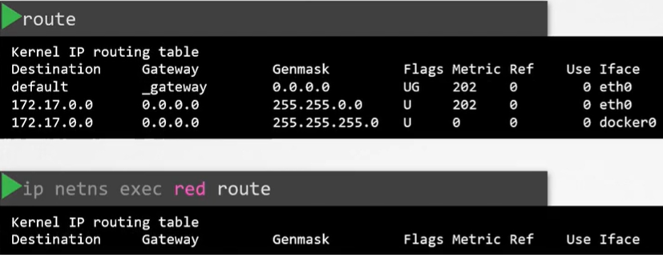
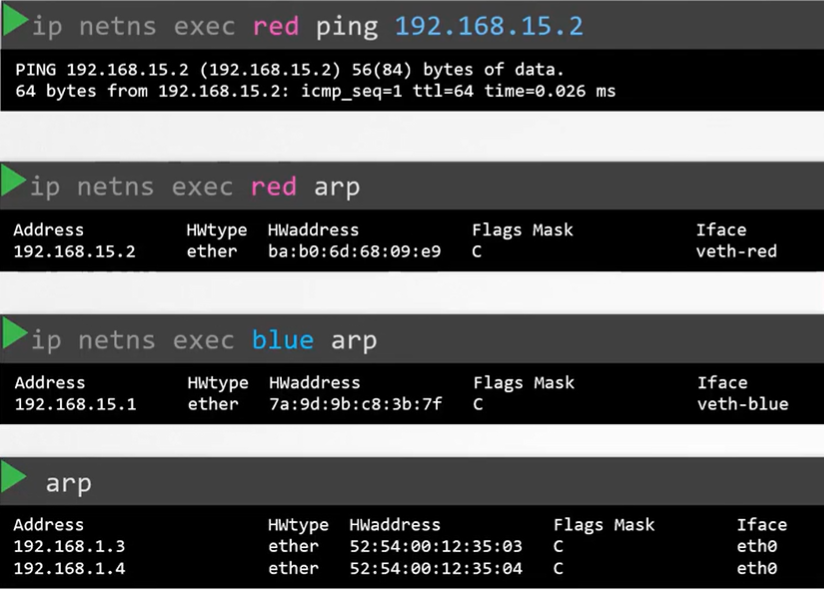
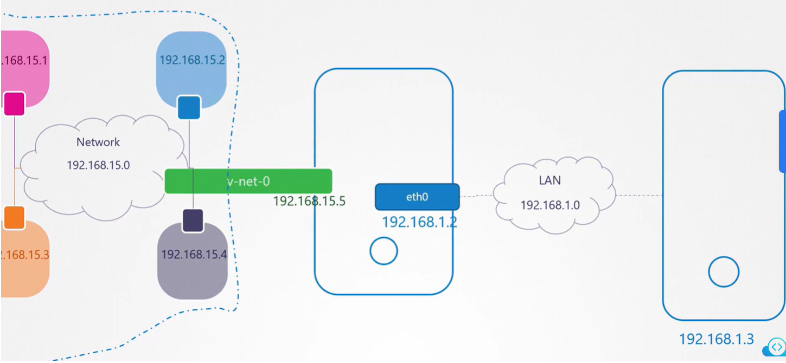
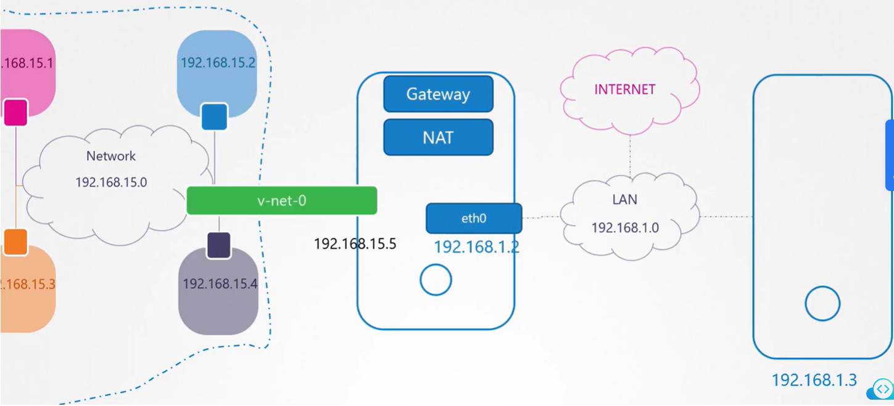

Network Namespaces используются контейнерами, такими как Docker, для обеспечения сетевой изоляции.

Начнем с простого хоста. Как мы уже знаем, контейнеры отделены от основного хоста с помощью namespaces.

Что такое namespaces? Если представить, что хост - это дом, то namespace - это отдельная комната в доме, которую вы выделили каждому ребенку. Комнаты помогают обеспечить уединение для каждого ребенка. Каждый ребенок может видеть только то, что находится в его комнате и не может видеть, что происходит вне его комнаты. По их мнению, они единственные, кто живет в доме. Однако вы, как родитель, имеете обзор во все комнаты, а также и в другие пространства дома. Если вы захотите, то сможете установить соединение между двумя комнатами в доме.

Когда вы создаете контейнер, то хотите убедиться, что он изолирован и не видит каких-либо процессов хоста или другого контейнера. Поэтому мы создаем для него специальную "комнату" на хосте с помощью namespace.

Что касается контейнера, то он видит только запущенные им процессы и думает, что находится на своем собственном хосте. Однако основной хост видит вообще все процессы, включая процессы, запущенные внутри контейнеров. Когда вы делаете листинг процессов в контейнере, то видите один единственный процесс с PID равным 1. Когда вы делаете листинг тех же процессов на основном хосте из под пользователя root, то видите вообще все процессы, включая процесс запущенный в контейнере, но в этот раз уже с другим PID. Это один и тот же процесс, но с разным PID внутри и во вне контейнера.

<br>

Наш хост имеет свои собственные интерфейсы, подключенные к локальной сети, а также свои собственные таблицу маршрутизации и таблицу ARP, содержащие информацию об остальной части сети. Мы хотим "запечатать" (seal) всю эту информацию от контейнера. Когда контейнер создается, мы создаем для него network namespace. Таким образом он не видит какой-либо network-related информации на хосте.

В пределах namespace контейнер может иметь свои собственные виртуальные интерфейсы, таблицу маршрутизации и таблицу ARP.

Чтобы создать новый network namespace на Linux-хосте используйте команду: `ip netns add red`. Создадим второй namespace: `ip netns add blue`.

Для просмотра созданных network namespace используйте команду: `ip netns`.

Для листинга интерфейсов на хосте мы используем команду: `ip link`. Как посмотреть то же самое, но внутри созданного нами network namespace?

Для этого используйте команду: `ip netns exec red ip link` либо `ip -n red link`. В выводе присутствует только `loopback` интерфейс, при этом не видно интерфейс основного хоста `eth0`.

<br>

С помощью namespaces мы успешно ограничили контейнеру видимость интерфейса основного хоста. То же справедливо и для таблицы ARP. Если мы выполним команду `arp` на хосте, то увидим список записей. Если же мы запустим эту команду внутри контейнера - `ip netns exec red arp`, то не увидим никаких записей.

<br>

Аналогично для таблицы маршрутизации.

<br>

На текущий момент эти network namespaces не имеют сетевой связности. У них нет собственных интерфейсов и они не могут видеть сеть основного хоста.

Для начала рассмотрим настройку связности между самими namespace. Также как мы соединяем две физические машины вместе с помощью кабеля, подключая его к сетевому интерфейсу на каждой из машин, мы можем соединить два namespace вместе с помощью виртуальной ethernet-пары или виртуального кабеля. Часто он упоминается как pipe, но мы будем называть его виртуальным кабелем с двумя интерфейсами на обоих концах.

Для создания "кабеля" выполняем команду: `ip link add veth-red type veth peer name veth-blue`. Здесь `veth-red` и `veth-blue` это два конца виртуального кабеля.

Следующий шаг - подключить каждый интерфейс кабеля в соответствующий namespace.

```bash
ip link set veth-red netns red
ip link set veth-blue netns blue
```

Затем мы можем назначить IP-адрес каждому namespace. Обязательно задаем маску подсети, иначе, если делать как в уроке без указания маски, будет принята маска по умолчанию `/32` и связности не будет!

```bash
ip -n red addr add 192.168.15.1/24 dev veth-red
ip -n blue addr add 192.168.15.2/24 dev veth-blue
```

Включаем интерфейсы.

```bash
ip -n red link set veth-red up
ip -n blue link set veth-blue up
```

Теперь namespaces могут достучаться друг до друга. Проверяем - `ip netns exec red ping 192.168.15.2`. Пинг должен идти.

Если мы посмотрим таблицу ARP для namespace `red`, то увидим, что он идентифицировал своего "синего" соседа. Аналогично для namespace `blue`.

Если же мы посмотрим таблицу ARP самого хоста, то увидим, что он ничего не знает о созданных нами namespace-ах и о созданных внутри них интерфейсах.

<br>

Это работает в случае, когда у нас только два namespace. Но что делать, когда их больше? Как заставить их всех взаимодействовать друг с другом? Точно так же, как в физическом мире, вы создаете виртуальную сеть внутри хоста. Чтобы создать сеть, вам нужен коммутатор. Соответственно, чтобы создать виртуальную сеть, вам нужен виртуальный коммутатор. Вы создаете виртуальный свитч внутри хоста и подключаете namespace к нему. Как же нам создать этот виртуальный коммутатор внутри хоста? Существуют различные решения, например native solution под названием *Linux Bridge*, *Open vSwitch* и т.д. В данном примере мы будем использовать Linux Bridge.

Для создания внутренней bridge-сети, мы добавляем новый интерфейс на наш хост: `ip link add v-net-0 type bridge`.

Посмотреть интерфейсы типа bridge в системе: `ip addr show type bridge`.

Но!!! Сначала редактируем файл `/lib/systemd/network/99-default.link`, комментируем в нем строку `MACAddressPolicy=persistent`.

Перезапускаем сервис (непонятно обязательно или нет): `systemctl restart systemd-networkd`. Если этого не сделать, то bridge-интерфейс не сможет подняться и будет в статусе `NO-CARRIER`.

Что касается нашего хоста, то для него это всего лишь другой интерфейс, как например `eth0`.

Включим созданный интерфейс: `ip link set dev v-net-0 up`.

Для namespace-ов этот интерфейс похож на коммутатор, к которому они могут подключиться. Рассматривайте его как интерфейс для хоста и коммутатор для namespace-ов.

Следующий шаг - подключить namespaces к новому виртуальному коммутатору. Ранее мы создали "кабель" или ethernet-пару с интерфейсом `veth-red` на одному конце и `veth-blue` на другом, т.к. хотели соединить два namespace напрямую. Теперь же мы будем подключать все namespaces к bridge-сети. Для этого нам нужен новый "кабель", а от старого мы избавимся.

Используем команду: `ip -n red link delete veth-red`. Когда мы удаляем линк (veth-red) на одном конце кабеля, другой линк (veth-blue) удаляется автоматически, т.к. это пара.

Теперь создадим новые "кабели" для подключения namespaces к bridge. Интерфейсы `veth-red-br` и `veth-blue-br` подключаются на стороне bridge.

```bash
ip link add veth-red type veth peer name veth-red-br
ip link add veth-blue type veth peer name veth-blue-br
```

Подключим один конец "кабелей" к namespaces.

```bash
ip link set veth-red netns red
ip link set veth-blue netns blue
```

Другой конец к bridge.

```bash
ip link set veth-red-br master v-net-0
ip link set veth-blue-br master v-net-0
```

Назначим IP-адреса на интерфейсы:

```bash
ip -n red addr add 192.168.15.1/24 dev veth-red
ip -n blue addr add 192.168.15.2/24 dev veth-blue
```

Включаем интерфейсы.

```bash
ip -n red link set veth-red up
ip -n blue link set veth-blue up

ip link set veth-red-br up
ip link set veth-blue-br up
```

Теперь контейнеры могут достучаться друг до друга по сети:

```bash
aidar@ubuntu-vm:~$ ip netns exec red ping 192.168.15.2
PING 192.168.15.2 (192.168.15.2) 56(84) bytes of data.
64 bytes from 192.168.15.2: icmp_seq=1 ttl=64 time=0.240 ms
64 bytes from 192.168.15.2: icmp_seq=2 ttl=64 time=0.080 ms
64 bytes from 192.168.15.2: icmp_seq=3 ttl=64 time=0.236 ms

aidar@ubuntu-vm:~$ ip netns exec blue ping 192.168.15.1
PING 192.168.15.1 (192.168.15.1) 56(84) bytes of data.
64 bytes from 192.168.15.1: icmp_seq=1 ttl=64 time=0.206 ms
64 bytes from 192.168.15.1: icmp_seq=2 ttl=64 time=0.073 ms
64 bytes from 192.168.15.1: icmp_seq=3 ttl=64 time=0.113 ms
```

Для основного хоста назначен IP `192.168.30.131` (ВМ VMware) и, если мы попытаемся с хоста проверить связность с одним из интерфейсов, находящихся в namespace, то увидим, что связность отсутствует.

Т.к. `v-net-0` по сути является обычным интерфейсом, то чтобы настроить сетевую связность между хостом и namespace, нужно всего лишь назначить IP-адрес на этот интерфейс (и что важно, автоматически добавится новый маршрут в таблицу маршрутизации):

`ip addr add 192.168.15.5/24 dev v-net-0`

Теперь мы можем пинговать интерфейс namespace с хоста:

```bash
aidar@ubuntu-vm:~$ ping 192.168.15.1
PING 192.168.15.1 (192.168.15.1) 56(84) bytes of data.
64 bytes from 192.168.15.1: icmp_seq=1 ttl=64 time=0.213 ms
64 bytes from 192.168.15.1: icmp_seq=2 ttl=64 time=0.102 ms
64 bytes from 192.168.15.1: icmp_seq=3 ttl=64 time=0.187 ms
```

Однако важно понимать, что вся эта сеть является приватной и ограничена в пределах хоста. Из namespaces вы не сможете получить доступ во внешний мир, а также никто извне не сможет получить доступ к приложениям внутри namespace. Единственная дверь во внешний мир - это ethernet-порт на хосте. Как мы можем настроить bridge для доступа к LAN сети через ethernet-порт? Предположим существует еще один хост с адресом `192.168.30.129`, подключенный к LAN сети. Как мы можем получить доступ к этому хосту из namespaces? Что произойдет, если мы попытаемся пингануть этот хост из namespace `blue`? Namespace `blue` увидит, что мы пытаемся достигнуть сети `192.168.30.0/24`, которая отличается от текущей сети namespace `192.168.15.0/24` и попытается найти ответ в своей таблице маршрутизации. Таблица маршрутизации namespace не содержит информации о других сетях.

```bash
aidar@ubuntu-vm:~$ ip netns exec blue route
Kernel IP routing table
Destination     Gateway         Genmask         Flags Metric Ref    Use Iface
192.168.15.0    0.0.0.0         255.255.255.0   U     0      0        0 veth-blue
```

Поэтому будет получен ответ:

```bash
aidar@ubuntu-vm:~$ ip netns exec blue ping 192.168.30.129
ping: connect: Network is unreachable
```

Поэтому нам нужно добавить запись в таблицу маршрутизации для предоставления шлюза (двери) во внешний мир. Как нам найти этот шлюз? Как мы обсуждали ранее, шлюз - это система в локальной сети, которая подключена к другим сетям. Какая система имеет один интерфейс в сети `192.168.15.0/24`, которая является локальной для namespace `blue`, а также подключена к внешней LAN-сети? Рассмотрим логическое представление. Это локальный хост, на котором присутствуют все эти namespaces, соответственно вы можете пинговать namespaces. Наш локальный хост также имеет интерфейс, подключенный к приватной сети. Поэтому наш локальный хост является шлюзом, соединяющим две сети вместе.

<br>

Теперь мы можем добавить маршрут в namespace `blue`, который говорит - направляй весь трафик к сети `192.168.30.0/24` через шлюз `192.168.15.5`.

`ip netns exec blue ip route add 192.168.30.0/24 via 192.168.15.5`

Помните, наш хост имеет два IP-адреса, один в bridge-сети `192.168.15.5` и другой во внешней сети `192.168.30.131`. Можете ли вы использовать любой из них в маршруте? Нет, т.к. namespace `blue` может достигнуть шлюз в его локальной сети только по адресу `192.168.15.5`. Шлюз по умолчанию будет доступен из namespace, когда вы добавите его в маршрут.

```bash
aidar@ubuntu-vm:~$ ip netns exec blue route
Kernel IP routing table
Destination     Gateway         Genmask         Flags Metric Ref    Use Iface
192.168.15.0    0.0.0.0         255.255.255.0   U     0      0        0 veth-blue
192.168.30.0    192.168.15.5    255.255.255.0   UG    0      0        0 veth-blue
```

Если мы попытаемся пингануть сейчас, то больше не увидим сообщения `Network is unreachable`, но все еще не увидим и каких-либо ответов от ping. В чем может быть проблема?

Похожую ситуацию мы обсуждали в одной из предыдущих лекций (видимо речь о курсе Docker), когда из нашей домашней сети пытались пробиться во внешний Интернет через маршрутизатор. Наша домашняя сеть имеет внутренние частные ("серые") IP-адреса, о которых destination-сеть в Интернете ничего не знает, а поэтому не может достучаться в ответ. Соответственно нам нужно включить NAT на нашем хосте, который выступает в роли шлюза, чтобы он мог отправлять сообщения в локальную сеть от своего имени со своим адресом.

Добавляем новое правило в талицу NAT в postrouting-цепочку для маскирования (замены) from-адреса во всех пакетах, исходящих от source-сети `192.168.15.0/24`, на собственный IP-адрес хоста.

`iptables -t nat -A POSTROUTING -s 192.168.15.0/24 -j MASQUERADE`, здесь `-t` - table to manipulate, `-A` - append to chain, `-j` - jump target.

Таким образом любой получивший эти пакеты во внешней сети, будет думать, что они пришли от самого хоста, а не от namespace.

Хотя в лекции об этом явно и не сказано, но нужно включить forwarding, иначе связность не появится: `sysctl net.ipv4.ip_forward=1`. И крайне желательно, чтобы на хосте, который выступает в роли шлюза, **не был установлен Docker**, т.к. он добавляет свои правила в iptables.

Теперь пинги должны доходить успешно:

```bash
aidar@ubuntu-vm:~$ ip netns exec blue ping 192.168.30.129
PING 192.168.30.129 (192.168.30.129) 56(84) bytes of data.
64 bytes from 192.168.30.129: icmp_seq=1 ttl=63 time=0.652 ms
64 bytes from 192.168.30.129: icmp_seq=2 ttl=63 time=0.562 ms
64 bytes from 192.168.30.129: icmp_seq=3 ttl=63 time=1.01 ms
```

Наконец предположим, что наша LAN подключена к Интернету и мы хотим, чтобы наши namespace также могли ходить в Интернет.

<br>

Мы пытаемся пинговать сервер в Интернете из namespace `blue`:

```bash
aidar@ubuntu-vm:~$ ip netns exec blue ping 8.8.8.8
ping: connect: Network is unreachable
```

Мы уже знаем, почему сеть недоступна. В таблице маршрутизации namespace `blue` есть маршрут только в сеть `192.168.30.0/24` и больше никуда. Т.к. эти namespaces могут достигнуть любой сети, которую может достигнуть наш хост, то мы может просто сказать - чтобы достигнуть любую внешнюю сеть, обращайся к хосту.

`ip netns exec blue ip route add default via 192.168.15.5`

Теперь пинги должны доходить успешно:

```bash
aidar@ubuntu-vm:~$ ip netns exec blue ping 8.8.8.8
PING 8.8.8.8 (8.8.8.8) 56(84) bytes of data.
64 bytes from 8.8.8.8: icmp_seq=1 ttl=127 time=41.8 ms
64 bytes from 8.8.8.8: icmp_seq=2 ttl=127 time=43.0 ms
64 bytes from 8.8.8.8: icmp_seq=3 ttl=127 time=38.0 ms
```

А что насчет связности из внешних сетей до самих namespaces? Например в namespace `blue` работает веб-приложение на 80 порту. На данный момент namespaces находятся во внутренней частной сети и никто извне не знает о них. Мы можем пинговать их только с нашего хоста. Если мы попытаемся пинговать "серый" адрес namespace с другого хоста, то увидим, что он недоступен - `ping: connect: Network is unreachable`. Очевидно потому что другой хост не знает об этой частной сети. Чтобы настроить сетевую связность, у нас есть два варианта.

Первый - сообщить второму хосту местонахождение частной сети, добавив новую запись в его таблицу маршрутизации. Сеть `192.168.15.0/24` может быть достигнута через интерфейс хоста с адресом `192.168.1.2`. Однако мы (по какой-то причине) не хотим этого делать.

Второй способ - добавить правило port forwarding с помощью iptables - любой трафик приходящий на порт 80 на локальном хосте будет перенаправлен на порт 80 IP-адреса, назначенного на namespace `blue`.

`iptables -t nat -A PREROUTING -p tcp --dport 80 -j DNAT --to-destination 192.168.15.2:80`