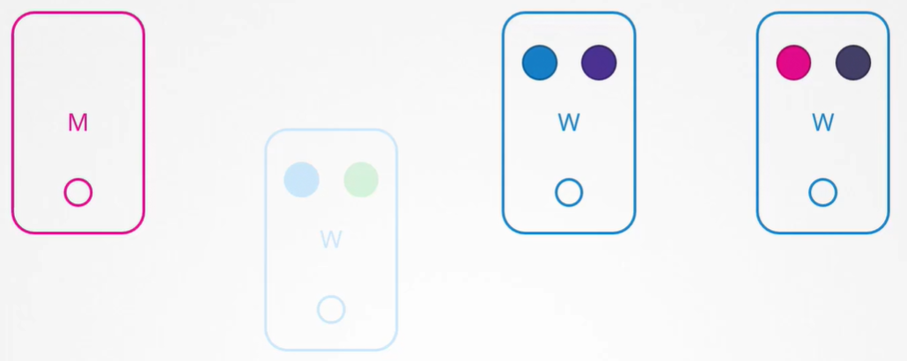
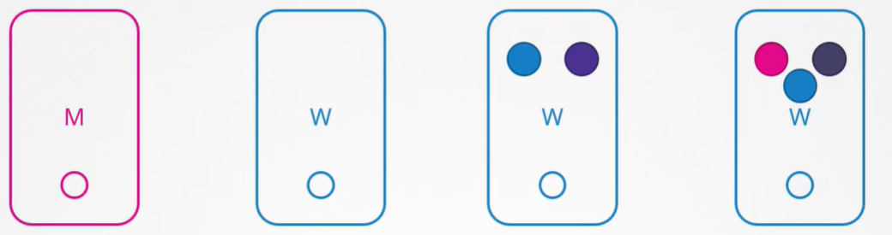

Предположим у нас есть кластер, состоящий из нескольких нод, и pod-ы обслуживающие приложения. Что будет, если одна из нод упадет? Разумеется pod-ы на ней станут недоступны. В зависимости от того каким образом были развернуты pod-ы, может возникнуть влияние на пользователей. Например, если у нас было несколько реплик "синего" pod-а, то пользователи, использующие "синее" приложение, не будут подвержены влиянию, т.к. они будут обслуживаться через другие оставшиеся "синие" pod-ы. Однако пользователи, использующие "зеленый" pod, будут подвержены влиянию, т.к. это единственный pod, обслуживающий "зеленое" приложение.

 

Что в этом случае делает K8s? Если нода возвращается в строй немедленно, то запускается процесс kube-control (?) и pod-ы возвращаются онлайн. Однако, если нода остается в down-е более 5 минут, тогда pod-ы на этой ноде завершаются (terminated). K8s считает их мертвыми. Если pod-ы были частью Replica Set, тогда они пересоздаются на других нодах. Время, в течение которого нода ждет возвращения pod-ов онлайн, известно как `--pod-eviction-timeout` и задается на kube-controller-manager с дефолтным значением 5 минут.

`kube-controller-manager --pod-eviction-timeout=5m0s`

Всякий раз когда нода уходит в оффлайн, master-нода ждет до 5 минут, прежде чем считать ноду мертвой.

Когда нода возвращается онлайн после периода pod-eviction-timeout, она поднимается пустой без запланированных на нее pod-ов.

Т.к. "синий" pod был частью Replica Set, то новый "синий" pod создался на другой ноде. Т.к. "зеленый" pod не был частью Replica Set, то он просто исчез.

 

Соответственно, если у вас есть задачи по техническому обслуживанию, которые должны быть выполнены на ноде, и вы знаете, что запущенные на этой ноде нагрузки имеют другие реплики, и если допустимо их падение на короткий период времени и вы уверены, что нода вернется в строй в течение 5 минут, то вы можете сделать быстрое обновление и перезагрузку.

Однако скорее всего вы не уверены, точно ли вернется нода в строй в течение 5 минут и вернется ли вообще. Поэтому существует более безопасный способ.

Вы можете целенаправленно осушить (drain) ноду, что все нагрузки переместились на другие ноды кластера.

`kubectl drain node-1`

Технически они не перемещаются. Pod-ы мягко завершаются на текущей ноде и пересоздаются на другой. Нода также оцепляется (cordoned) и помечается как *unschedulable*. Это значит, что pod-ы не могут быть запланированы на эту ноду до тех пор, пока вы специально не удалите это ограничение. Теперь вы можете безопасно перезагружать ноду. Когда нода вернется онлайн, она все еще будет unschedulable. Вам нужно снять оцепление (uncordon), чтобы pod-ы можно было вновь планировать к размещению на этой ноде.

`kubectl uncordon node-1`

Запомните, pod-ы, которые были перемещены на другие ноды, не вернутся на исходную ноду автоматически. Только новые pod-ы будут создаваться на этой ноде.

Также существует команда `kubectl cordon node-1`. Она просто помечает ноду как unschedulable. В отличие от команды `drain` она не завершает и не перемещает pod-ы с существующей ноды.