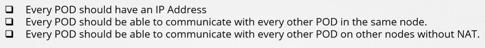

В предыдущих уроках мы говорили о сети, которая соединяет ноды кластера между собой. Но существует также другой уровень сети, являющийся ключевым для функционирования кластера - сеть на уровне pod-ов. Как нам обращаться к pod-ам? Как они взаимодействуют друг с другом? Как нам получить доступ к приложениям, запущенным в этих pod-ах, изнутри кластера, а также извне? K8s ожидает, что вы сами должны решить эти вызовы (challenges). На текущий момент K8s не поставляется со встроенным решением. Однако K8s имеет четко опубликованные требования для pod networking. Посмотрим, что они из себя представляют.

K8s ожидает, что каждый pod получит свой собственный уникальный IP-адрес.

Каждый pod, используя этот IP-адрес, должен иметь возможность достигнуть любой другой pod на этой же ноде.

Каждый pod, используя этот IP-адрес, должен иметь возможность достигнуть любой другой pod на остальных нодах.

 

Не имеет значения, что это за IP-адрес и к какому диапазону он принадлежит. Пока обеспечивается решение, которое заботится об автоматическом назначении IP-адресов и устанавливает связность между pod-ами на одной ноде, а также между pod-ами на разных нодах, при этом без настройки правил NAT, вы прекрасны.

Как реализовать модель, которая решает все эти требования? Существует множество сетевых решений, которые это делают (подразумеваются CNI плагины).

Но сначала попробуем решить эту проблему самостоятельно, используя уже имеющиеся у нас знания.

Предположим у нас есть кластер, состоящий из трех нод, неважно какие из них master, а какие worker.

Ноды являются частью внешней сети `192.168.1.0/24`. Соответственно ноды имеют адреса `192.168.1.11`, `192.168.1.12` и `192.168.1.13`.

Когда создаются контейнеры, K8s создает для них network namespaces. Для включения связности между ними, мы подключаем эти namespace к bridge-сети.