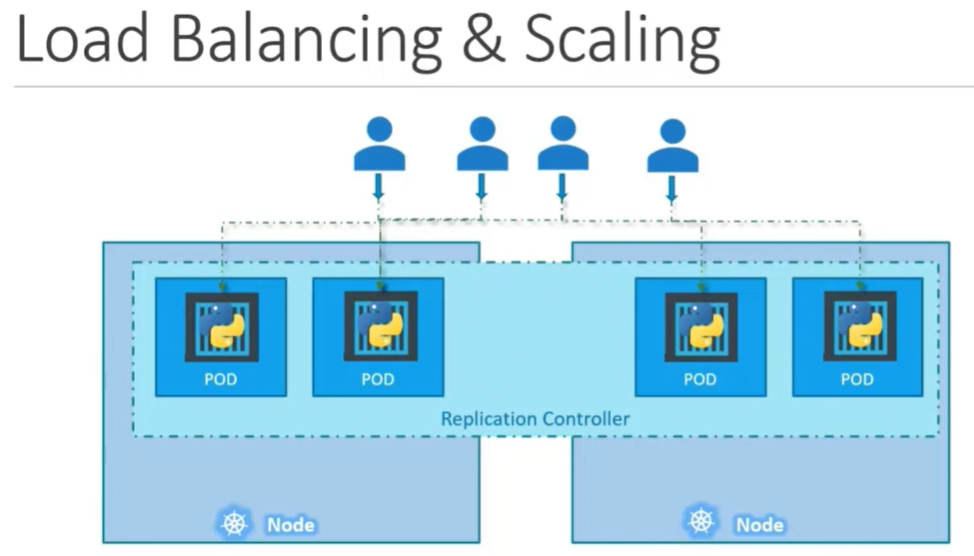

Контроллеры - это процессы, которые следят за объектами K8s и реагируют соответственно.

Что такое реплика и зачем нам нужен *Replication Controller*? Вернемся к нашему первому сценарию с одним pod-ом, в котором запущено наше приложение. Что если наше приложение по каким-либо причинам зафейлится и pod упадет? Пользователи больше не смогут получить доступ к нашему приложению. Для предотвращения потери доступа пользователями к нашему приложению, нам нужно более одного экземпляра или pod-а запущенных одновременно. При таком способе, если один pod упадет, наше приложение все еще будет запущено на другом.

Replication Controller помогает нам запустить несколько экземпляров одного pod-а в K8s-кластере и там самым обеспечить высокую доступность (HA). Значит ли это, что вы не можете использовать Replication Controller, если планируете иметь только один pod? Нет. Даже если у вас всего один pod, Replication Controller может помочь автоматически поднимая новый pod, когда существующий по каким-либо причинам упал. Таким образом Replication Controller гарантирует запуск указанного нами количества pod-ов одновременно, даже если их один или сто.

Другая причина, по которой нам нужен Replication Controller - создание множества pod-ов для распределения нагрузки между ними. Например у нас есть один pod, обслуживающий группу пользователей. Когда количество пользователей увеличивается, мы разворачиваем дополнительный pod для балансировки нагрузки между двумя pod-ами. Если спрос увеличивается дальше и у нас закончились ресурсы на первой ноде, мы можем развернуть дополнительные pod-ы на других нодах в кластере. Таким образом Replication Controller может охватывать сразу несколько нод кластера.

<br>

Контроллер помогает нам балансировать нагрузку среди множества pod-ов на разных нодах, а также масштабировать наше приложение при увеличении спроса.

Важно заметить, что существует два схожих термина - *Replication Controller* и *Replica Set*. Оба имеют аналогичные цели, но все же отличаются друг от друга.

Replication Controller - это более старая технология и на смену ему пришла Replica Set. Replica Set - это новый рекомендованный способ для настройки репликации.

Давайте посмотрим каким образом мы можем создать Replication Controller. Ниже представлен definition-файл:

```yaml
apiVersion: v1
kind: ReplicationController
metadata:
  name: myapp-rc
  labels:
    app: myapp
    type: front-end
spec:
  template:
    metadata:
      name: myapp-pod
      labels:
        app: myapp
        type: front-end
    spec:
      containers:
        - name: nginx-container
          image: nginx
  replicas: 2
```

Теперь давайте посмотрим на Replica Set. Ниже представлен ее definition-файл:

```yaml
apiVersion: apps/v1
kind: ReplicaSet
metadata:
  name: myapp-replicaset
  labels:
    app: myapp
    type: front-end
spec:
  template:
    metadata:
      name: myapp-pod
      labels:
        app: myapp
        type: front-end
    spec:
      containers:
        - name: nginx-container
          image: nginx
  replicas: 2
  selector:
    matchLabels:
      type: front-end
```

Главное отличие между Replication Controller и Replica Set состоит в том, что Replica Set обязательно требует наличия опции `selector:`.
в то время как для Replication Controller опция selector возможна, но не обязательна
если в yaml-файле для Replication Controller пропустить опцию selector, тогда по умолчанию будут приняты labels указанные для pod-а
ReplicaSet также позволяет управлять pod-ами, которые не были определены в yaml-файле самой ReplicaSet

задача ReplicaSet состоит в мониторинге pod-ов и запуске нового pod-а, если какой-либо из pod-ов упал

Replication Controller не будет создавать новые pod-ы, если уже существует соответствующее число pod-ов с labels указанными в RC definition файле
должны ли мы в этом случае в RS definition файле описывать секцию template (характеристики pod-ов), если pod-ы уже были созданы ранее и нам не требуется их создавать заново? Ответ - да, нужно. Т.к. если какой-либо pod упадет, RS должна поднять новый pod и для этого должна быть описана секция template

чтобы изменить количество реплик, можно отредактировать RS definition файл и выполнить команду "kubectl replace -f replicaset-definition.yaml"
второй способ изменить количество реплик:
kubectl scale --replicas=6 -f replicaset-definition.yaml
kubectl scale replicaset myapp-replicaset --replicas=6   #type=replicaset, name=myapp-replicaset

при этом количество реплик в самом RS definition файле не изменится

kubectl delete replicaset myapp-replicaset   #удалить RS и pod-ы созданные этой RS
kubectl replace -f replicaset-definition.yaml   #обновить RS

если мы вручную создадим pod с label, который указан в селекторе RS, то pod будет сразу удален, т.к. RS будет поддерживать заданное число реплик

kubectl edit rs myapp-replicaset   #редактировать налету