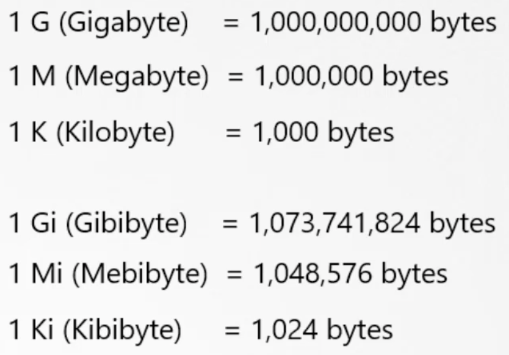
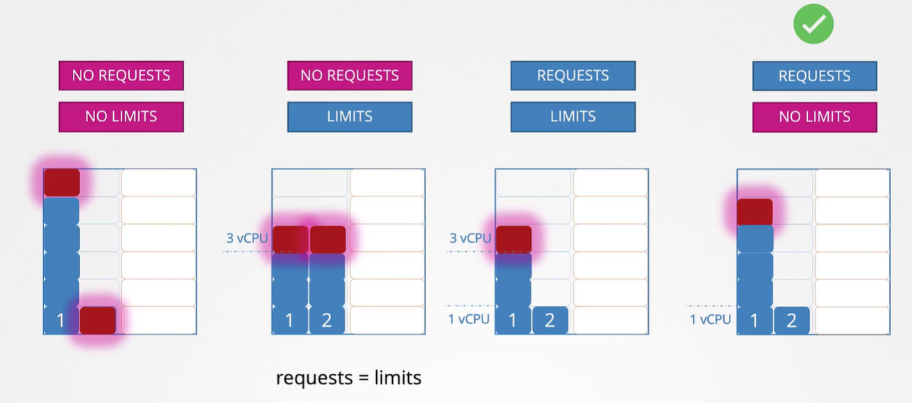
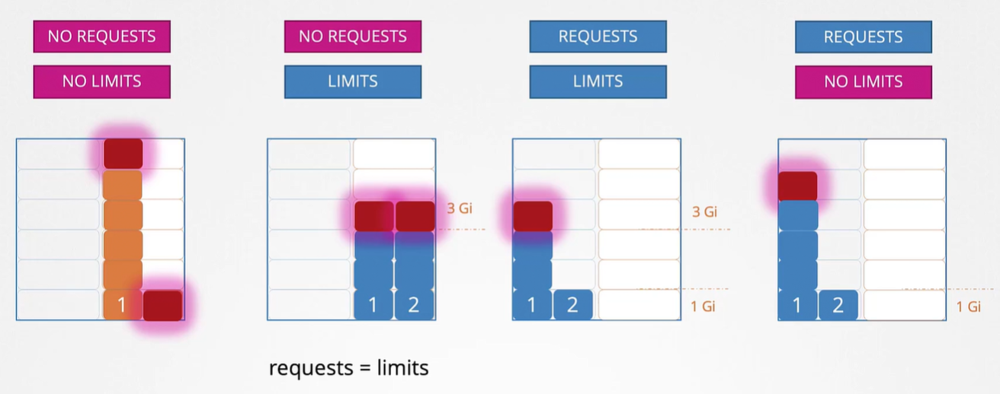

K8s Scheduler решает на какую ноду назначить pod.

Scheduler смотрит сколько ресурсов требует pod и сколько доступно на ноде и в зависимости от этого принимает решение на какую ноду поместить pod.

Если ни на одной из нод кластера не будет достаточно свободных ресурсов, требуемых для размещения pod-а, тогда Scheduler приостановит размещение pod-а и он будет висеть в статусе Pending. Если при этом посмотреть события с помощью команды `kubectl describe pod nginx`, то можно увидеть сообщение "Insufficient cpu".

*Resource request* - минимальное количество cpu или ram, необходимое для запуска для контейнера.

Когда Scheduler пытается определить ноду с достаточным количеством ресурсов для размещения pod-а, он ориентируется на эти значения.

Мы можем определить это в definition файле pod-а или Deployment в блоке `resources` => `requests`:

```yaml
apiVersion: v1
kind: Pod
metadata:
  name: simple-webapp-color
  labels:
    name: simple-webapp-color
spec:
  containers:
    - name: simple-webapp-color
      image: simple-webapp-color
      ports:
        - containerPort: 8080
      resources:
        requests:
          memory: "4Gi"
          cpu: 2
```

Для cpu можно указать значение например 0.1 или 100m (милли), минимально 1m.

1 CPU = 1 AWS vCPU = 1 GCP Core = 1 Azure Core = 1 Hyperthread

<br>

По умолчанию контейнер не имеет ограничений на потребление ресурсов ноды, соответственно может скушать вообще все ресурсы ноды и "задушить" процессы самого хоста.

Мы можем задать лимиты на использование ресурсов в definition файле pod-а или Deployment в блоке `resources` => `limits`:

```yaml
apiVersion: v1
kind: Pod
metadata:
  name: simple-webapp-color
  labels:
    name: simple-webapp-color
spec:
  containers:
    - name: simple-webapp-color
      image: simple-webapp-color
      ports:
        - containerPort: 8080
      resources:
        requests:
          memory: "1Gi"
          cpu: 1
        limits:
          memory: "2Gi"
          cpu: 2
```

Важно! limits и requests устанавливаются для каждого контейнера в pod-е.

Если контейнер в pod-е попытается выйти за рамки лимита по CPU, система ограничит (throttle) его потребление заданными рамками. Т.е. контейнер не сможет использовать больше CPU, чем задано в `limits`.

Что касается RAM, то контейнер может выйти за установленный лимит по памяти, но в таком случае pod будет остановлен (terminated) с ошибкой OOM (Out of Memory), которую можно будет увидеть в выводе команды `kubectl describe pod nginx`.

По умолчанию в K8s не заданы какие-либо дефолтные значения для `requests` и `limits`. Это значит, что любой pod может использовать столько ресурсов, сколько ему нужно на любой ноде и "задушить" другие pod-ы или процессы на этой ноде. Это очень-очень важно знать!

Рассмотрим как работают `requests` и `limits` для CPU.

Предположим существует два pod-а, конкурирующие за ресурсы кластера. В данном случае, когда мы говорим pod, то имеем ввиду контейнер внутри pod-а.

Без установленных `requests` и `limits`, один pod может "употребить" все ресурсы CPU на ноде и помешать другому pod-у получить необходимые ресурсы.

Другой вариант - заданы `limits`, но не заданы `requests`. В этом случае K8s автоматически задаст для `requests` такое же значение, что установлено для `limits`. Например для `requests` и `limits` принято значение 3 vCPU, тогда для каждого pod-а будет гарантированно выделено 3 vCPU и не больше.

Следующий вариант - заданы и `requests` и `limits`. В этом случае каждый pod получит гарантированное количество запрошенных CPU - 1vCPU и сможет вырасти до 3vCPU, но не более. Этот вариант выглядит более подходящим, но есть один недостаток. Если первый pod по некоторым причинам потребует большее количество тактов CPU, а второй pod при этом НЕ будет реально потреблять много CPU, то в этом случае мы не захотим ограничивать потребление CPU первым pod-ом. Мы хотим разрешить первому pod-у потреблять доступное количество тактов CPU, пока второй pod в них действительно не нуждается.

И последний сценарий - заданы `requests`, но не заданы `limits`. Т.к. в данном случае заданы `requests`, то каждый pod гарантированно получит 1 vCPU. Однако т.к. не заданы `limits`, любой pod в случае необходимости сможет "употребить" столько vCPU сколько доступно. Но в любой момент времени, если второму pod-у потребуются дополнительные такты CPU, то ему будет гарантированно выделено запрошенное (requested) количество CPU. Это наиболее подходящий вариант.

Конечно возможны ситуации, когда вы очень хотите ограничить ресурсы для pod-а, и в этом случае вы можете задать `limits`. Хороший пример - непосредственно наше лабораторное окружение KodeKloud. По сути оно представляет из себя контейнеры в кластере и находится в public-доступе. Соответственно пользователи могу запускать любой тип нагрузки какой захотят. Поэтому мы устанавливаем `limits` для предотвращения возможного злоупотребления инфраструктурой, например для майнинга Bitcoin и др. Это применимо конкретно для нашего случая. Если же вы не хотите ограничивать потребление дополнительных CPU для своего приложения, то в случае необходимости можете не рассматривать установку `limits`. Однако в этом случае убедитесь, что для всех pod-ов заданы `requests`, т.к. это единственный способ гарантированно получить ресурсы pod-у в случае, когда для остальных pod-ов не установлены `limits`.

<br>

Теперь посмотрим как это работает для памяти (RAM). Предположим существует два pod-а, конкурирующие за ресурсы кластера.

Без установленных `requests` и `limits`, один pod может "употребить" всю память ноды и помешать другому pod-у получить необходимые ресурсы.

Другой вариант - заданы `limits`, но не заданы `requests`. В этом случае K8s автоматически задаст для `requests` такое же значение, что установлено для `limits`. Например для `requests` и `limits` принято значение 3 Gi, тогда для каждого pod-а будет гарантированно выделено 3 Gi памяти и не больше.

Следующий вариант - заданы и `requests` и `limits`. В этом случае каждый pod получит гарантированное количество запрошенной памяти - 1 Gi и сможет вырасти до 3 Gi, но не более. Этот вариант выглядит более подходящим, но есть один недостаток. Если первый pod по некоторым причинам потребует большее количество памяти, а второй pod при этом НЕ будет реально потреблять много памяти, то в этом случае мы не захотим ограничивать потребление памяти первым pod-ом. Мы хотим разрешить первому pod-у потреблять доступное количество RAM, пока второй pod в ней действительно не нуждается.

И последний сценарий - заданы `requests`, но не заданы `limits`. Т.к. в данном случае заданы `requests`, то каждый pod гарантированно получит 1 Gi памяти. Однако т.к. не заданы `limits`, любой pod в случае необходимости сможет "употребить" столько RAM сколько доступно. Но если второму pod-у потребуется больше RAM, то для освобождения памяти придется "убить" первый pod. Т.к. в отличие от CPU мы не можем ограничить (throttle) потребление памяти. Как только память выделена pod-у, единственный способ ее высвободить - "убить" pod.

<br>

Как мы уже говорили ранее по умолчанию в K8s не заданы какие-либо дефолтные значения для `requests` и `limits`. Но как нам добиться, чтобы каждый созданный pod имеет некоторые дефолтные настройки? Это возможно с помощью *LimitRanges*. LimitRanges помогают нам определить дефолтные значения, которые будут установлены для контейнеров в pod-ах, созданных без указания `requests` либо `limits` в pod definition файле. Это применимо на уровне namespace.

```yaml
apiVersion: v1
kind: LimitRange
metadata:
  name: cpu-resource-constraint
spec:
  limits:
  - default: # здесь задаются дефолтные limits
      cpu: 500m
    defaultRequest: # здесь задаются дефолтные requests
      cpu: 500m
    max: # здесь задаются максимальный и минимальный лимит, который может быть установлен для контейнера в pod-е
      cpu: "1"
    min:
      cpu: 100m
    type: Container
```

Аналогично для RAM:

```yaml
apiVersion: v1
kind: LimitRange
metadata:
  name: memory-resource-constraint
spec:
  limits:
  - default: # здесь задаются дефолтные limits
      memory: 1Gi
    defaultRequest: # здесь задаются дефолтные requests
      memory: 1Gi
    max: # здесь задаются максимальный и минимальный лимит, который может быть установлен для контейнера в pod-е
      memory: 1Gi
    min:
      memory: 500Mi
    type: Container
```

Данные лимиты применяются в момент создания pod-а. Поэтому если вы создали или изменили LimitRange, то это не повлияет на существующие pod-ы. Это повлияет только на новые создаваемые pod-ы.

И наконец существует ли какой-то способ ограничить итоговое количество ресурсов, потребляемых приложениями развернутыми в K8s кластере? Например, мы хотим сказать, что все вместе взятые pod-ы не должны потреблять больше, чем заданное количество CPU или RAM. Для этого мы можем создавать квоты на уровне namespace.

```yaml
apiVersion: v1
kind: ResourceQuota
metadata:
  name: my-resource-quota
spec:
  hard:
    requests.cpu: 4
    requests.memory: 4Gi
    limits.cpu: 10
    limits.memory: 10Gi
```

---
---

Задание небольшого CPU requests даёт pod-у хорошие шансы быть запланированным

Установка limits на ресурсы CPU, большего, чем requests, позволяет достичь 2 вещей:
- при увеличении нагрузки pod может задействовать дополнительные ресурсы CPU
- количество ресурсов CPU, которые pod может задействовать при повышении нагрузки, ограничено некоторой разумной величиной
