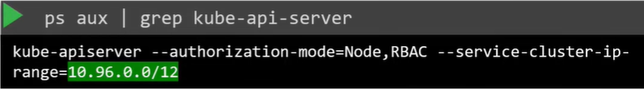
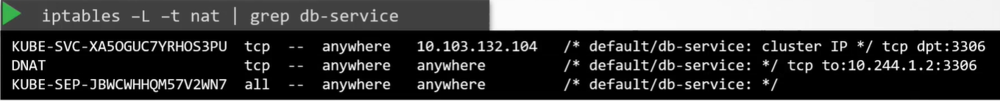

На самом деле вам редко нужно конфигурировать pod-ы для взаимодействия друг с другом напрямую. Если вы хотите, чтобы один pod получил доступ к приложению, расположенному в другом pod-е, всегда нужно использовать Service.

Когда создается Service, он доступен для всех pod-ов в кластере, независимо от того на каких нодах они находятся. В том время как pod размещается на ноде, Service размещается в кластере. Он не связан с определенной нодой. Но важно помнить, что Service доступен только из кластера. Такой тип Service известен как *ClusterIP*.

Чтобы сделать приложение в pod-е доступным извне кластера, мы создаем другой тип Service - *NodePort*.

В данном уроке мы больше сфокусируемся на Services и меньше на pod-ах. Как Services получают IP-адреса и как они (Services) становятся доступны на всех нодах кластера? Как Service становится доступен для внешних пользователей через порт на каждой ноде?

Начнем с чистого листа. У нас есть кластер, состоящий из трех нод, пока еще нет pod-ов или Services. Мы уже знаем, что на каждой ноде запущен процесс kubelet, отвечающий за создание pod-ов. Каждый процесс kubelet на каждой ноде следит за изменениями в кластере через kube-apiserver. И каждый раз, когда должен быть создан новый pod, kubelet создает pod на нодах. Затем он вызывает CNI плагин для конфигурирования сети для этого pod-а.

Аналогично на каждой ноде запущен другой компонент - kube-proxy. Он тоже следит за изменениями в кластере через kube-apiserver и каждый раз, когда должен быть создан новый Service, вступает в действие. В отличие от pod-ов Services не создаются и не назначаются на каждую ноду. Services являются cluster wide концепцией. Они существуют на всех нодах кластера. Собственно говоря, они не существуют вовсе. Не существует сервера или сервиса, который действительно слушает на IP-адресе Service. Мы видели, что у pod-ов есть контейнеры, у контейнеров есть namespace-ы с интерфейсами и IP-адресами, назначенными на эти интерфейсы. У Services ничего подобного не существует. Нет процессов или namespace-ов или интерфейсов для Service. Это всего лишь виртуальный объект. Как же они получают IP-адрес? И как мы получаем доступ к приложению в pod-е через Service? Когда мы создаем объект Service в K8s, ему назначается IP-адрес из предопределенного диапазона. Компонент kube-proxy, запущенный на каждой ноде, получает этот IP-адрес и создает forwarding-правило на каждой ноде кластера, которое говорит, что любой трафик приходящий на этот IP (IP объекта Service) должен идти на IP-адрес pod-а. Как только правило создано, всякий раз, когда pod пытается достигнуть IP-адрес Service, он перенаправляется на IP-адрес pod-а, который доступен с любой ноды кластера. Важно запомнить, что это не просто IP-адрес, а комбинация IP + порт. Всякий раз, когда создается или удаляется Service, компонент kube-proxy создает либо удаляет эти правила.

Как создаются эти правила? Kube-proxy поддерживает различные способы, такие как например *userspace*, когда kube-proxy слушает порт для каждого Service и проксирует подключения к pod-ам, создание правил *ipvs* и третий знакомый нам вариант (используется по умолчанию) - использование iptables.

Режим proxy может быть задан с помощью опции `--proxy-mode` в процессе настройки сервиса kube-proxy:

`kube-proxy --proxy-mode [userspace | iptables | ipvs] ...`

Если он не задан явно, то по умолчанию используется iptables.

Рассмотрим как iptables настраивается с помощью kube-proxy и как посмотреть их на нодах.

Предположим у нас есть pod с именем `db`, развернутый на `node-1`. Pod имеет IP-адрес `10.244.1.2`. Мы создали Service типа ClusterIP, чтобы сделать этот pod доступным в пределах кластера. Когда создается Service K8s назначает ему IP-адрес, в данном примере `10.103.132.104`. Этот диапазон задается в опции  kube-apiserver под названием `--service-cluster-ip-range` и по умолчанию имеет значение `10.0.0.0/24`.

`kube-api-server --service-cluster-ip-range ipNet (default 10.0.0.0/24)`

В нашем случае, если мы посмотрим на опции kube-apiserver, то увидим:

 

Это дает нашим Services любой IP-адрес из диапазона `10.96.0.0 - 10.111.255.255`. Следует также упомянуть, что при настройке сети для pod-ов, мы использовали диапазон `10.244.0.0/16`. Это дает нашим pod-ам IP-адреса из диапазона `10.244.0.0 - 10.244.255.255`. Какой бы диапазон не был указан для каждой из этих сетей, они не должны пересекаться. Обе сети должны иметь свой собственный выделенный диапазон IP-адресов для работы. Не должно быть случаев, когда pod и Service получили одинаковый IP-адрес.

Вы можете посмотреть правила iptables, созданные kube-proxy, в таблице NAT. Ищите по имени Service, т.к. все правила, созданные kube-proxy, имеют комментарий, содержащий название Service: `iptables -L -t nat | grep db-service`.

 

Эти правила означают, что любой трафик, приходящий на IP-адрес `10.103.132.104` (IP-адрес нашего Service) на порт `3306`, должен иметь адрес назначения