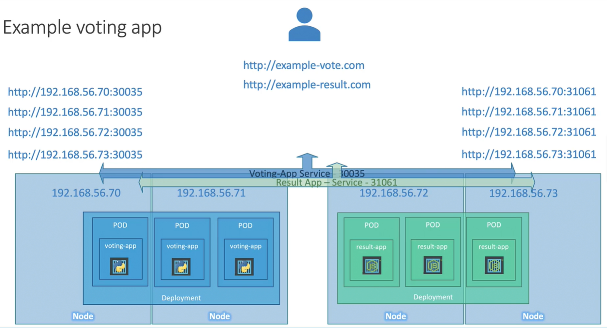

LoadBalancer - предоставляет балансировщик нагрузки для нашего приложения, доступен только в публичных облачных провайдерах (AWS, Azure, GCP).

Принцип работы Service типа NodePort представлен на схеме ниже.

<br>

Если вы зададите тип Service равным LoadBalancer, то в неподдерживаемом окружении (например VirtualBox) это будет иметь такой же эффект как использование Service типа NodePort.

Манифест файл Service типа LoadBalancer:

```yaml
apiVersion: v1
kind: Service
metadata:
  name: myapp-service
spec:
  type: LoadBalancer
  ports:
    - targetPort: 80   #порт pod-а
      port: 80         #порт объекта Service
      nodePort: 30008  #порт ноды кластера
  selector:
    app: myapp         #label нужного нам pod-а
    type: front-end
```