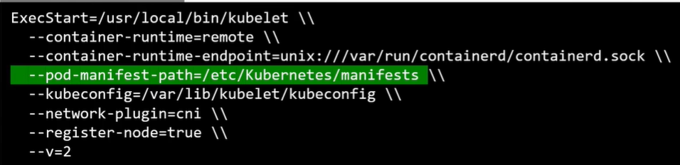
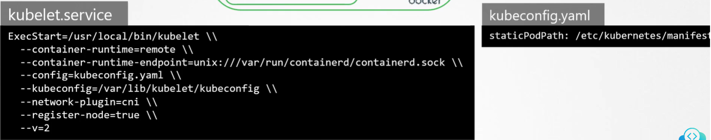

Kubelet полагается на инструкции от kube-apiserver, чтобы понять какие pod-ы разместить на своей ноде. Эти инструкции в свою очередь основываются на решении принятом kube-scheduler-ом и сохраняются в хранилище etcd.

Но что если в кластере отсутствуют kube-apiserver, kube-scheduler, контроллеры и БД etcd? Что если вообще нет master-а? Что если нет других нод? Вы один в море. И не являетесь частью кластера. Может ли kubelet делать что-то как капитан корабля? Может ли он действовать как независимая нода? Если да, то кто будет предоставлять инструкции необходимые для создания pod-ов?

Kubelet может управлять нодой самостоятельно. Мы имеем установленные на хосте kubelet и Docker для запуска контейнеров. Нет кластера K8s, соответственно отсутствуют kube-apiserver и другие компоненты.

Единственное, что умеет делать kubelet - создавать pod-ы. Но у нас нет API-сервера, что предоставить детали для создания pod-ов. Мы знаем, чтобы создать pod, нужны подробности описанные в pod definition файле. Но как мы можем предоставить pod definition файл kubelet-у без kube-apiserver?

Вы можете сконфигурировать kubelet для чтения pod definition файлов из директории на сервере, предназначенной для хранения информации о pod-ах. Kubelet периодически проверяет эту директорию на наличие файлов, читает их и создает pod-ы на хосте. Но не только создает, а еще и гарантирует, что pod останется в живых. Если приложение упадет, kubelet попытается перезапустить его.

Если вы внесете изменения в какой-либо из файлов в этом каталоге, kubelet пересоздаст pod, чтобы изменения вступили в силу. Если вы удалите файл из директории, pod удалится автоматически.

Эти pod-ы, созданные kubelet самостоятельно без вмешательства kube-apiserver или остальных компонентов кластера K8s, известны как статические pod-ы.

Запомните, таким способом вы можете создать только pod-ы. Вы не можете создать Replica Set, Deployment или Service путем размещения definition файлов в назначенную директорию. Все они являются концептуальными частями всей архитектуры K8s, для которой требуются другие cluster plane компоненты, такие как replication-controller, deployment-controller и т.д.

Kubelet работает на уровне pod-ов и может понимать только pod-ы. Поэтому он имеет возможность создавать статические pod-ы.

Что за предназначенная директория и как мы можем ее настроить? Это может быть любая директория на хосте. Путь до этой директории передается kubelet в виде опции при запуске сервиса. Опция называется `--pod-manifest-path`.

 

Существует и другой способ настройки. Вместо задания опции прямо в файле `kubelet.service`, вы можете предоставить путь до другого конфигурационного файла с помощью опции `--config` и уже в нем определить путь до соответствующей директории с помощью опции `staticPodPath`.

 

Кластеры, созданные с помощью инструмента kubeadm, используют данный подход.