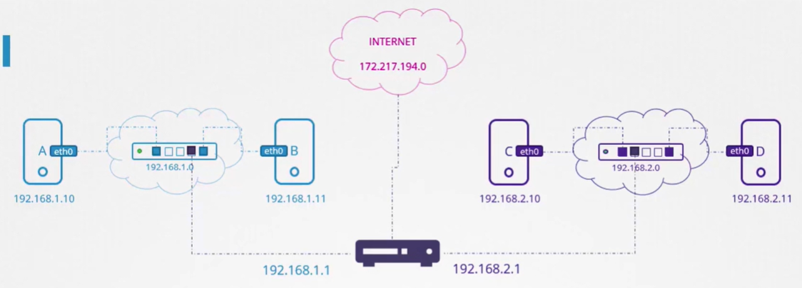

Смотреть интерфейсы хоста: `ip link`.

Назначить IP-адрес на интерфейс хоста: `ip addr add 192.168.1.10/24 dev eth0`.

Если представить, что сеть - это комната, то шлюз - это дверь во внешний мир.

Смотреть конфигурацию маршрутов в системе: `route`.

 

Чтобы настроить шлюз на хосте B для возможности соединения с хостами в сети `192.168.2.0/24` используем команду:

`ip route add 192.168.2.0/24 via 192.168.1.1`

Важно понимать, что так нужно настроить все хосты. Например, чтобы хост C мог отправлять пакеты хосту B нужно настроить шлюз:

`ip route add 192.168.1.0/24 via 192.168.2.1`

 

Предположим мы хотим открыть доступ в Google для наших хостов (сеть `172.217.194.0` в Интернете). Добавляем еще одну запись в таблицу маршрутизации для хоста C:

`ip route add 172.217.194.0/24 via 192.168.2.1`

Но т.к. существует огромное количество разных сайтов в различных сетях в Интернете, то вместо добавления в таблицу маршрутизации одного и того же IP-адреса вашего роутера для каждой такой сети, вы можете просто сказать - для любой сети, маршрут к которой неизвестен, используй роутер в качестве шлюза по умолчанию.

`ip route add default via 192.168.2.1`

Также вместо `default` можно указать `0.0.0.0`, означающее - any IP destination.

