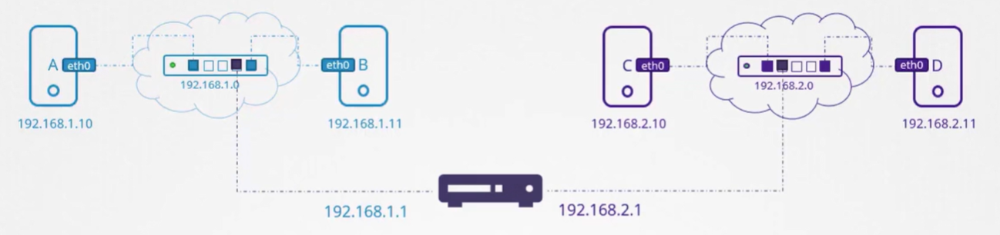

Смотреть интерфейсы хоста: `ip link`.

Назначить IP-адрес на интерфейс хоста: `ip addr add 192.168.1.10/24 dev eth0`.

Если представить, что сеть - это комната, то шлюз - это дверь во внешний мир.

Смотреть конфигурацию маршрутов в системе: `ip route` либо `route`.

 

Чтобы настроить шлюз на хосте B для возможности соединения с хостами в сети `192.168.2.0/24` используем команду:

`ip route add 192.168.2.0/24 via 192.168.1.1`

Важно понимать, что так нужно настроить все хосты. Например, чтобы хост C мог отправлять пакеты хосту B нужно настроить шлюз:

`ip route add 192.168.1.0/24 via 192.168.2.1`

 

Предположим мы хотим открыть доступ в Google для наших хостов (сеть `172.217.194.0` в Интернете). Добавляем еще одну запись в таблицу маршрутизации для хоста C:

`ip route add 172.217.194.0/24 via 192.168.2.1`

Но т.к. существует огромное количество разных сайтов в различных сетях в Интернете, то вместо добавления в таблицу маршрутизации одного и того же IP-адреса вашего роутера для каждой такой сети, вы можете просто сказать - для любой сети, маршрут к которой неизвестен, используй роутер в качестве шлюза по умолчанию.

`ip route add default via 192.168.2.1`

Также вместо `default` можно указать `0.0.0.0`, означающее - any IP destination.

Если же значение `0.0.0.0` указано в колонке `Gateway`, это значит, что вам не требуется шлюз. Например в нашем случае, чтобы хост C смог получить доступ к какому-либо устройству в сети `192.168.2.0/24`, ему не требуется шлюз, т.к. это его собственная сеть.

 

Предположим, что в вашей сети два роутера - один для доступа в интернет, другой для внутренней частной сети. Тогда вам потребуется две отдельных записи (entries) для каждой сети.

 

Одна запись для внутренней частной сети: `ip route add 192.168.1.0/24 via 192.168.2.2`. И другая запись со шлюзом по умолчанию для всех остальных сетей, включая публичные.

 

Соответственно, если есть проблемы с доступом в Интернет с ваших хостов, то таблица маршрутизации и конфигурация шлюза по умолчанию могут быть хорошим местом для старта.

Теперь посмотрим каким образом можно настроить Linux хост в качестве роутера.

Например у нас есть три хоста A, B и С. Хост B при этом подключен к обеим сетям и будет выполнять роль роутера. Если мы сразу попытаемся пингануть хост C с хоста A, то получим следующее:

 

Это происходит потому, что хост A не знает как попасть в сеть `192.168.2.0/24`. Поэтому добавляем запись в таблицу маршрутизации на хосте A:

`ip route add 192.168.2.0/24 via 192.168.1.6`

Если пакеты дойдут до хоста C, то он в свою очередь должен будет послать ответ обратно хосту A. Но когда хост C попытается достигнуть сеть `192.168.1.0/24`, то столкнется с аналогичной проблемой - "Network is unreachable". Поэтому мы должны сказать хосту C, что он может достучаться до хоста A через хост B, который выступает в качестве роутера. Поэтому добавляем запись в таблицу маршрутизации на хосте C: `ip route add 192.168.1.0/24 via 192.168.2.6`.

Если мы попытаемся выполнить ping сейчас, то больше не увидим ошибку "Network is unreachable", однако и не увидим ответов.

По умолчанию в Linux пакеты не перенаправляются с одного интерфейса на другой. Т.е. в нашем случае пакеты поступившие на интерфейс `eth0` хоста B не перенаправляются куда-либо через интерфейс `eth1`. Это сделано из соображений безопасности. Например, если интерфейс `eth0` подключен к внутренней частной сети, а интерфейс `eth1` к публичной сети, мы не хотим чтобы кто-то из публичной сети отправлял сообщения в нашу приватную внутреннюю сеть до тех пор, пока мы явно не разрешим это.

Т.к. в нашем случае обе сети приватные и можно безопасно включить взаимодействие между ними, то мы можем разрешить хосту B перенаправлять пакеты из одной сети в другую.

`cat /proc/sys/net/ipv4/ip_forward`

По умолчанию значение в этом файле равно `0`, что означает запрет перенаправления.

Для разрешения перенаправления: `echo 1 > /proc/sys/net/ipv4/ip_forward`. Это временная мера, которая будет работать до первой перезагрузки.

Чтобы включить forwarding на постоянной основе, нужно изменить это значение в файле `/etc/sysctl.conf`:

`net.ipv4.ip_forward=1`

Важно отметить, что команды `ip addr add 192.168.1.10/24 dev eth0` также дают временный эффект до первой перезагрузки.

Чтобы внести изменения на постоянной основе, нужно отредактировать файл `/etc/network/interfaces`.