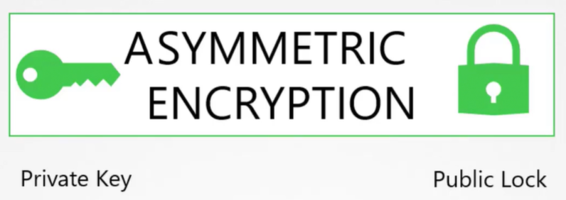
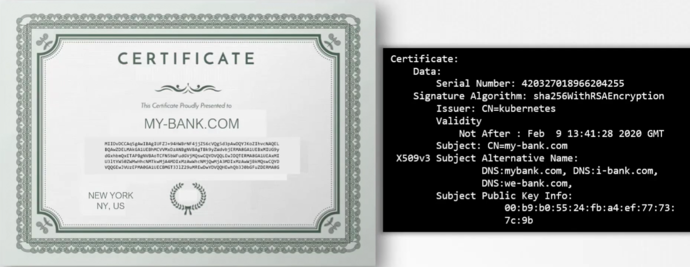
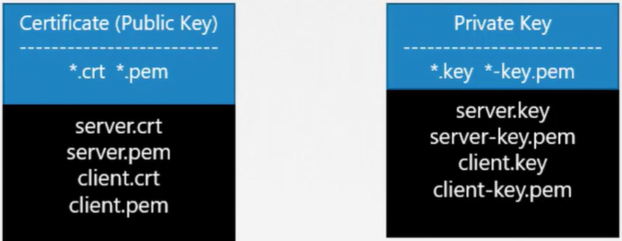

Сертификат используется, чтобы гарантировать доверие между двумя сторонами в процессе транзакции. Например, когда пользователь пытается получить доступ к веб-серверу, TLS-сертификат гарантирует, что взаимодействие между пользователем и сервером зашифровано, и сервер действительно является тем, за кого себя выдает.

Рассмотрим следующий сценарий. Если пользователь получает доступ к приложению для онлайн-банкинга без использования защищенного соединения, то учетные данные, которые он введет, будут переданы в обычном текстовом формате. Хакер, прослушивающий сетевой трафик, может легко извлечь учетные данные и использовать их для взлома банковского аккаунта. Очевидно, что это не безопасно.

Вы должны зашифровать передаваемые данные, используя ключи шифрования. Данные шифруются с помощью ключа, который по сути является набором случайных чисел и алфавита. Вы добавляете случайное число к данным и шифруете в формате, который не может быть распознан. Затем данные отправляется на сервер. Хакер, прослушивающий сетевой трафик, получает данные, но ничего не может с ними сделать. Однако то же самое происходит и с сервером, получившим данные. Он не может расшифровать данные без ключа. Копию ключа также должна быть отправлена на сервер, чтобы он смог расшифровать и прочитать сообщение. Т.к. ключ передается через ту же сеть, атакующий может извлечь и его, а затем расшифровать данные с его помощью. Это известно как *симметричное шифрование*. Это безопасный способ шифрования, но т.к. он использует один и тот же ключ для шифрования и дешифрования данных, и т.к. ключ необходимо передавать между отправителем и получателем, существует риск получения доступа к ключу хакером и дальнейшей расшифровки данных.

И здесь на помощь приходит *асимметричное шифрование*. Вместо использования единого ключа для шифрования и дешифрования данных, асимметричное шифрование использует пару ключей - приватный ключ и публичный ключ. Ради этого примере мы будем называть их приватный ключ и публичный замок.

<br>

Ключ (key), который только со мной, поэтому он приватный. Замок (lock), доступ к которому может получить каждый, поэтому он публичный. Хитрость здесь в том, что если вы зашифровали или заблокировали (lock) данные с помощью вашего замка (lock), то вы сможете открыть их только с помощью связанного ключа. Поэтому ваш ключ всегда должен быть в безопасности у вас и не должен передаваться никому другому. А вот замок публичный и им можно делиться с другими людьми, но с его помощью они смогут только заблокировать что-либо. Независимо от того, что было заблокировано с помощью публичного замка, оно может быть разблокировано только с помощью вашего приватного ключа.

Рассмотрим еще более простой случай обеспечения (securing) ssh-доступа к серверам через пару ключей. Есть сервер, к которому вам нужен доступ. Вы не хотите использовать пароли, т.к. это слишком рискованно, и решили использовать пару ключей. С помощью команды `ssh-keygen` вы генерируете пару ключей - приватный и публичный. Она создает два файла: `id_rsa` - приватный ключ, `id_rsa.pub` - публичный ключ (точнее не публичный ключ, а публичный замок). Затем вы защищаете ваш сервер путем полной блокировки доступа к нему, за исключением "двери", которая заблокирована вашим публичным замком. Обычно это делается путем добавления на сервер записи, содержащей ваш публичный ключ, в файл `~/.ssh/authorized_keys`. Как видите замок публичный и любой может попытаться прорваться через него. Но до тех пор пока никто не получит в свои руки ваш приватный ключ, который находится в безопасности на вашем лаптопе, никто не сможет получить доступ на сервер.

При попытке подключиться по ssh вы указываете местоположение приватного ключа: `ssh -i id_rsa user1@server1`.

Что если в вашем окружении есть и другие сервера? Как вы можете защитить более одного сервера с помощью пары ключей? Вы можете создать копии вашего публичного замка и положить их на множество серверов. Затем вы можете использовать тот же самый приватный ключ, чтобы безопасно подключаться по ssh к этим серверам.

Что если и другим пользователям нужен доступ к вашим серверам? Они могут сгенерировать свои собственные пары ключей, а вы, как единственный имеющий доступ к этим серверам, можете создать для этих людей дополнительные "двери" и заблокировать их с помощью соответствующих публичных замков. Скопируйте все публичные замки на сервера, и теперь другие люди смогут получить доступ к серверам с помощью их приватных ключей.

Вернемся к примеру с веб-сервером. Проблема симметричного шифрования заключается в том, что ключ, используемый для шифрования данных, передается на сервер через ту же сеть вместе с зашифрованными данными. Поэтому существует риск получения доступа к ключу хакером и дальнейшей расшифровки данных. Что если бы мы смогли каким-то образом безопасно передать ключ на сервер? Как только ключ будет безопасно передан и доступен для сервера, клиент и сервер смогут продолжить безопасно взаимодействовать друг с другом, используя симметричное шифрование.

Чтобы безопасно передать симметричный ключ от клиента к серверу, мы используем асимметричное шифрование. Мы генерируем приватный и публичный ключ на сервере. Теперь когда вы поняли идею, далее мы будем называть публичный замок публичным ключом. Ранее использовалась команда `ssh-keygen`, чтобы создать пару ключей для ssh-подключения. Формат немного отличается.

Здесь для генерации пары ключей мы используем команды:

```bash
openssl genrsa -out my-bank.key 1024
openssl rsa -in my-bank.key -pubout > mybank.pem
```

Когда пользователь первый раз обращается к веб-серверу по https, он получает с сервера публичный ключ. Предполагается, что хакер, слушающий весь трафик, также получит копию публичного ключа. Браузер пользователя шифрует симметричный ключ с помощью публичного ключа, предоставленного сервером. Симметричный ключ не безопасен. Затем пользователь посылает это (зашифрованный симметричный ключ) серверу. Хакер также получают копию. Сервер использует приватный ключ для дешифровки сообщения и извлекает из него симметричный ключ. Однако хакер в этой ситуации не имеет приватного ключа для расшифровки и извлечения симметричного ключа из полученного им сообщения. У него есть только публичный ключ, с помощью которого он может только заблокировать или зашифровать сообщение, но не дешифровать его. Теперь симметричный ключ безопасно доступен только серверу и пользователю, и они могут использовать его для шифрования данных и пересылки друг другу. Получатель может использовать тот же симметричный ключ для расшифровки данных и извлечения информации.

С помощью асимметричного шифрования мы успешно передали симметричный ключ от пользователя к серверу, а с помощью симметричного шифрования мы защитили все будущие взаимодействия между ними.

Теперь хакер ищет новые способы взлома аккаунта и осознает, что единственный способ получить ваши учетные данные - заставить вас ввести их в предоставленную им форму. Поэтому он создает веб-сайт, который выглядит в точности как веб-сайт банка. Хакер размещает этот сайт на собственном сервере. Он хочет, чтобы вы думали, что сайт безопасен. Поэтому злоумышленник генерирует приватный и публичный ключи и настраивает их на своем веб-сервере. И наконец ему удается каким-либо образом настроить ваше окружение (или сеть) для перенаправления запросов к веб-сайту банка на свои сервера.

Когда вы открываете браузер и вводите адрес веб-сайта, то видите очень привычную страницу, ту же самую страницу для логина, которую привыкли видеть. Вы вводите имя пользователя и пароль, убедившись, что ввели https-ссылку, что в свою очередь гарантирует, что взаимодействие безопасно зашифровано. Ваш браузер получает публичный ключ (злоумышленника), вы посылаете зашифрованный симметричный ключ, а затем и учетные данные, зашифрованные симметричным ключом. Получатель дешифрует учетные данные тем же симметричным ключом.

Вы безопасно взаимодействовали с сервером зашифрованным способом, но с сервером хакера.

Что, если бы у вас была возможность взглянуть на полученный от сервера ключ и посмотреть является ли он легитимным ключом от реального банковского сервера? Когда сервер отправляет ключ, он отправляет не только его. Он отправляет сертификат, который содержит ключ внутри. Если вы рассмотрите сертификат поближе, то увидите, что он похож на настоящий сертификат, но в цифровом формате. Он содержит информацию о том, кому выдан сертификат, публичный ключ этого сервера, местонахождение этого сервера и т.д. Справа вы видите содержимое настоящего сертификата. На каждом сертификате указано имя лица или субъекта, которому выдан сертификат. Это очень важно, т.к. это поле помогает подтвердить их личность.

<br>

Если это для веб-сервера, то данное поле должно совпадать с тем, что пользователь вводит в url браузера. Если банк известен под какими-либо другими именами и если он хочет, чтобы пользователи получали доступ к его приложениям также под другими именами, все эти имена должны быть указаны в сертификате в секции "Subject Alternative Name".

Но как вы могли заметить, кто угодно можно сгенерировать такой сертификат. Вы можете сгенерировать подобный для себя, сказав, что вы - Google. И это то, что делает хакер в таком случае. Он генерирует сертификат, говорящий, что он является веб-сайтом вашего банка.

Как вы можете посмотреть сертификат и проверить его подлинность? И вот где в игру вступает самая важная часть сертификата - кто подписал и выпустил сертификат. Если вы сгенерировали сертификат, тогда вам нужно будет самостоятельно его подписать. Это известно как *самоподписанный сертификат*. Любой посмотревший на сгенерированный вами сертификат немедленно узнает, что это небезопасный сертификат, т.к. подписали его вы. Если вы рассмотрите полученный от хакера сертификат поближе, то заметите, что это поддельный сертификат, подписанный самим хакером. Собственно говоря, браузер делает это за вас.

Все браузеры имеют встроенный механизм проверки сертификатов, где полученный от сервера сертификат проверяется на подлинность. Если браузер определяет, что сертификат поддельный, то он предупреждает вас об этом.

Каким образом вы можете создать легитимный сертификат для вашего веб-сервера, которому будут доверять браузеры? Как получить сертификат, подписанный уполномоченным лицом? И вот тут на передний план выходят центры сертификации (Certificate Authority). Это хорошо известные организации, которые могут подписывать и проверять ваши сертификаты. Некоторые из популярных - это Symantec, Digicert, Comodo, GlobalSign и т.д.

Вот как это работает. Вы создаете Certificate Signing Request (CSR) с помощью сгенерированного вами ранее ключа и доменного имени вашего веб-сайта. Делается это командой: `openssl req -new -key my-bank.key -out my-bank.csr -subj "/C=US/ST=CA/O=MyOrg, Inc./CN=mydomain.com"`. Эта команда сгенерирует файл `my-bank.csr`, фактически являющийся запросом на подпись сертификата, который затем должен быть передан в CA для подписи. Центр сертификации проверяет необходимые детали и как только все проверено, он подписывает сертификат и высылает его обратно вам. Теперь у вас есть сертификат, подписанный CA, которому доверяют браузеры.

Если хакер попытается получить свой сертификат, подписанный таким же образом, он потерпит неудачу на стадии валидации и его сертификат будет отклонен центром сертификации. Соответственно размещенный у него веб-сайт не будет иметь действительный сертификат.

CA использует различные методы, чтобы убедиться, что вы являетесь фактическим владельцем этого домена.

Теперь у вас есть сертификат, подписанный CA, которому доверяют браузеры. Но как браузеры узнают легитимен ли сам CA? Что если, например, сертификат был подписан поддельным CA? В нашем примере сертификат был подписан Symantec. Откуда браузер знает, что Symantec является действительным (valid) CA и, что сертификат фактически был подписан Symantec, а не кем-либо выдавшим себя за Symantec?

Сами CA имеют набор публичных и приватных пар ключей. CA используют приватные ключи для подписания сертификатов. Публичные ключи всех CA встроены в браузеры. Браузер использует публичный ключ CA, чтобы проверить, что сертификат на самом деле был подписан самим CA. Вы можете посмотреть их в настройках браузера в разделе "Certificates" на вкладке "Trusted Root CA".

Все это публичные CA, которые помогают нам убедиться, что публичные сайты, которые мы посещаем, являются легитимными. Однако они не помогают в проверке сайтов расположенных приватно, например в пределах вашей организации. Для этого вы можете настроить свой собственный приватный CA. Большинство указанных выше компаний могут предоставлять свои сервисы в том числе и частным (private) образом. CA-сервер, который вы можете развернуть внутри вашей компании. Затем вы сможете установить публичный ключ внутреннего CA во все браузеры ваших сотрудников и тем самым установить защищенное соединение внутри организации.

Подведем кратко итоги.

Для шифрования сообщений мы используем асимметричное шифрование с парой публичного и приватного ключа. Сервер использует пару ключей для защиты HTTPS-трафика.

- Для этого сервер сначала посылает Certificate Signing Request (CSR) в сторону CA.
- CA использует приватный ключ для подписи CSR. Помните, что все пользователи имеют копию публичного ключа CA.
- Подписанный сертификат отправляется обратно серверу.
- Сервер настраивает веб-приложение с использованием подписанного сертификата.
- Всякий раз, когда пользователь обращается к веб-приложению, сервер сначала отправляет сертификат с его публичным ключом.
- Браузер пользователя читает сертификат и использует публичный ключ CA для проверки и извлечения публичного ключа сервера.
- Затем он генерирует симметричный ключ, который в дальнейшем хочет использовать для взаимодействия.
- Симметричный ключ шифруется с помощью публичного ключа сервера и отправляется обратно серверу.
- Сервер использует свой приватный ключ для дешифровки сообщения и извлечения симметричного ключа.
- Симметричный ключ используется для дальнейшего взаимодействия.

Таким образом администратор генерирует пару ключей для защиты SSH. Веб-сервер генерирует пару ключей для защиты веб-сайта с помощью HTTPS. CA генерирует свой собственный набор пары ключей для подписывания сертификатов. Конечный пользователь генерирует только единственный симметричный ключ. Как только установлено доверие с веб-сайтом, он использует имя пользователя и пароль для аутентификации.

С помощью пары ключей сервера клиент может проверить, что сервер действительно является тем, за кого себя выдает. Однако при этом сервер не знает наверняка, что клиент является тем, за кого себя выдает. Это может быт хакер, выдающий себя за пользователя и каким-то образом получивший доступ к его учетным данным. Не по сети конечно, т.к. мы уже защитили ее с помощью TLS. Может быть каким-то другим способом.

Что же может сделать сервер, чтобы проверить, что клиент действительно является тем, за кого себя выдает? Для этого в рамках первоначального упражнения по установлению доверия сервер может запросить сертификат от клиента. Соответственно клиент должен сгенерировать пару ключей и получить подписанный действительным CA сертификат. Затем клиент посылает сертификат серверу для проверки, что он (клиент) действительно является тем, за кого себя выдает. Сейчас вы вероятно думаете, что никогда не генерировали клиентский сертификат для доступа к веб-сайту. Это происходит потому, что клиентские TLS-сертификаты обычно не реализуются на веб-серверах. Даже если они есть, то все это реализуются "под капотом". Поэтому обычному пользователю не нужно генерировать и управлять сертификатами вручную.

Вся эта инфраструктура, включающая в себя CA, серверы, людей, процессы выпуска, распространения и обслуживания цифровых сертификатов, известная как *Инфраструктура Открытых Ключей* (Public Key Infrastructure, PKI).

Если по итогу данного урока у вас сложилось впечатление, что только замок (или публичный ключ) может зашифровать данные, пожалуйста забудьте, т.к. это не является правдой. По факту это два связанных ключа. Вы можете зашифровать данные одним из них и расшифровывать только с помощью второго. Вы не можете зашифровать и расшифровать данные одни и тем же ключом. Поэтому нужно быть внимательным, чем вы шифруете свои данные.

Если вы зашифровали данные приватным ключом, то помните, что кто угодно может расшифровать и прочитать сообщение вашим публичным ключом.

Обычно файлы сертификатов с публичным ключом имеют расширение `.crt` или `.pem`, а файлы приватных ключей имеют расширение `.key` или `key.pem`.

<br>